# Alert to SMS using Zapier
Alerts generated by the Analytics module can also be forwarded to a phone number using SMS. It is recommended that this service be used only for critical alerts with high severity. The alert is forwarded to a receiver in Zapier.com through webhooks. Follow the guide below to configure the service in Zapier and alerting module.
## Configuration in Zapier.com
You need to create an account in Zapier.com to use it's features. Once the account is created, login to your account and follow the steps mentioned below:
- Navigate to settings >> Advanced
- Navigate to "SSL Certificate Checks"
- Select "Disable SSL Certificate Checks"
- This is done to avoid errors as we are using self-signed certificate in zwan-analytics
- If the certificate is from valid certificate authority this step can be ignored.
    ### Create a Zap
    Zap consist of a trigger and an action, we need to create a trigger as a webook and action will be, to send SMS to a specific phone number. Trigger will be a receiver webhook which will receive the alert and process it based on user configuration.
    - Click on Create >> New Zap
    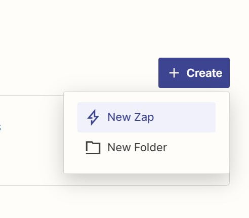
    - Create a new Trigger in this Zap
    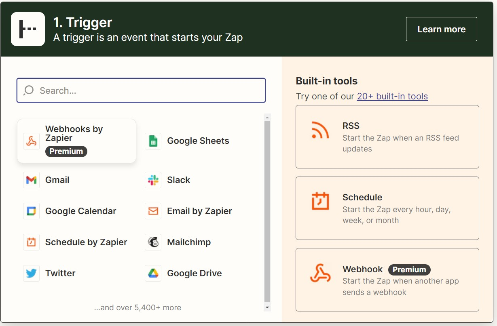
    - Select "Catch Raw Hook" from the event drop down.  
    
      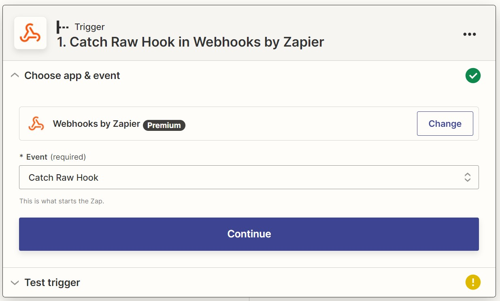
    - Select continue and it will display a webhook url.  
    
      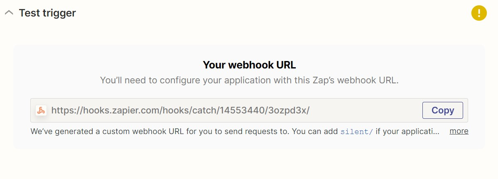
    - Copy this whole URL by pressing the "Copy" button
    - This URL will be used in Analytics alerting to create a webhook
    At this point, the Zap trigger is created, we can leave this at this stage and proceed to create an alert so that we can receive it in zapier.com and process it to select the request and format.  
    - Open another tab in the web browser and login to zWAN Director.  
    
    ## Configuration in zWAN Director
    Login to zWAN Director and navigate to alerting. Now we need to create a destination in alerting which will send the alert to this Zap whenever it is triggered.  

    ### Create Destination
    - Navigate to Alerting >> Advance configuration >> Destinations >> Add Destinations
    - Provide a name for this new destination.
    - Select type as "Custom webhook" from the drop-down list.
    - Select "Define endpoint by URL"
    - In the Webhook URL, paste the URL we generated in the "catch Raw hook" section.
    - Select "Method Selection" as POST
    - Select "Header information" Key as Content-Type and Value as application/json.
    - Click on "Create" to create this destination.  
  
    ### Create Monitor
    - Navigate to Alerting >> Advance configuration >> Monitors >> Create monitor
    - Select a name for your monitor
    - Select "Define using extraction query"
    - Select index as "elastiflow-3.5.3-tenant-name-*". The 'tenant-name' should be the name of the tenant used for login in to zWAN Director, for example the index can be given like "elastiflow-3.5.3-zwan-tenant-*".
    - Define the extraction query, a sample is provided below which looks for Link down in the logs every 2 minutes.
    - ```
      {
        "size": 1,
        	"query": {
        		"bool": {
        			"filter": [
        				{
        					"range": {
        						"@timestamp": {
        							"from": "{{period_end}}||-2m",
        							"to": "{{period_end}}",
        							"include_lower": true,
        							"include_upper": true,
        							"format": "epoch_millis",
        							"boost": 1
        						}
        					}
        				},
        				{
        					"wildcard": {
        						"syslog_message": {
        							"wildcard": "*AMZ_Link is Down",
        							"boost": 1
        						}
        					}
        				}
        			],
        			"adjust_pure_negative": true,
        			"boost": 1
        		}
        	},
        	"aggregations": {}
      }
        ```
    - The query will run every 2 minutes to look for link down logs.
    - Make sure you generate at least one log so that when you run the query using the RUN button you have a response.
    - Monitor schedule frequency "By interval" every 2 mins.
    - Click on Create to create this Monitor.
    - You have to create a trigger in alerting for the monitor we created above. After creating the monitor it will automatically take you to creating trigger. If not, then Select the monitor and create new trigger.
    - In Configure actions dialog, Select a name for the trigger.
    - Select destination as the webhook created in the previous step while creating monitor.
    - In the message section you can customize the body of the alert, a sample is given below;
    - ``` 
          An alert of severity: {{ctx.trigger.severity}} was generated on {{ ctx.results.0.hits.hits.0._source.syslog_timestamp}}
          Edge Controller: {{ ctx.results.0.hits.hits.0._source.node.hostname }}
          IP Address: {{ ctx.results.0.hits.hits.0._source.node.ipaddr}}
          Message: {{ ctx.results.0.hits.hits.0._source.syslog_message}}
      ```
    - If you have a log from the last 2 mins you can see a proper Message Preview else it will be showing the field value as empty
    - Use "Send test message" and quickly navigate to the other browser tab where you were creating a Zap.
    - Quickly click on "Test trigger" in zap section.
    - Select Request A and select the raw_body as the format in the Zap. Then click Continue.  
    
      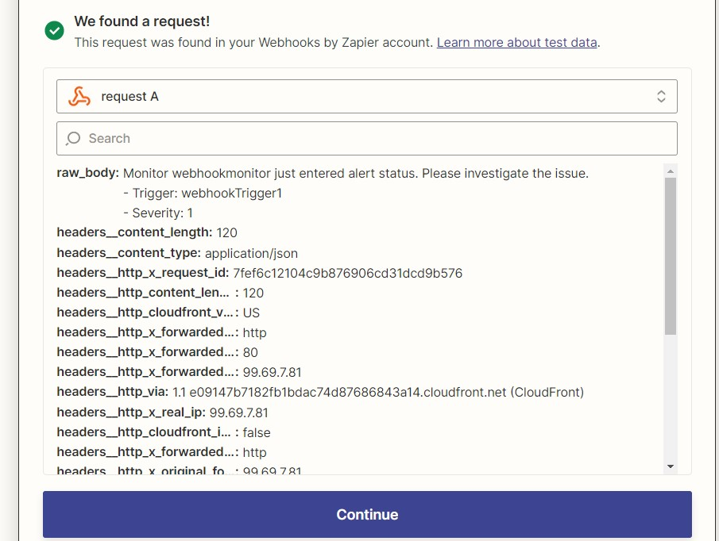
    - Come back to zWAN Director and Click on Create to create the Alerting trigger.
    - Alert with the webhook is now created in the Alerting section of zWAN Director.

    ### Continue to Create Zap
    - Next step will Create an action for the zap trigger we created.
    - Select "SMS by Zapier" from the list of actions  
    
      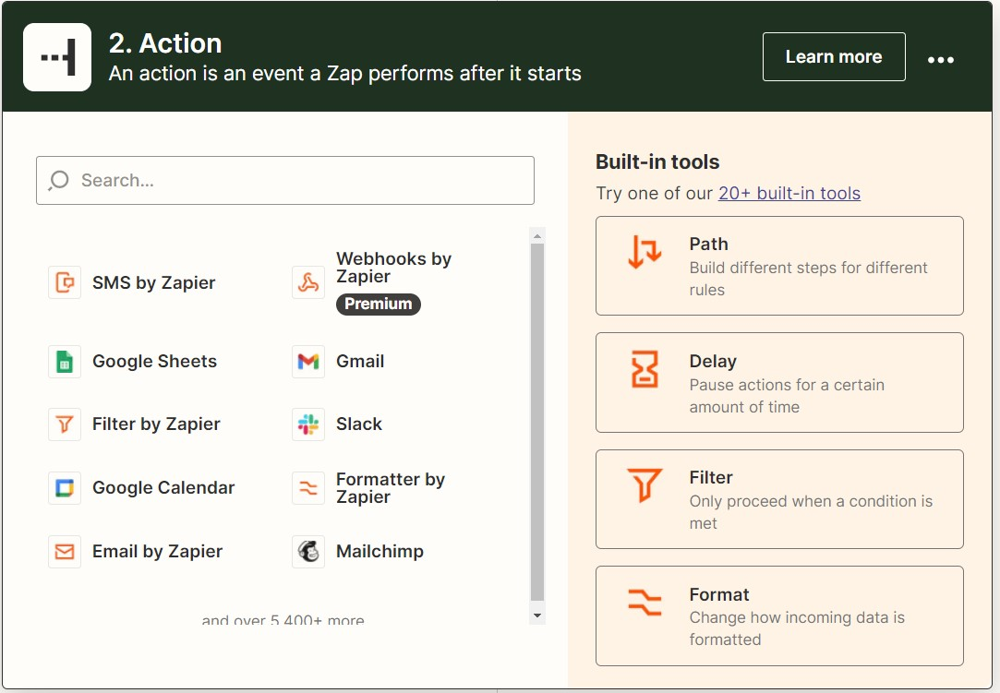  
    - Select "Send SMS" as event
      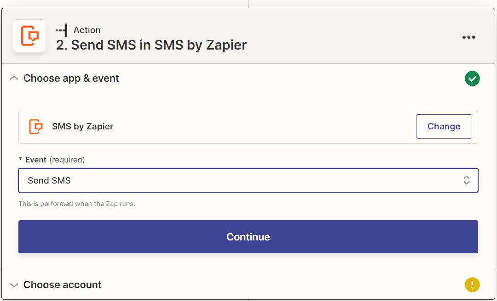
    - Click on create new account for SMS
    - Provide the number where you want to receive the SMS.  
      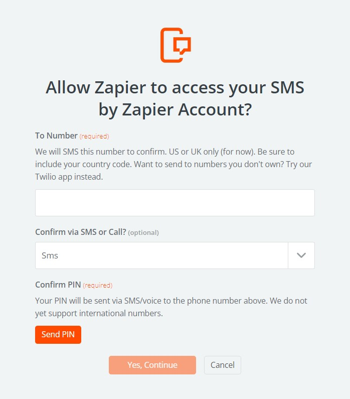
    - This step verifies the phone number by using a pin which will be sent to this number.
    - Once the verification is done the number will be added to the action

      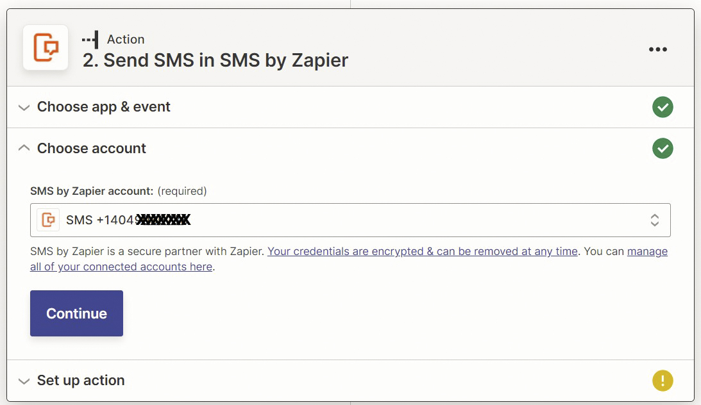
    - Click on continue
    - Select a "From number"
    - This is list of number from which the SMS will be sent to your number.
    - It is recommended to use a specific number from the list and not a random number which will be easier to track
      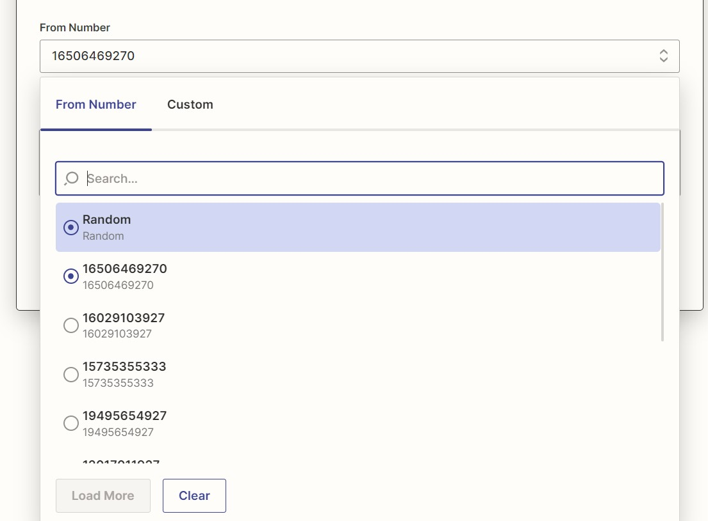
    - You can test action or skip the test action and Publish your Zap.
    - Select "Publish & Turn On"  
      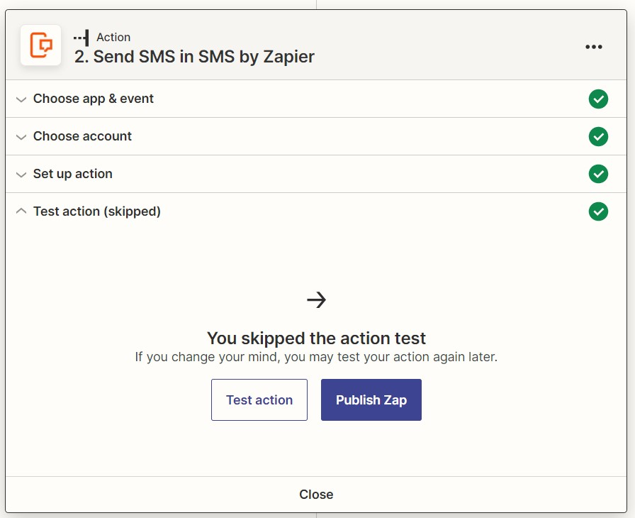
      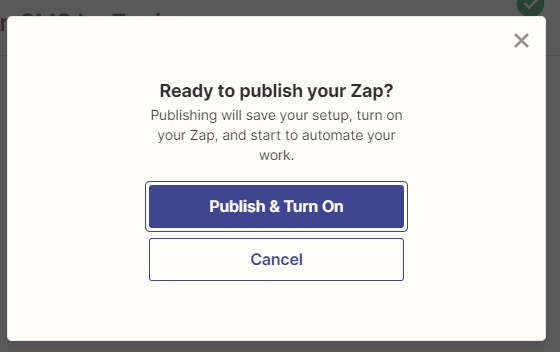
    - Change the name of your Zap
      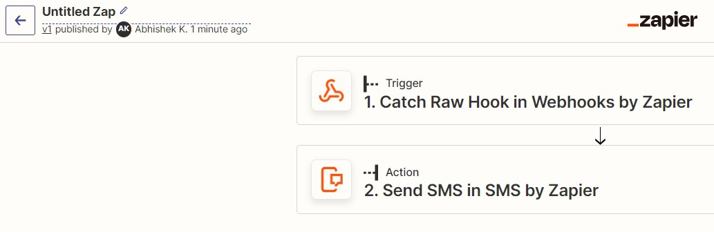