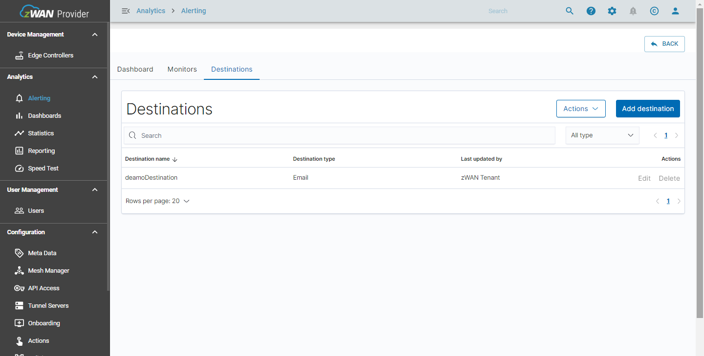

# Alerting

- The alerting feature notifies you when data from one or more database meets certain conditions. For example, you might want to notify in email if your application logs more than five HTTP 503 errors in one hour.
- We are supporting e-mail as a notification channel to send an alert.
- This advanced section is only for users who are familiar with scripting and Linux fundamentals.

## Key Terms

| Terms       | Definitions                                                                                                                                     |
| ----------- | ----------------------------------------------------------------------------------------------------------------------------------------------- |
| Monitor     | A job that runs on a defined schedule and queries database. The results of these queries are then used as input for one or more triggers.       |
| Trigger     | Conditions that, if met, generate alerts.                                                                                                       |
| Alert       | An event associated with a trigger. When an alert is created, the trigger performs actions, which can include sending a notification.           |
| Action      | The information that you want the monitor to send out after being triggered. Actions have a destination, a message subject, and a message body. |
| Destination | A reusable location for an action, such as Amazon Chime, Slack, or a webhook URL.                                                               |

## Predefined Alerts:

- Some categories of alerts are pre-defined for ease of use. A monitor is pre-created with defined trigger condition and an e-mail is sent to notify the user.
- Predefined monitors will monitor the alerts for every 15 minutes and will send an alert once the conditions are met.
- The notification in email contains following details like tenant name from which the notification is sent, device IP address or host name, and message.

1. Autoflow - Defines a rule to generate an alert for network balancing rule for autoflow controller.
2. Net balancer - Defines a rule to generate an alert for failover monitor and gateway monitor. Net balancer rule will contain jitter, latency and packet loss conditions.
3. IPS Alert - Defines a rule to detect network attacks like DDoS
4. IPS Flow - Defines a rule to generate an alert as to which server to client the attack was detected.
5. CPU and Memory Threshold - Defines a rule when CPU and memory met certain condition. It generates the alert when CPU utilization reaches 80% or above and free memory is less than 500 MBs.
6. Firmware Update - Defines a rule when the device is updated with latest firmware image successfully.
7. Interface status - Defines a rule when the device interface status is changed, like LAN or WAN is UP or Down.
8. Reboot - Defines a rule to alert the user whenever the device reboots.
9. UnCleanShutDown - Defines a rule to generate the alert whenever the device was shutdown unexpectedly during the last power cycle.
10. Startup - Defines a rule to generate an alert when the device started successfully.
11. Tunnel Status - Defines a rule to generate an alert whenever the SSL/IPSEC tunnel created or deleted. Tunnel is a medium to communicate between the sender and receiver.
12. LTE - Defines a rule to generate an alert with signal quality details like signal to noise ratio, signal strength and the interface name with LTE support.
13. DDOS Attack - Defines a rule to generate an alert for ICMP FLOOD, PORTSCAN, SSH BRUTEFORCE, TCP SYN ATTACK, TCP RST ATTACK and UDP FLOOD.
14. DNS - Defines a rule to generate an alert for NXDOMAIN, REFUSED and SERVFAIL.

### Steps to create Monitor for Predefined Alerting

1.  Go to Alerting menu, under Analytics section in Provider UI.


<center>Figure 1: Alerting page.</center>

2. The SMTP credentials needs to be configured to proceed with creating alerts.


<center>Figure 2: SMTP error.</center>

3. Steps for selecting SMTP configuration.


<center>Figure 3: Navigating SMTP configuration.</center>

4. SMTP configuration dialog appears. Enter the valid details in the following input fields:

- SMTP Host: Specify the SMTP host
- SMTP Port: Specify the SMTP port for the required host.
- User Name: Specify the Username to access the SMTP server.
- Sender Email Address: Specify a valid email address, this will be used to send the alerts to destination e-mail addresses.
- Password: Enter the credential for the email account.
- Click on the SAVE button.
- The credentials are saved in a keystore database which is encrypted and the credentials cannot be retrived or viewed anywhere.


<center>Figure 4: Saving SMTP configuration.</center>

> Note: If the deployment is on a single server system, it will check for the analytics virtual machine’s (VM) availability. If it is not available, it will throw an error. If the deployment is on a HA system, it will check for the analytics virtual machine in all the nodes of the HA server. If any one of the VM is not available, the API will throw an error.

5. Click CREATE button in top right corner of the page.

6. Create Monitor dialog appears. Click on "Enable Monitor" to proceed.  
     
   <center>Figure 6: Enabling the Monitor.</center>

7. In the Create Monitor dialog box, enter the details in the following fields:

- Name: Specifies the name for monitor.
- Events: Events can be selected in two ways that are to be triggered.

 + Select all events:

    - To select all events which need to be triggered select the check box “Select All Events.”
    - 
    - <center>Figure 7.1: Select all Events.</center>
    - All the selected events will be displayed in “Events” field. (To delete a particular Event from the list click the ‘X’).  

+ Select Specific Events:

    - Select the Events from the drop-down list box which will appear after clicking on the text box.  
    - To select the event, click the check box of that event.  
    - To add multiple events, select the check box of desired events.  
    -   
    - <center>Figure 7.2: Select Events.</center>
    - All the selected events will be displayed in “Events” field. (To delete a particular Event from the list, click the ‘X’).  
    - Receiver Email: Add valid e-mails to receive alerting notifications. Select the add button icon to add e-mail.  
    -   
    - <center>Figure 7.3: Receiver Email.</center>  
    - To select the multiple e-mail addresses, enter the e-mail in Receiver E-mail and select the add email icon.  

8. Select the ‘CREATE’ to create the monitor.  


<center>Figure 8: Create Monitor.</center>

9. The newly created Monitor will be displayed in the Alerting Page once the monitor is created successfully.


<center>Figure 9: Monitor created successful.</center>

### Steps for Advance Configuration in Predefined Alerting:

The Advance configuration feature lets the user to specify configuration for Monitor, Trigger and Action.

- Select the ADVANCE CONFIGURATION in the top of the Alerting page.


<center>Figure 10: Advance Configuration.</center>

### Listed the section to not change in the Advance configuration for Predefined Alerting:

- Do not Change any configuration in the Destination.
- Do not change the Sender and Receiver name under Destination.
- Under Monitor -> Action (Don’t Select enable or disable).


<center>Figure 11: Monitor -Enable and Disable.</center>

- Do not change the Monitor Name.
- Do not change the destination under action.

### Changes that are applicable in Advanced Configuration for Predefined Alerting:

1. To change the Trigger

- ADVANCE CONFIGURATION -> Monitor.
- Select the required Monitor name.


<center>Figure 12: Navigating Monitor.</center>

- To edit the ‘Trigger’ select the name under “Triggers” and then select the “Edit” button.


<center>Figure 13: Editing the Trigger.</center>

- Under “Edit Trigger”, one can change the Trigger name as desired.
- Trigger Condition can also modified from the default to the required condition.


<center>Figure 14: Editing the Trigger Condition.</center>

2. To change the Action

- ADVANCE CONFIGURATION -> Monitor.
- Select the required Monitor name.


<center>Figure 15: Navigating Monitor.</center>

- To edit the ‘Trigger’ select the name under “Triggers” and then select the “Edit” button.


<center>Figure 16: Editing Action .</center>

- In the bottom of the Edit Trigger page, go to “Configure Action” Select the action.
- The Action Name, Message Subject and Message can be changed.(DO NOT CHANGE THE DESTINATION).


<center>Figure 17: Editing Action .</center>

- Select the update .

## Steps to configure alerts using Advance Configuration.

1. Create destination as e-mail.
2. Create sender and receiver group in e-mail destination. Configure sender details through the SMTP configuration under the “Settings”.
3. Create monitor to monitor the scheduled job and mention the period of monitoring.
4. Create trigger which contains specific conditions.
5. Create action which contains the information that you want the monitor to send out after it is triggered. Actions have a destination, subject, and a body.

## Configuration

### Create destination:

- Navigate to Alerting in Provider UI. Select the ADVANCE CONFIGURATION.

- Select Destinations --> Add destination.

- Specify a name for the destination so that you can identify it later.


<center>Figure 18: Creating Sender.</center>

- Select E-mail under the Type
- Select the "Manage Sender" for the Entering the Sender.
- Select Add sender -> New sender -> enter a unique name for "Sender Name".
- Enter the valid e-mail address, SMTP host and the port.
- Choose an encryption method or use the default value of none. However, most email providers require SSL or TLS, which requires a username and password. In our case we are using TLS as encryption method and port as 587.
- Choose Save to save the configuration.


<center>Figure 19: Manage Email Sender.</center>

- Select Manage e-mail groups -> Add email group -> New email group .
- Enter a unique name -> Save. For recipient e-mails, enter any number of e-mail addresses.


<center>Figure 20: Manage Email Group.</center>

- Click Create button to create a destination.


<center>Figure 21: Create Destination.</center>

- Destinations which were created by the user will be displayed.



<center>Figure 22: Destination page.</center>

### Create monitors:

- Navigate to Alerting -> ADVANCE CONFIGURATION

- Select Monitors -> Create monitor.


<center>Figure 23: Navigating Monitor.</center>

- Enter a unique Monitor Name.
- Choose "Define using visual graph".
- Choose one or more indices. You can also use \* as a wildcard to specify an index pattern.


<center>Figure 24: Create Monitor.</center>

- Then choose an aggregation (for example, count() or average()), a set of documents, and a timeframe. Visual definition works well for most monitors.


<center>Figure 25: Aggregation for Monitor.</center>

- Advance users familiar with DSL queries can go with using _Extraction Query: as a monitor type.
- Choose a frequency and time zone for your monitor. Note that you can only pick a time zone if you choose Daily, Weekly, Monthly, or custom “cron” expression for frequency.

- Choose Create.


<center>Figure 26: Complete the monitor creation.</center>

> Note:

1. Define the monitor in one of two ways either using visual graphs or using extraction query.
2. We are using an DSL query for predefined alert categories.

### Create triggers:

- These steps differ based on whether you chose "Define using visual graph" or "Define using extraction query" or "Define using Anomaly detector" when you created the monitor.
- Specify a name and severity level for the trigger. For Trigger condition, specify a threshold for the aggregation and timeframe you chose earlier, such as “is below 1,000” or “is exactly 10 or "is above 500".


<center>Figure 27: Trigger condition.</center>

- We can configure multiple triggers for one monitor.
- Add an action and specify a name for the action. Choose a destination which was created under "Destination" tab.


<center>Figure 28: Selecting destination in action.</center>

- Add a subject and body for the message.
- Change the mustache templates, for example:

```sh
{"text":"Monitor {{ctx.monitor.name}} just entered alert status. Please investigate the issue.
- Trigger: {{ctx.trigger.name}}
- Severity: {{ctx.trigger.severity}}
- Period start: {{ctx.periodStart}}
- Period end: {{ctx.periodEnd}}"}
```

- Choose Create.


<center>Figure 29: Completing the trigger and Action Creation.</center>

> Note:

- You can add variables to your messages using Mustache templates.
- (Optional) Use action throttling to limit the number of notifications you receive within a given span of time.

### Steps to Delete Monitor:

1. Click Delete (trashcan) icon in the corresponding table row.


<center>Figure 30: Deleting Monitor.</center>

2. Confirm Delete Monitor Dialog appears. Click “YES” button to confirm delete.


<center>Figure 31: Deleting Monitor.</center>