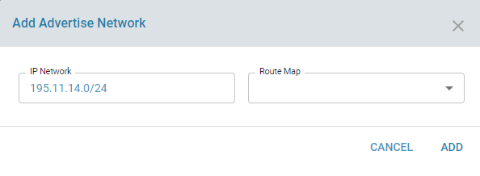

# BGP

## Overview: 

BGP stands for Border Gateway Protocol and is a dynamic routing protocol used between network hosts. BGP is designed to exchange routing information between autonomous systems (AS) on the internet. All packet exchanges on the internet go with ASN as the unique identifier. It can be used for the WAN network or exterior routing (eBGP) and also the LAN network or interior routing (iBGP).

## Functionality:

ZWAN uses BGP to peer the Edge Controller to the ISP. An ASN number is required and should be acquired from ARIN or the respective organisation based on geography for eBGP or mutually agreed upon by internal neighbors for iBGP.

Each ISP is configured as a BGP Neighbor. Multiple neighbours can be configured. 

When BGP peering is successful with the ISP, the edge controller can be used to advertise our address space to the ISP. The ISPs in turn can advertise a default route, a default and partial routing table or a full Internet routing table. Receiving a default route requires minimum resources. 

Detailed information on each parameter is beyond the scope of the document as is part of understanding the protocol. Information on different configuration parameters can be found http://docs.frrouting.org/en/stable-7.3/bgp.html

## Configuration Parameters
    
The BGP service needs to be in enabled state. An ASN number and a unique router ID is also specified and the latter is commonly set to a local private address.

Local Networks can be advertised using the Advertise Network option

Peering with an ISP can be performed by configuring a Neighbor

## Use Cases:
    
Configure peering with multiple neighbors and advertisement and exchange of routes in both directions.

BGP testcases using the deploy framework can be referred from
    https://gitlab.amzetta.com/sdwan/zwan-cpe/tree/development/common/zeroshell/testscripts/deploy/BGP_simple_peering

These were created based on the following testcases "netkit-labs_interdomain-routing.tar" from Netkit labs. The tar file is attached in the same folder

## Known Limitations:

NA

## Future:

