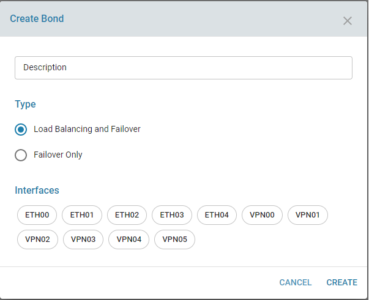
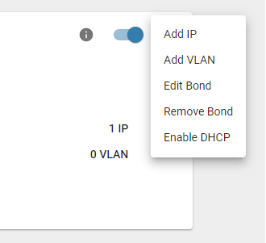
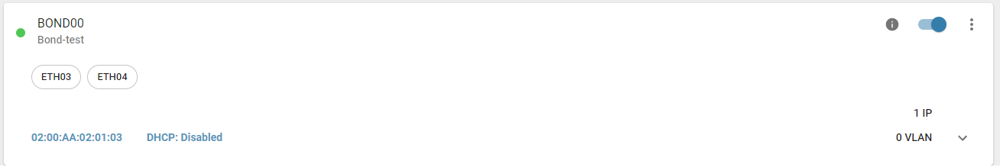
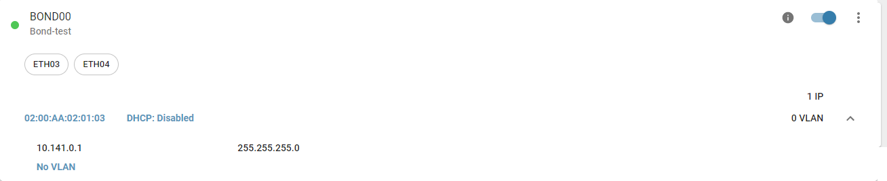

# Bonding

## Overview
Network bonding is a process of combining or joining two or more network interfaces together into a single interface. Network bonding offers performance improvements and redundancy by increasing the network throughput and bandwidth. If one interface is down or unplugged the other one will work. It can be used in situations where you need fault tolerance, redundancy or load balancing networks. In Linux, a special kernel module named bonding is used to connect multiple network interfaces into a single interface. Two or more network interfaces can be connected into a single logical “bonded” interface. The behavior of the bonded interfaces depends on the type of bonding method used. We can bond two VPN interfaces to provide fault tolerance and load balancing between two branches. 

## Functionality

zWAN supports following two modes of bonding. 

Balance RR or Load Balancing and Failover mode :  This mode is based on Round-robin policy and it is the default mode. This mode offers fault tolerance and load balancing features. It transmits the packets in Round robin fashion that is from the first available slave through the last.

Active Backup or Failover only mode:  This mode is based on Active-backup policy. Only one slave is active in this band, and another one will act only when the other fails. The MAC address of this bond is available only on the network adapter part to avoid confusing the switch. This mode also provides fault tolerance. 

Bond can be created using creating interfaces or VPN tunnels. If redundancy and fault tolerance is the main objective, then bonding is the way to go as user will not notice any lag or slowness in application.

*Other functionalities*

1) Create Bond: Create a new bond using the interfaces.

When creating a bond a primary interface should be provided. This interface will used as the primary interface of the bond and the new bond interface will have the MAC address of the primary interface.

The below screenshot shows the bond creation page from UI.

2) Edit/modify a bond configuration by adding more interfaces to already existing bond.
3) Delete Bond : Delete the bond
4) Add Static IP to a bond (refer Interface section )
5) Add VLAN ( refer VLAN )
6) Enable DHCP to acquire DHCP IP on the bond interface.
7) Disable DHCP on the bond interface
9) Renew/Release DHCP IP on the bond interface

## Configurable Parameters

The configurables paramters in bond are as follows

1) Description: Any user description
2) Change the mode or type of bonding
3) Add one or more physical/virtual interfaces to the existing bond

## Result

Once the bond is created, a new device will be created named as BOND00, BOND01 etc.

After creation of the bond using multiple interfaces, the bond information will as below screenshot

Status Indicators

GREEN : Denote Bond interface is UP
RED   : Denote Bond interface is DOWN
GREY  : Denote Bond Interface is Disabled

Also the interfaces IP which was already configured will be carried over to the bond. So if both interfaces had an IP, both IP's will be displayed under Bond Information. In the below screenshot ETH03 had an IP, so only that IP will displayed.

## Use cases

As explained above main use of bonding is for load balancing and fault tolerance and reduncdancy. 

Two VPN tunnels can be bonded between to edge controllers which gives security and redundancy between them

## Future enhancements

Other bond modes such as weighted load balancing, ALB can be added in the future.

## Known Issues

Load balancing feature will be only usefull if both the lines are of same bandwidth. Otherwise one line can be over-loaded which may result in traffic congestion.

After deleting the bond, sometimes the actual IP of the interface before creating the IP was not restored.

