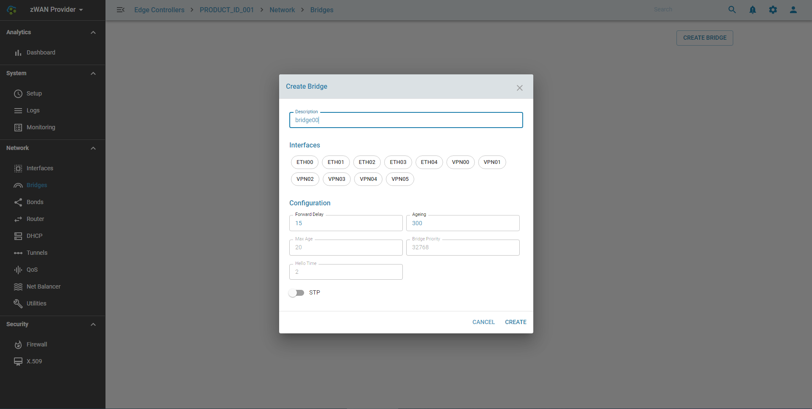
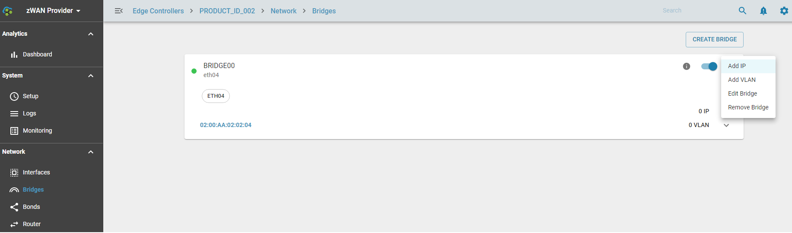
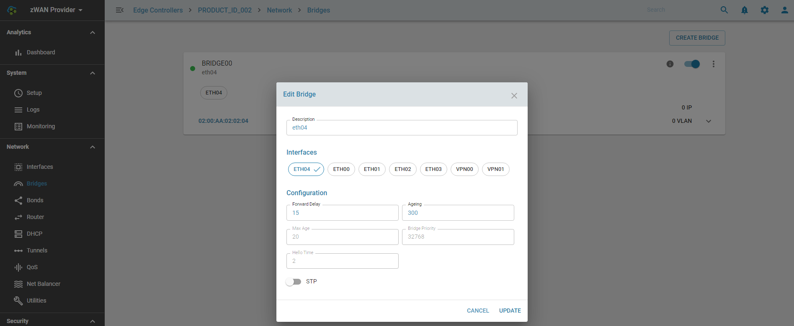

# Bridges

## Overview: 

A bridge is a piece of software used to unite two or more network segments. A bridge behaves like a virtual network switch, working transparently. Any real devices (e.g. ETH00) and virtual devices (e.g. VPN00) can be connected to it. Packets are forwarded based on Ethernet address, rather than IP address (like a router). Since forwarding is done at Layer 2, all protocols can go transparently through a bridge.

## Functionality:

The following are supported

    1) Create a bridge
    2) Update a bridge
    3) Delete a bridge
    4) Assign IP Address to a bridge
    5) Add VLAN to bridge

## Configuration Parameters

### Forward Delay

Forwarding delay time is the time spent in each of the Listening and Learning states before the Forwarding state is entered. This delay is so that when a new bridge comes onto a busy network it looks at some traffic before participating. The range is 4 - 30 seconds

### Ageing

The aging time is the number of seconds a MAC address will be kept in the forwarding database after having received a packet from this MAC address. The entries in the forwarding database are periodically timed out to ensure they won't stay around forever. Normally there should be no need to modify this parameter, but it can be changed with (time is in seconds). The range is 10 to 1,000,000 seconds

## Spanning Tree Protocol (STP)

Spanning tree is helpful when you have multiple bridges on your network, and they can all collaborate to find the shortest path between two ethernets, handle multiple hops and avoid cyclic routes.

### Max Age

If a another bridge in the spanning tree does not send out a hello packet for a long period of time, it is assumed to be dead. The range is 6 - 40 seconds

### Bridge Priority

Each bridge has a relative priority and cost. Each interface is associated with a port (number) in the STP code. Each has a priority and a cost, that is used to decide which is the shortest path to forward a packet. The lowest cost path is always used unless the other path is down. If you have multiple bridges and interfaces then you may need to adjust the priorities to achieve optimium performance. The priority value is an unsigned 16-bit quantity (a number between 0 and 65535).

The bridge with the lowest priority will be elected as the root bridge. The root bridge is the “central” bridge in the spanning tree.

### Hello Time

Periodically, a hello packet is sent out by the Root Bridge and the Designated Bridges. Hello packets are used to communicate information about the topology throughout the entire Bridged Local Area Network. The range is 1-10 seconds

### Create a bridge

### Bridge Information

Status codes of bridge once it is created
    
    GREEN   : Link is UP
    RED     : Link is down
    GREY    : Bridge has been disabled by the user

### Update a bridge

    
## Use Cases:
    

## Known Limitations:

- Only **99** Bridges can be created per ZWAN controller

## Future:

