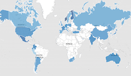
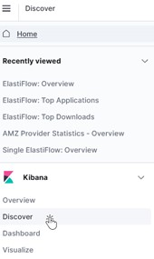

<h1> Analytics Server</h1>  

## How to create visuals using Kibana
---

## Objective

This document explains how a user can create their own charts using the data in Elasticsearch. The charts in the zWAN-Director are part of its user interface, that is, they are displayed within its UI. To create new charts or edit an existing one, user must log in to the UI of the Analytics server.

There are multiple components and terminology in the Analytics server UI which will also be explained in this document.

## Analytics server user interface

As the analytics server UI is within the zWAN-Director UI, we will not be able to edit/create charts unless we login to it in development mode.

To open analytics UI in development mode, follow the steps below:

- Login to zWAN-Director UI with the admin credentials
  - https://\<director-ip-or-domain-name\>/\<tenant-name\>
  - For example, https://zwandemo.amzetta.com/zwan-tenant
- Click on 'Dashboard' button on the left menu in the zWAN-Director UI. This will initiate the login to analytics server using the token generated in the zID server. Analytics server uses SSO mechanism for validating user credentials.
- Once the analytics server UI is loaded, right-click on the web browser's tab and select 'Duplicate' or 'Duplicate Tab' option from the menu. This will open a new tab with the same content as that of the main UI.
- In this new tab, select the whole URL and add port 8081 to the server URL part. This will open a direct connection to the analytics server UI.
  - For example,
    - Change this URL – [https://zwandemo.amzetta.com/zwan-tenant/#/analytics/dashboard](https://zwandemo.amzetta.com/zwan-tenant/#/analytics/dashboard)
    - To [https://zwandemo.amzetta.com:8081/](https://zwandemo.amzetta.com:8081/)
    - Press Enter to navigate the modified URL.
- You can now create, Edit or delete the dashboards, visuals and panels.
- Before you proceed, make sure you have data indexed to Elasticsearch.
  - All Syslog and Netflow data reside in elastiflow-3.5.3-\<tenant-name\>-\* index or database.
  - All IPS alert data resides in suricata-alert-\<tenant-name\>-\* index or database.
  - All IPS flow data resides in suricata-flow-\<tenant-name\>-\* index or database.
- The UI can filter data for a specific edge controller, or an edge controller group based on the field 'node.ipaddr' in each log/record. This field contains the management IP address of the edge controller. It is passed in the URL from the zWAN-Director. If filter is not applied for this field, the resulting data will be for overall across all edge controllers.
- All dashboards and visuals are tenant specific, that is, if you have created/modified a visual in 'zwan-tenant', these changes will not be available for another tenant within the same MSP.

## Dashboard

A dashboard is a collection of panels that you use to analyze your data. On a dashboard, you can add a variety of panels that you can rearrange and tell a story about your data.

A panel is a placeholder for charts or visuals. Panels contain everything you need, including visualizations, interactive controls, markdown, and more.

With Dashboard, you can:

- Add multiple panels to see many aspects and views of your data in one place.
- Arrange panels for analysis and comparison.
- Create and apply filters to focus on the data you want to display.
- Control who can use your data.

To create a new dashboard, click on the Dashboard link.

This will take you to the Dashboard list page, If you do not see the list page then repeat the above process again to see the list. Sometimes the first click takes you to the last edited dashboard and not to the list page.

  
Dashboard list page will look like the one mentioned in the screenshot above.

Click on the "Create Dashboard" link.

Add new visual to this dashboard and click on 'Save' at the top right menu.

  
  

## Panels/Visualizations

### Types of panels

There are several types of panels/visualizations/charts in the analytics server UI. They are explained below:

### Area  
| Displays data points, connected by a line, where the area between the line and axes are shaded. Use area charts to compare two or more categories over time and display the magnitude of trends. |  |
| --- | --- |
|
### Stacked Area
Displays the evolution of the value of several data groups. The values of each group are displayed on top of each other. Use stacked area charts to visualize part-to-whole relationships, and to show how each category contributes to the cumulative total. |  |
| --- | --- |
### Bar
Displays bars side-by-side where each bar represents a category. Use bar charts to compare data across a large number of categories, display data that includes categories with negative values, and easily identify the categories that represent the highest and lowest values. Kibana also supports horizontal bar charts. |  |
| --- | --- |
### Stacked Bar
Displays numeric values across two or more categories. Use stacked bar charts to compare numeric values between levels of a categorical value. Kibana also supports stacked horizontal bar charts. |  |
| --- | --- |
### Line
Displays data points that are connected by a line. Use line charts to visualize a sequence of values, discover trends over time, and forecast future values. |  |
| --- | --- |
### Pie
Displays slices that represent a data category, where the slice size is proportional to the quantity it represents. Use pie charts to show comparisons between multiple categories, illustrate the dominance of one category over others, and show percentage or proportional data. |  |
| --- | --- |
### Donut
Like the pie chart, but the central circle is removed. Use donut charts when you'd like to display multiple statistics at once. |  |
| --- | --- |
### Heat map
Displays graphical representations of data where the individual values are represented by colors. Use heat maps when your data set includes categorical data. For example, use a heat map to see the flights of origin countries compared to destination countries using the sample flight data. |  |
| --- | --- |
### Goal
Displays how your metric progresses toward a fixed goal. Use the goal to display an easy to read visual of the status of your goal progression. |  |
| --- | --- |
### Gauge
Displays your data along a scale that changes color according to where your data falls on the expected scale. Use the gauge to show how metric values relate to reference threshold values or determine how a specified field is performing versus how it is expected to perform. |  |
| --- | --- |
### Metric
Displays a single numeric value for an aggregation. Use the metric visualization when you have a numeric value that is powerful enough to tell a story about your data. |  |
| --- | --- |
### Data table
Displays your raw data or aggregation results in a tabular format. Use data tables to display server configuration details, track counts, min, or max values for a specific field, and monitor the status of key services. |  |
| --- | --- |
### Tag cloud
Graphical representations of how frequently a word appears in the source text. Use tag clouds to easily produce a summary of large documents and create visual art for a specific topic. |  |
| --- | --- |
### Maps
Maps enable you to parse through your geographical data at scale, with speed, and in real time. With features like multiple layers and indices in a map, plotting of raw documents, dynamic client-side styling, and global search across multiple layers, you can understand and monitor your data with ease. |  |
| --- | --- |
  
## Create Panels/Visuals

To create a panel or visual, make sure you have data indexed into Elasticsearch and an index pattern to retrieve the data from Elasticsearch.

To begin, click Create new, then choose one of the following options on the New Visualization window:

Click on the type of panel you want to create, then configure the options.

Select an editor to help you create the panel.

To help the user understand, we will explain how to create a TSVB chart (Time series visual builder). The requirement for our sample is to create a time-based area chart which displays the bandwidth(bits/second) for each application across all the edge controllers in each time range.

### Create TSVB panel/chart.

TSVB is a time series data visualization editor that allows you to use the full power of the Elasticsearch aggregation framework.

With TSVB, you can:

- Combine an infinite number of aggregations to display your data.
- Annotate time series data with timestamped events from an Elasticsearch index.
- View the data in several types of visualizations, including charts, data tables, and markdown panels.
- Display multiple index patterns in each visualization.
- Customize the data with labels and colors.

To create a TSVB chart select the 'TSVB' from the 'New Visualization' list.

1. When you open TSVB, click 'Panel options', then verify the following:
   - The index pattern is configured.
     - For our sample, it will be elastiflow-3.5.3-zwan-tenant-\*.
   - For 'Time field', specify if you want to use a time different date time field.
     - For our sample, we will use the default '@timestamp'.
   - For the interval, you can leave it as auto.
     - It can also be configured like '\>=5m' so minimum interval which can be selected in 5 minutes.
   - Specify if you want to show the last bucket, which usually contains partial data.
     - For our sample, it will be 'Yes'.
2. Click 'Data' and under 'Metrics' tab and 'Aggregation' field select 'Sum'. We are trying to add all the bytes for each application which we have received as logs/records.
3. In the 'Field' option enter 'flow.bytes', this will be used in Aggregation.
4. To calculate the application bandwidth, we need to divide the data transferred for each application by the time interval for that duration. To achieve that, we will add another series.
   - Click on the '+' icon and add a new series.
   - 
   - Select 'Bucket Script' form 'Aggregations' and define a variable which will store the value "Sum of flow.bytes" for each bucket. We can define this variable as 'bucketSumVariable'.
   - Select 'Sum of flow.bytes" from the drop-down list.
   - Now to convert the flow.bytes in bits we need to multiply by 8. To get bandwidth, the bucket sum must be divided by the time interval of that bucket. This is provided by the pre-defined variable called '\_interval'. To access the bucket interval (in milliseconds) use 'params.\_interval'. To access any defined variable, we can use the params option.
   - So we will use the formula "(params.bucketSumVariable \* 8) / (params.\_interval / 1000)" we are dividing params.\_interval by '1000' to get the result in seconds instead of milliseconds.
   - 
5. Select 'Group by' as 'Terms'- this is done to group the items by a specific field in the record.
6. Select the specific field which you need the 'Group by' to act on using the 'By' selection. For our sample, it will be 'flow.application'.
7. Select the 'Top' 100 values which will display only the top 'n' values to avoid crowding the chart.
8. Select 'Order by' as 'Sum of 'flow.bytes' and 'Direction' as 'Descending' which will arrange the result in descending order of the selected field. That is, the 'flow.application' with highest sum for 'flow.bytes' will be listed first and then the next highest and so on and so forth.
   - 
9. By now the chart has started displaying the numbers, to convert the numbers to bytes format, click on 'Options' tab next to 'Metric' tab.
   - Select 'Bytes' as 'Data Formatter' and Enter '{{value}}its/s' as 'Template'.
   - 
10. Click on Save at the top right corner and provide a title and description to the chart. Select "Add to Dashboard after saving".
  
### Save the dashboard.

When you are finished making changes, save the dashboard.

- From the toolbar, click Save.
- Enter the dashboard Title and an optional Description.
- To save the time range, select Store time with dashboard. (Optional)
- Click Save.

## Understanding the TSVB series panel

Every visualization shares the same interface for creating a Series. Each series can be thought of as a separate Elasticsearch aggregation, which prevents them from being compared with math. Each series has an Options tab that controls the styling and Elasticsearch options, which are inherited from the Panel options. Having separate options for each series allows you to compare different Elasticsearch indices, or to view two time periods from the same index.

To configure the value of each series, select the function first and then the inputs to the function. Only the last function is displayed.

Series can optionally have a Group by, which will show each group separately in the chart. The Filters grouping lets you assign a color to each filter. The Terms grouping has special behavior in the Time series chart, which is controlled by Options \> Split color theme.

## TSVB reference

TSVB has implemented shortcuts for some frequently used functions.

### Filter ratio

Returns a percent value by calculating a metric on two sets of documents. For example, calculate the error rate as a percentage of the overall events over time.

### Counter rate

Used for when dealing with monotonically increasing counters. Shortcut for max, derivative, and positive only.

### Positive only

Removes any negative values from the results, which can be used as a post-processing step after a derivative.

### Series agg

Applies a function to all the Group by series to reduce the values to a single number. This function must always be the last metric in the series. + For example, if the Time series chart shows 10 series, applying a "sum" series agg will calculate the sum of all 10 bars and output a single Y value per X value. This is often confused with the overall sum function, which outputs a single Y value per unique series.

### Math

The math context can do both simple and advanced calculations per series. This function must always be the last metric in the series.

## Editing existing panels/visuals.

Existing charts can also be modified in the development mode user interface. The process to enable 'Edit' mode is explained below:

1. Navigate the dashboard you want to modify.
2. Click on 'Edit' at the top right corner of the webpage.
   - 
   - This will enable the 'Edit' mode for each individual chart/visual.
3. Navigate to the visual you want to edit and click on the 'Settings' icon on the visual.
   - 
   - This will open a visual in Edit mode where you can change the various properties of the chart.

## Filter Based Search

An intuitive way of searching specific fields where user has instant access to all available fields in the document rather than remembering or referring to the sample document to get the field names.

More operator options that can be applied against individual fields:

- is
- is not
- is one of
- is not one of
- exists
- does not exists

##

If multiple filter-based search is applied — the search works as an incremental search. For example — if there are 100 records and user applied filter 1 that retrieved 30 records. Now if user applies filter 2 along with filter 1 — then the search is applied within the 30 records that are retrieved.

Custom labels can be applied on specific filter types for more intuitive reading.

Multiple actions can be performed on a defined filter like — INCLUDES, EXCLUDES, DISABLE, ENABLE etc.

To check what all fields are present in the index or database, user can navigate to 'Discover' page in the UI which will all the available fields for each index/database.

 

The 'Available fields' lists the fields in the index/database 'elastiflow-3.5.3-zwan-tenant-\*', user can select any of these fields to filter the search in the dashboard.

Detailed information can also be found on the [Kibana filters](https://itnext.io/kibana-7-x-options-to-customize-filter-share-and-save-120b8ca5d9a8) page.

 

## Adding navigation for the new dashboard

Navigation in the Analytics UI is created using the 'Markdown' chart from the visualization. To add navigation for the newly created dashboard, edit the visual using the steps mentioned in the '[EDIT exiting panels/visuals](#_EDIT_exiting_panels/visuals.)' section.

The section consists of text and URL format **[text](\<url\> ?embed=true&show-time-filter=true)**. The ' **text**' portion will be displayed to the user while **\<url\>** provides the navigation to specific dashboard.

The URL to a particular dashboard can be located through the web browser's URL tab as shown in the highlighted portion of the screenshot below.

With ' **?embed=true&show-time-filter=true**' the parameter is for the analytics web server to open the dashboard URL in the Director UI window without the headers. We need to preserve this with the URL.

Do the new tab markdoen format may look like below:

\[New Dashboard](#/view/cf8d3dd0-abcd-11ed-a8f4-f36bcdb6b6b6b?embed=true&show-time-filter=true)

The style to the tab is provided by the 'Panel Options \>\> Style' tab in the markdown visualization.
  
### Lucene Filter  
To filter the dashboard content, it is also advisable to use the 'Lucene Filter' tab in the dashboard. 
For example, the following image show the 'AMZ Syslog Management' dashboard which is filtering all the logs where the field 'syslog_message' is set to '*MANAGEMENT*'. This will get all the logs which have MANAGEMENT in the syslog_message field.  
  

### Filter for documents using wildcards
To search for documents matching a pattern, use the wildcard syntax. For example, to find documents where http.response.status_code begins with a 4, use the following syntax:

<code>http.response.status_code: 4*</code>

### Combining multiple queries
To combine multiple queries, use the and/or keywords (not case-sensitive). For example, to find documents where the http.request.method is GET or the http.response.status_code is 400, use the following query:

http.request.method: GET OR http.response.status_code: 400

Similarly, to find documents where the http.request.method is GET and the http.response.status_code is 400, use this query:

<code>http.request.method: GET AND http.response.status_code: 400 </code>

To specify precedence when combining multiple queries, use parentheses. For example, to find documents where the http.request.method is GET and the http.response.status_code is 200, or the http.request.method is POST and http.response.status_code is 400, use the following:

<code>(http.request.method: GET AND http.response.status_code: 200) OR
(http.request.method: POST AND http.response.status_code: 400)</code>

You can also use parentheses for shorthand syntax when querying multiple values for the same field. For example, to find documents where the http.request.method is GET, POST, or DELETE, use the following:

<code>http.request.method: (GET OR POST OR DELETE)</code>

### Querying nested fields
Querying nested fields requires a special syntax. Consider the following document, where user is a nested field:
<code>
{
  "user" : [
    {
      "first" : "John",
      "last" :  "Smith"
    },
    {
      "first" : "Alice",
      "last" :  "White"
    }
  ]
}
</code>

To find documents where a single value inside the user array contains a first name of “Alice” and last name of “White”, use the following:

<code>user:{ first: "Alice" and last: "White" }</code>

Because nested fields can be inside other nested fields, you must specify the full path of the nested field you want to query. For example, consider the following document where user and names are both nested fields:
<code>
{
  "user": [
    {
      "names": [
        {
          "first": "John",
          "last": "Smith"
        },
        {
          "first": "Alice",
          "last": "White"
        }
      ]
    }
  ]
}
</code>
To find documents where a single value inside the user.names array contains a first name of “Alice” and last name of “White”, use the following:

<code>user.names:{ first: "Alice" and last: "White" }</code>

More information about the Lucene filter can be found [here](https://www.elastic.co/guide/en/kibana/master/kuery-query.html).