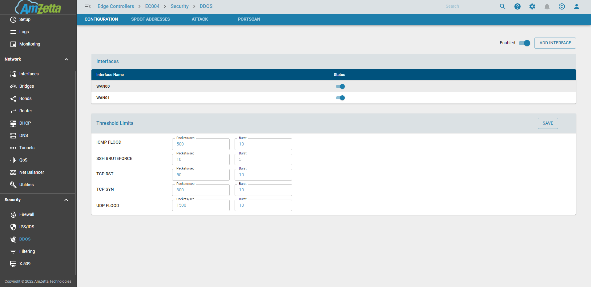
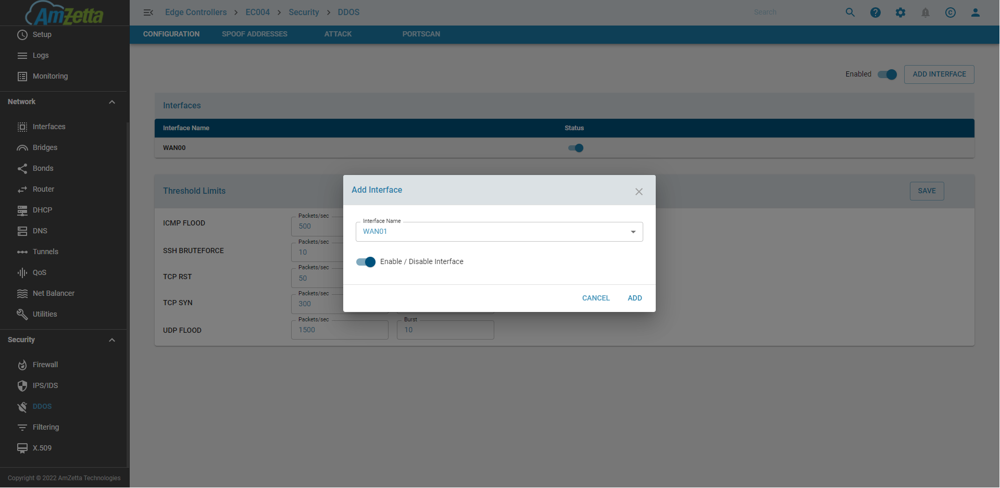
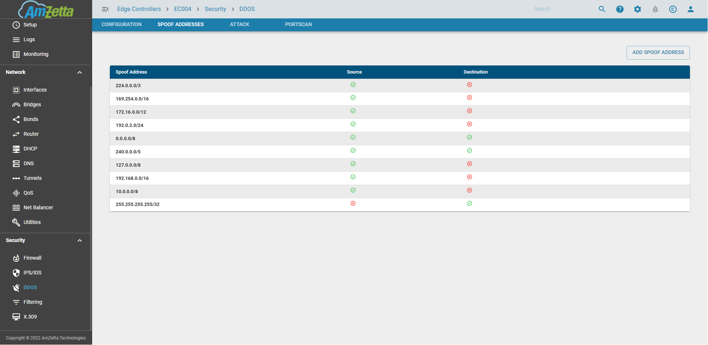
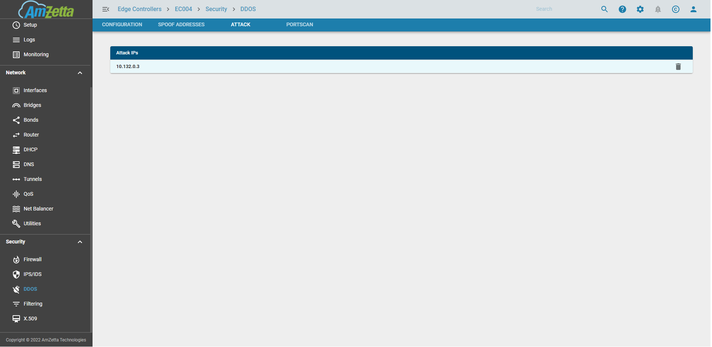
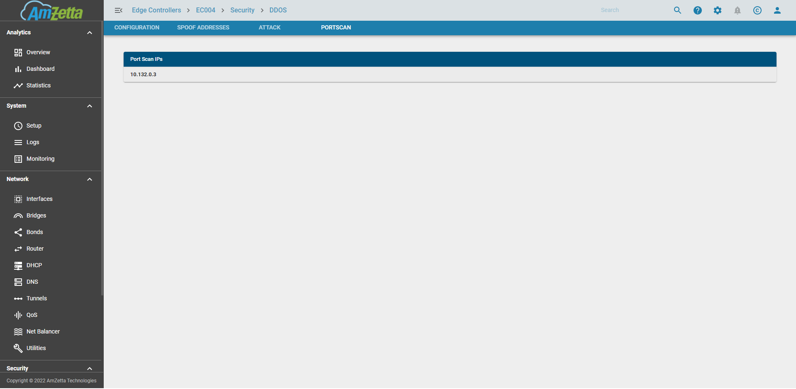
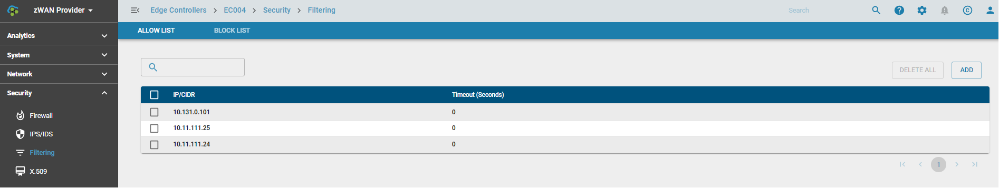
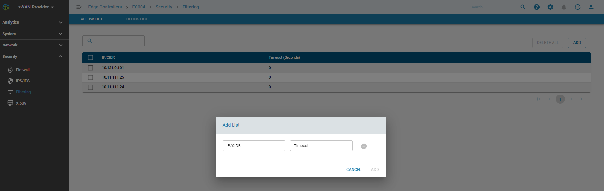
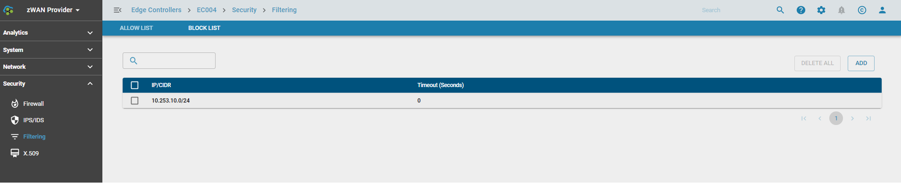
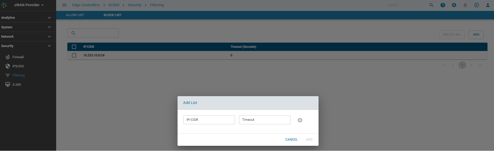

# DDOS

## Overview: 

Distributed Denial of Service or more commonly known as DDoS attack is an malicious attempt to disrupt the normal flow of traffic of a targeted server, or network byt overwhelming the target with a flood of internet traffic.

zWAN provides basic support for DDoS or DoS attacks, but if the attacker's traffic has already passed your ISP and reaching the EC, the link to the EC is already exhausted which would disrupt the normal traffic flow. What zWAN DDoS does is that, once an attack is detected based on the thresholds configured, it will stop processing the packets and drop them. This prevents wastage of CPU and Memory resources on the EC and also prevents any KP or OOM killers from getting exercised. 

## Functionality:

1) DDoS can be enabled/disabled on a global basis
2) DDoS can be enabled/disabled on a per WAN interface
3) Attack Thresholds can be set for different type of traffic per source. The attacks thresholds are mainly
    a) ICMP FLOOD       Defaults : 300 packets/sec
    b) UDP FLOOD        Defaults : 1000 packets/sec
    c) TCP SYN          Defaults : 300 packets/sec
    d) TCP RST          Defaults : 50 packets/sec
    e) SSH BRUTEFORCE   Defaults : 10 packets/sec
4) IPs that attempted to attack or portscan the EC can be viewed
5) Permanent or temporary allowLists and blockLists are supported 

Please note : In order for DDOS to work, the firewall INPUT policy should be set to default DROP.

## Configuration Parameters

### DDOS Status

### Configure DDOS per interface

### DDOS Settings for ICMP FLOOD, UDP FLOOD, TCP SYN, TCP RST, and SSH BRUTEFORCE

### DDOS IP List

Spoof Addresses

There are IP Networks which are not seen if the EC is directly facing the Internet Network. If the EC is in an internal network and if a 10.0.0.0/8 ip is possible then the spoof address entries need to be updated accordingly before enabling DDOS

Attack

IPs that attempted to attack or portscan the EC will be added to a temporary DDOS List for a 5 minute time period. The 5 minute timeperiod is enforced so that any false positives get automatically removed from the list after that time or even manually removed by the user. 

PortScan

There are external devices which try to run a portscan on the EC. They are then blocked of for a day. If there is a false positive then those IPs can be manually removed by the user. 

### AllowLists

Trusted IPs or subnets can be added to the allowlists so that the packets are not dropped due to any false positives in IPS or default drop rules in any firewall chains. Traffic from these IPs are always accepted before any additional processing takes place.

IPs or subnets are be temporarily added to the allowlist for a specific time period provided in seconds or until the next reboot. If a reboot happens within the given time period the entries would need to be added temporarily again.

IPs or subnets that need to be permanently allowed can be added with a timeout of 0.

One or more IPs or subnets can be added or deleted at a time

### BlockLists

IPs or subnets which are deeemed to be bad or malicious content orignating from them, can be added to the blocklist. These IPs would be blocked as soon as it enters the netfilter chains so that no further processing is done.

IPs or subnets are be temporarily added to the blocklist for a specific time period provided in seconds or until the next reboot. If a reboot happens within the given time period the entries would need to be added temporarily again.

IPs or subnets that need to be permanently blocked can be added with a timeout of 0.

One or more IPs or subnets can be added or deleted at a time

## Use Cases:

DDOS

## Known Limitations:

## Future:

