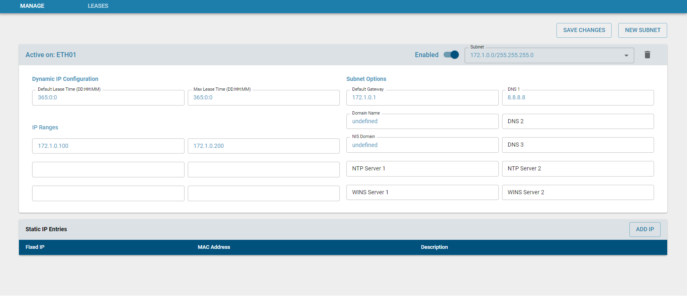
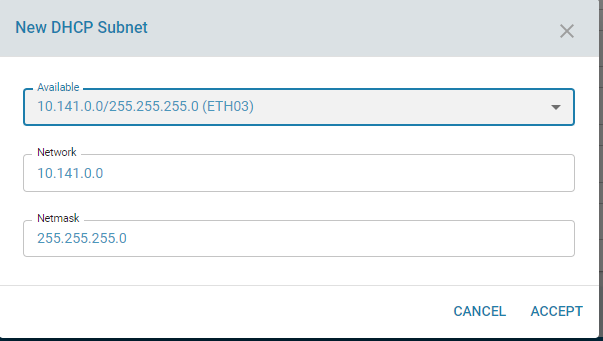
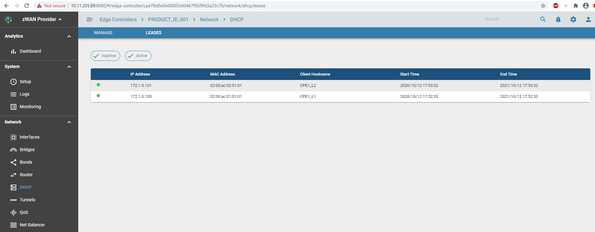

# DHCP Server

## Overview

A multi-homed dhcp server is useful in creating multiple networks or different subnets. This helps to segregate network traffic and isolate network traffic between branches and Data-centers based on the subnet. This also helps to create multiple domains in a particular branch which in-turn helps to classify the traffic based on the domain/subnet and steer traffic through the SDWAN edges devices. It also helps to prioritize the flow based on the domain if needed. zWAN's dhcp server helps to create multiple networks on the same interface by making use of the VLAN functionality. Multiple VLAN's can be created on the same physical interface. By creating separate subnet for each VLAN and assigning DHCP range for each VLAN, network segregation can be easily configured in low end edge devices which has only single ingress interface. zWAN  uses isc-dhcp-server in Ubuntu for configuring multi-homed dhcp server feature.
 
## Functionality 

The DHCP server allows to assign multiple IP ranges for a specified subnet. We support 3 different ranges for a  single subnet. It also allows to assign static IP address for systems which needs permanent IP address. The default and max lease times can be configured through UI. We also support connecting the DHCP server to NTP, WINS, DNS servers, NIS domain  for corresponding functionalities.
 
The below screenshot depicts the DHCP server config for a single subnet

Also the below screenshot shows creation of a new DHCP subnet across multiple VLANs on a single interface. The user can select a individual VLAN subnet and configure DHCP settings for that particular subnet.

The main functionalities include

    1) Creating a DHCP subnet from the available interfaces which have a static IP assigned.
    2) Configure the subnet with the DHCP server details
    3) Add static IP to DHCP subnet to be assigned to specific clients
    4) Edit/Modify static IP info assigned to the clients
    5) Delete the static IP info assigned to specific clients
    6) Edit/Modify the paramters of the configured the DHCP subnet
    7) Delete the DHCP server subnet

## Configuration parameters

1) Interface through which the DHCP assigns the above sub-range 
IPs to the dhcp clients
2) Status of the DHCP server for this subnet
3) The network range of the subnet, eg 30.30.0.0
4) The netmask for the network eg :255.255.0.0
5) Default Gateway(router) for the DHCP subnet
6) Array of DNS servers for this subnet, 7) We support 3 DNS server entries
8) IP/Name of NIS Domain
9) Array of IP/Name of the first NTP (Network time protocol)servers, We support 2 ntp servers entires
10) Array of IP/Name of first WINS(Windows Internet Name Service)servers
11) Default DHCP lease duration
12) Max DHCP lease duration
13) DHCP IP ranges, We support 3 ranges entries
14) Advanced DHCP subnet options
15) DHCP Static IP details

    

## Result

Once a DHCP subnet is created, the user can connect a system through a switch to the interface on which DHCP subnet is created. dhclient <interface-name> on the client machine should provide the DHCP IP. If the IP is leased out from the DHCP server, the leases tab will display the lease details such as the IP, lease duration etc.

A specific ID will be asigned to each DHCP server config. This will be used to further edit/delete the config

Similarly a specific ID will be assigned when assigned specific static IP to a client in the subnet. Use the ID to edit/delete the config.

 
 
## Known Limitations

A static IP should be assigned from the interface page to list the available interfaces or VLAN on top of which a DHCP server subnet can be configured. Only then the interface will be listed in DHCP page to create a subnet. When creating the DHCP subnet, the subnet mask cannot be edited as it is part of the static IP created.

## Future Enhancements

Advanced DHCP configuration options will be added in future.