# DNS 
Domain Name System converts domain names into IP address. It can be considered as a Phone book of Internet. DNS translates domain names to IP addresses so browsers can load Internet resources. This helps browsers or applications to connect to websites and other internet services. DNS servers eliminate the need for humans to memorize IP addresses.

There could be several reasons to have your own DNS server.

    1) A local DNS server can decrease response time for address queries, and make more efficient use of network resources, improving performance overall.

    2) A local DNS server can be used to filter queries. For example, it may block DNS resolution of sites serving advertising or malware.

    3) Some people run their own DNS server out of concerns for privacy and the security of data.

    4) You might want your own DNS server in your own home lab or small organization to manage internal, local name resolution. In addition, you do not have to remember addresses, rely on an external DNS service, or maintain hosts files on all your devices.

## Overview

ZWAN DNS functionality can be used to configure it as caching server, local DNS, or a forwarder. It can also do recursion and keep records it gets from other DNS servers. Its capable of DNSSSEC validation and act as a trust anchor. It can also perform TLS encryption. ZWAN uses a lightweight DNS package called Unbound.  Unbound can be a authoritative service, like if you have just a few zones — so it can serve as a stub or "glue" server, or host a small zone of just a few domains — which makes it perfect for a lab or small organization. It's also very popular as a recursive and caching layer server in larger deployments. 

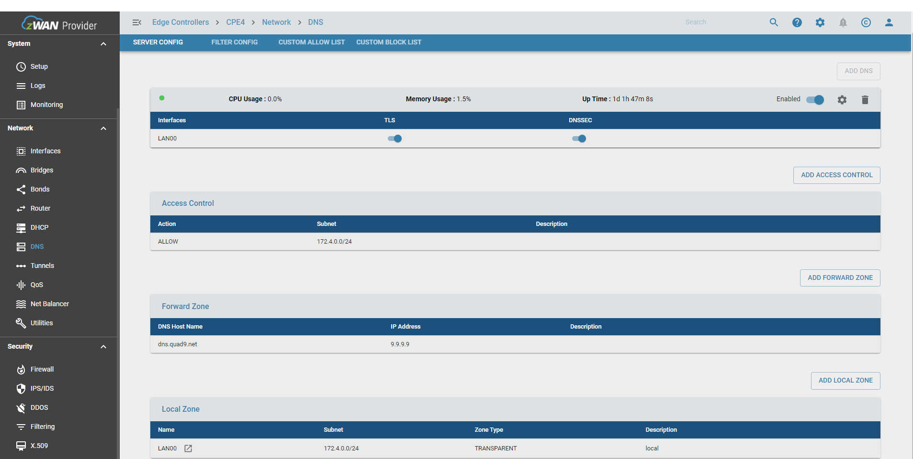
## Functionality

The main functionalities include

   ### Configure basic DNS parameters. Enable/Disable DNS, TLS, DNSSEC etc.

   The basic paramters include input interfaces, enabling/disabling DNS, DNSSEC and TLS. The TLS/SSL feature is used to encrypt the DNS queries forwarded to public DNS servers. We are using TLSv1.2 as the unbound dns package is based on version 1.6.2 in Ubuntu 18.04. Disable DNS is used to disable the DNS feature in Edge controller. DNSSEC feature is to digitally sign a dns query to public dns server which adds more security to dns query.
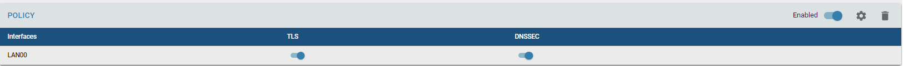
   ###  Add/Modify/Delete Access Control to control which subnet DNS queries should be honored

   Access control feature is used to control the DNS functionality for any query made on to the edge controller by any subnet mentioned in subnets configured in access control section. 

   The actions are as follows. Please refer unbound-conf(5) man page to understand each action. Refer action section in access control.
   
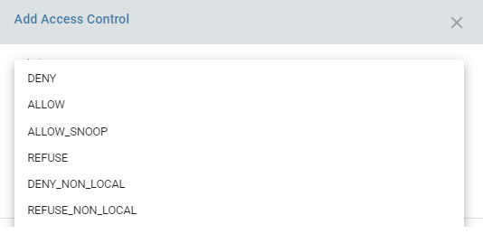
   ### Add/Modify/Delete Local Zone to add Local Caching Zone

   Adding local zone DNS feature allows to resolve local hostnames within the organization. It allows the edge controller to act as an authoritative server for local DNS queries. The important paramters are subnet, zonename and the type and private zone. Zone name cannot be edited once added.
   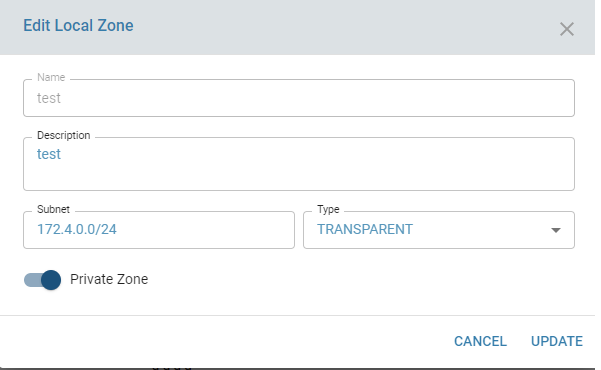

   Different types for local zone settings are as follows. Please refer unbound-conf(5) man page to understand each type.

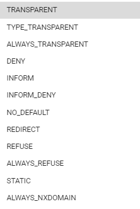

   Subnet is an optional parameter while adding local zone. Multiple local zones can be added to group different systems to its IP in separate zone types as mentioned above. Subnet is normally provided when that particular zone is only for private use. Select 'Private Zone' button so that the domains in the local zone are not exposed outside and is private to the systems in LAN. Usually only one local zone will be created and all local hosts and its IP addresses wil be associated to that local zone. For complex networks multiple local caching zones are created and used.
   
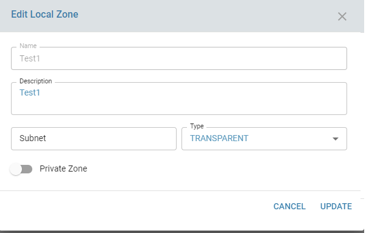
   
   To add to local zone data click on the link to the local zone data as mentioned in the below screen

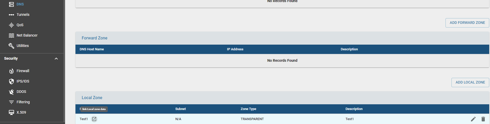

   ### Add/Modify/Delete Local Zone Data to add local hostnames to local zones

   Adding local zone data allows to add local hostnames and it's ipaddress for local name resolution. Again domain name is optional field here. For example some systems will be addressed as 'printer' or 'printer.local', whereas some can be addressed as 'printer.local.amzetta'. Here 'printer' is the hostname, 'local' is the local zone name and amzetta is the domain name.

   If user behind the LAN performs dns query, the DNS resolver will return its ipaddress if queried for 'printer' or 'printer.local' or 'printer.local.amzetta'

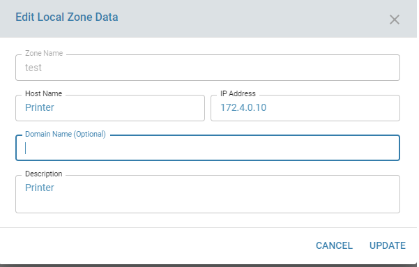
   ### Add/Modify/Delete Forward Zone Data to configure forwarder
   
   This allows to configure DNS as a forwarder to resolve internet domains. The added functionality is to enable TLS feature to added extra security when queries are forwared to public DNS servers. When global TLS flag is disabled in dns config section, the tls feature will be disabled for all the forwarders configured with TLS upstream flag. When TLS feature is enabled, the port for outside queries is 853, otherwise it will be 53.

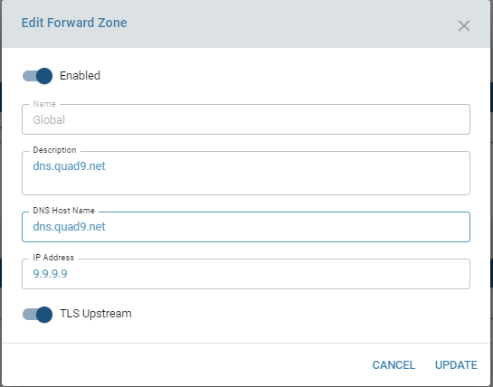
   ### Add/Modify/Delete Input Interfaces to listen on Query Interfaces

   This allows to add multiple input interfaces to listen for DNS queries. Internally when an interface is provided, the IP address of the interface is retrieved and saved in config file. UI may only list LAN interfaces as we provide DNS functionality only for LAN interfaces.

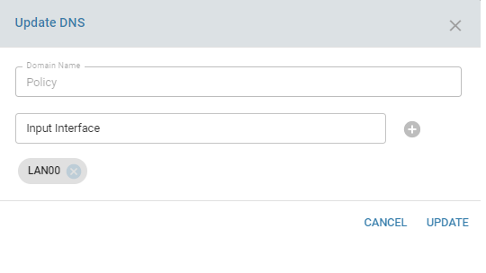
   ###  Enable/Disable/Modify advanced settings of DNS 

   This allows to enable and disable Query name minimization, log query reply, hide version, hide identity, prefetch options in DNS. More options will be added in future.

   Prefetch: If  yes, message cache elements are prefetched before they expire to keep the cache up to date. Turning it on gives about 10       percent more traffic  and load on the machine, but popular items do not expire from the cache.
   
   Hide Identity: If enabled id.server and hostname.bind queries are refused.
   
   Hide Version:  If enabled version.server and version.bind queries are refused.
   
   Query Name minimization to reduce the amount of information passed on to the DNS server for privacy

   The log level helps in debugging any DNS related issues. 1 is default and 5 is highest.
   0:only errors
   1:general oper. info(Default),
   2:detailed oper. info.
   3:query level info.
   4:algorithm level info.
   5: client identification for cache misses.

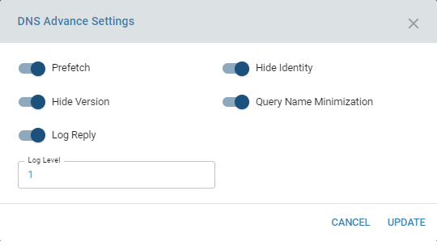
   ###  Deleting the DNS config

   Clear DNS allows to clear out the DNS config.
## Configuration parameters

1) Interface on which the DNS queries will be resolved/answered.
2) DNSSEC: To enable or disable dns security (To digitally sign a DNS query when making a DNS query to an external DNS server)
3) TLS:To enable or disable TLS/SSL feature (To encrypt the DNS query when making a DNS query to an external DNS server which supports the same)
4) Access control:  Subnet on which the DNS queries to be allowed
5) Access control:  Action to be performed for DNS queries on the subnet configured. Default is 'allow'
6) Forward Zone: Hostname and ipaddress of the external DNS server
7) Forward Zone: TLS upstream if the external DNS server supports TLS enabled DNS query resolution.
8) Local Zone: To create a local zone with a subnet and the type of query resolution it wants to support for local DNS query resolution. Default is 'transparent'.
9) Local Zone Data: To add local hostnames to the local zone for local DNS query resolution.
10) Advanced Settings: Enable/Disable Prefetch functionality of DNS. Default is enabled.
11) Advanced Settings: Hide Identity and Hide version of DNS server: Default is enabled.
12) Advanced Settings: Query Name minimization to reduce the amount of information passed on to the DNS server for privacy.Default is enabled.
13) Advanced Settings: Log Query to log the query reply with error code for any DNS query.Default is enabled.
14) Advanced Settings: Log level (1-5) to increase or decrease the amount of logging when DNS querriesa re made on to the server. Default is 1.

## Result

With DNS configured with Access Control, Local Zone,Local zone data  and Forward Zone local DNS queries and internet queries will be resolved by the edge controller.

The syslog will display the query results which logs the query status with error codes and status of each query.

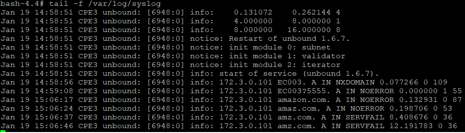

## Known Limitations

## Future Enhancements
