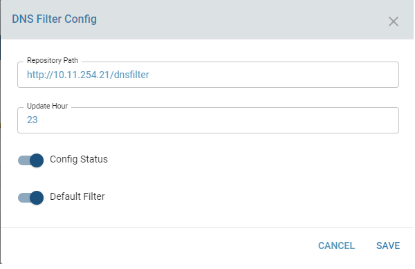

# DNS FILTER
DNS filtering is an added feature in zWAN CPE to provide enhanced security and administrator control to prevent users from accessing unwanted/malicious websites. This feature makes use of the Domain Name blocking when a client machine tries to resolve the DNS query for such a website. It also reduces the network bandwidth usage by blocking ads if enabled. 
## Overview

DNS filtering is used mainly to block a category of domains which internally enhance security avoiding access to malicious or suspicoius domains. Domains names are classified into categories which are pulled from various open and free Databases. The filter categories are classified based on the type of website, size of the database, purpose etc. The database needs to be updated regularly and formatted and kept in a common repository, so that all the CPE’s configured with DNS filtering can pull the database from the common repository. For now, the common repository is hosted in minio or any webserver authorized by the network administrator. The external repos from where the Domain Name databases is maintained is also provided as a query for the sources. Currently the repo is a hardcoded set, and it can be expanded/modified in future. The Domain Names database should be periodically downloaded onto a central repository in minio and all CPEs are scheduled to pull it daily from the repository. An api is provided to update the time of day to download the filters. An API is also provided to update the location of common repo from where the domain names are downloaded in each CPE. There is autorun module which runs and checks the daily update schedule time and downloads the source and merge with custom allow list and blocklist and update Unbound allow and block.


## Functionality

The main functionalities include

   ### Configure DNS filter

   Enabling DNS filter config includes enabling the config status. It also fields to mention repository path and update hour of the day. The repository should have zWAN formatted database files of all categories mentioned in the sources list. There is a custom application which downloads the database files from different open and free sources to generate the formatted zWAN database files. 
   
 

   The update hour denotes the hour of the day when each edge controller pulls its own enabled categories. 'Default' option in the drop down denotes daily update (repo pull) from respository will be performed by the software at a set time. 'No update' denotes daily update feature is disabled. '0-23' denotes the 24 hour clock hour of the day which user can pick for the update to be triggered.

 

   Default denotes use the default category which is assigned to the system. Refer the screenshot to view the default category for DNS filter. This database contains sufficient set of domains names of different categories which provides a standard security with minimal memory and cpu requirement.


   Once configured user should be able to view the repository path and last filter pull/reload time. It will also denote the reload time. The reload time and update time is based on any change/action done to dns filter config. The changes could be enabling or disabling filter config, enabling or disabling filter sources/categories, adding domains to custom allow or block list. If a change is performed the DNS filter status colour will change to "Amber" and when it is applied and filter is reloaded the status colour changes to "Green". 

   ###  Enable/Disable Filter Sources/Categories
   Multiple categories can be enabled or the user can select a combination of categories which is denoted as "Compliation". The category databases size ( number of domain names) range from hundreds to millions. 
 
   Large databases may in-turn consume more memory and cpu resources, hence database  categories should be enabled based on the hardware capability. User can view the details of each category by hover-over the eye icon.

   The view of each category contains information regarding the details of each source. It includes the URL from which the database is pulled. If the user wants to check a particular domain is part of that database, he/she can browse the URL and search for the domain name. Searching for a domain name is not supported for now as the database is huge and provider support is needed. The user can aslo check the number of entries and memory requirement and description before enabling a specific category for filtering. 


   Use the checkbox to select the desired categories to be enable dor disabled. Once enabled, as mentioned above the filter database has to be reloaded and hence the filter status will change to "Amber". Finally when the filter is reloaded, the status changes to "Green"

   
   Once loaded, the memory and cpu usage of the DNS server can be viewed in the DNS server config page.

      
   
   ### Add/Delete Custom Allowlist
   There is an added functionality to allow specific domains which are part of any category which is enabled to block. User should add the specific domain to the allowlist.This is useful when the intended domain name is part of an enabled category and the user wants to allow that domain name.


   Once added the custom allow list will be displayed in the UI


   
 
   ### Add/Delete Custom Blocklist
   Similarly if user can add more domains names to the custom block list which he/she intends to block. This is useful when the intended domain name is not part of the enabled DNS filter category.


   Once added the custom block list will be displayed in the UI


## Uploading latest filter Database file to minio
Follow the instructions in the link below to create the DNS filter Database files.  

https://gitlab.amzetta.com/sdwan/dns-filter/-/blob/master/README.md 
Once the filter files are created it should be uploaded to a common repository for all the Edge controllers to pull and download.  

Log in to the minio location in your provider system. In the screenshot the IP of the provider is 10.11.255.12. Enter the login credentials. 

Once logged in, create a bucket to upload the filter files using create bucket. 

Once the bucket is created, change the Access Policy of the bucket to Public. Click on the Manage button in bucket to change the policy.The default policy is Private.  


 Then click on the desired bucket and upload the files. You can upload the files directly into the bucket or upload a folder container the files into the bucket. Once upload is complete, verify status of all the files   

 

Update the repository path in the edge controller. The format of the URL should be as follows 

 

DNS filter repository path format when pulling from minio  

 

When files are inside a folder ‘dnsfilter’ inside a bucket ‘dns’, URL format is ‘https://10.11.255.12:7080/minio/dns/dnsfilter’ 

Here 10.11.255.12 is the provider IP and 7080 is the port. 

If the files are inside a bucket called ‘dnsf’,  the URL format is ‘https://10.11.255.12:7080/minio/dnsf’ 

## Result

With DNS Filter configured the filter config page will show the details of the configuration and categories enabled. The status color will be "Green". 


The syslog will display the DNS queries which are blocked and the user should get an alert specifying the source and the blocked domain name

When filtering is enabled, the ELK Dashboard logs will display the websites blocked by the enabled filter. 


## Known Limitations
The database source is limited and hardcoded. Separate program needs to be executed to download the defined category databases from the sources and manually copied to repository location. 
All the filter databases should be not be enabled in low memory and low end Edge controllers. 
Current limitation enforced is as follows.
```
For EC of 1GB memory, the total database size of all filters should not exceed 25MB

Sample filters combinations	
	Max Config - Compilation (Category): Steven Black (Maintainer) and anyone of Advertising (Category) [Adguard or Easylist or AdAway] (Maintainer) and Phishing (Category): RPiList-Phishing(Maintainer)
	or 
	Compilation(Category): Steven Black (Maintainer) and Phishing (Category): RPiList-Phishing(Maintainer) and Malware (Category): RPiList (Maintainer)
   or 
   Compilation (Category): Steven Black (Maintainer) and anyone of Advertising (Category) [Adguard or Easylist or AdAway] (Maintainer)
	or 
	Single Config -	Compilation(Category) : sjhgvr (Maintainer)

For EC of 2GB memory, the total database size of all filters should not exceed 50MB

Sample filters combinations	
   Compilation (Category): Steven Black (Maintainer) and anyone of Advertising (Category): [Adgaurd or Easylist or Adaway] and Phishing (category): RPiList-Phishing(Maintainer)  
   or
	Compilation (Category): sjhgvr (Maintainer) and anyone of Advertising (Category): [Adgaurd or Easylist or Adaway] and anyone of Phishing (category)- RPiList-Phishing(Maintainer)
   or
	Compilation (Category): Notracking (Maintainer) and anyone of Advertising (Category) [Adgaurd or Easylist or Adaway] and Phishing (category)- RPiList-Phishing(Maintainer)
	or
	All Compilation (Category) of Steven Black, notracking, sjhgvr, adguard-dns
	or 
	Select one from each category except [ Adult(Category) of ut-capitole(Maintainer) and Allowlist categories of ut-capitole and anudeep (Maintainer)] so that the total size do not exceed 50 MB.

For EC of 4GB memory, the total database size of all filters should not exceed 100MB

Sample filters combinations	
   Select every categories except [Adult(Category) of ut-capitole(Maintainer) and Allowlist categories of ut-capitole and anudeep (Maintainer)] so that the total size do not exceed 100 MB

For EC of >=8GB memory, the total database size of all filters should not exceed 300MB

Sample filters combinations
	Select everything except Allowlist categories of ut-capitole and anudeep (Maintainer)
```
Please refer the following link to download and execute the download program.
https://gitlab.amzetta.com/sdwan/dns-filter/-/blob/master/README.md
## Future Enhancements
