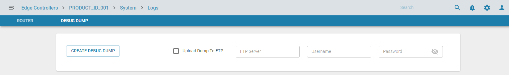

# Debug Dump

## Overview

Debug dump collects the system information, logs, and other state-full features pertaining to the edge controller  which is required incase of edge controller failure. It can also be used in having an in-depth analysis of an issue which cannot be resolved from the centrally managed orchestration server. The dump can be uploaded to the centrally located or configured FTP server. The debug dump created will be compressed file and the filename will contain edge controller name and time-stamp.

## Functionality

The user must enter the FTP server credentials to upload dump dump to the remote FTP location. There is also an option to create the debug dump without uploading to the FTP if the FTP is not reachable

## Result

Once the debug dump API is executed, the debug dump created will be compressed file and the filename will contain edge controller name and time-stamp

## Use cases

Debug dump will be used to debug edge controller when user or customer reports a crtical issue and if the edge controller is not accessible from the centrally managing server or in depth analysis of an issue is required to resolve the issue.

## Future enhancements

This feature will be enhanced later to a much more secure and automated manner in upcoming releases.

## Known Limitation

NA

