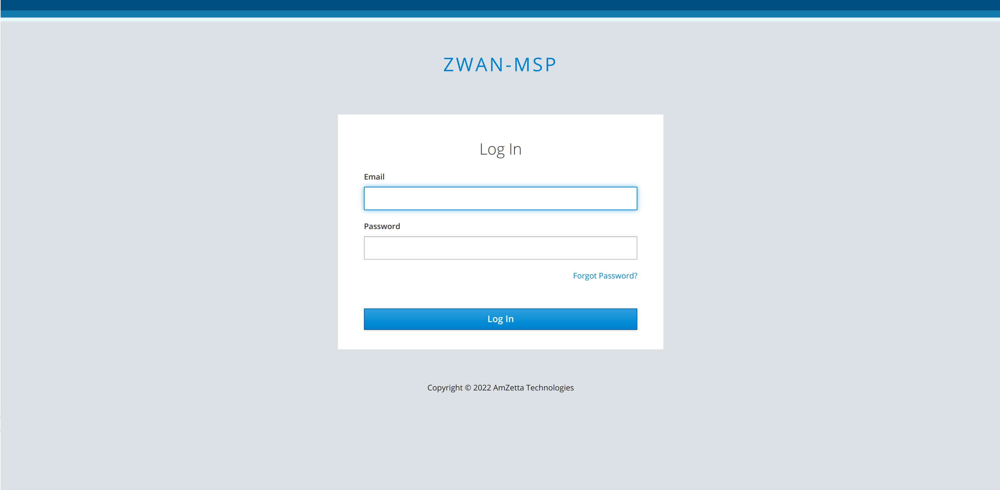

# **DC Backup**

1. Login to MSP page https://<domain-name>:7080 and select DB Backup tab.

2. Select “ADD FTP SERVER” button and add the ftp details, where the backup files should the uploaded.

3. Select “ADD BACKUP JOB” button and add the backup job with your required schedule.

4. After adding the job, press “start” button to start DC backup. Backup files will be uploaded to the configured ftp location.

# **DR restore**

1. Download deployment source and navigate to deployment/setup path and open restore.yml file. Specify the ftp details from where the backup files need to be fetched and the backup file names.

2. Confirm the target host machine details are proper in deployment/setup/master.yml file, before proceeding restore.

3. Start restore to target machine from deployment/setup folder. This will restore the director with the backup files. Run the following command.

   **`$ cd deployment/setup`**

   **`$ ./setup.sh <standalone> restore`**

4. Once restore complete, you can view all the data restored proper in the director page.
