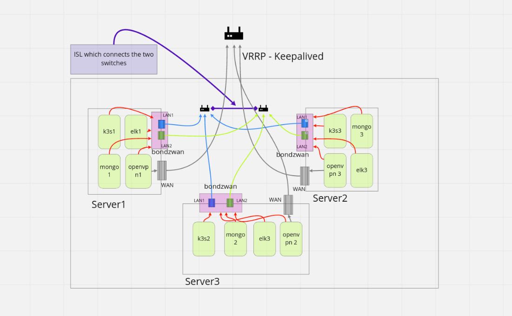
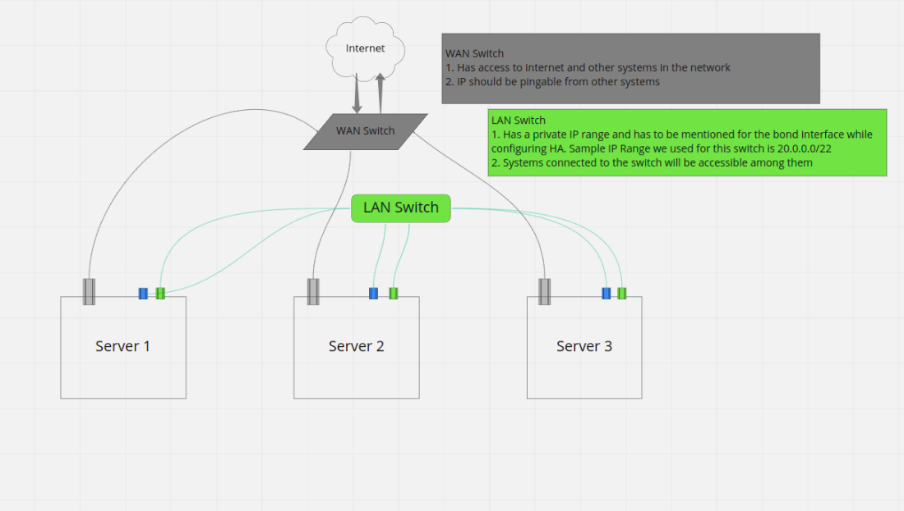

# zWAN Deployment - User Guide

## Introduction

zWAN is AmZetta’s implementation of SDWAN solution. zWAN is targeted towards small to midsize enterprises that are looking to incorporate SDWAN into their networking infrastructure.

AmZetta’s zWAN is composed of two major parts

A centralized management/orchestration server (or cluster of servers)/director is responsible for the management plane and certain control plane activities.

A distributed edge controller(s) that is responsible for data-plane activities.

    This document explains the deployment of director in a Standalone and High Availability Setup.

## Requirements

### 1. Installer Host

Ubuntu18.04 in Virtual or Physical Machine.

Yaml Installation

Deployment Binaries

### 2. Director Host

#### 2.1. Standalone Setup

Ubuntu server 18.04 with H/W configuration as below

- Storage – 256GB

- RAM – 64GB

- CPU - 16 cores

- 1 NIC

#### 2.2. HA Setup

3 systems with the below configuration.

Ubuntu server 18.04 with H/W configuration as below

- Storage – 256GB

- RAM – 64GB

- CPU - 16 cores

- 3 NICs

- 1 for WAN

- 2 for LAN side – Connected to a switch. These interfaces need to be up and IP need not be assigned for them.

## 3. Installation

Source can be downloaded from build released FTP location
ftp://zWAN@ussftp.amzetta.com/zwan-provider/

### Prerequisites

Prerequisites in the installer and the director host are installed automatically from the scripts.
In the installer host, pre_req.sh needs to be run before setup.sh, installs the required software components.
In the director host, the ansible playbooks takes care of the installation of S/W requirements, the playbooks are called from setup.sh

Note:

1.<span style="color: red"> Scripts needs to be run only in user mode. </span>

2.If diab setup is already installed in the Remote Host, remove the same using the destroy.sh and make sure the VM’s and iptables rules are deleted.

### Configuration

1. Copy the zwan-provider-xxx.zip to file installer host using winscp.
2. Login to installer host and go the file copied location.
3. Extract the files using the command unzip zwan-provider-xxx.zip.
4. Go to deployment/setup location
5. Modify the master.yml file with the valid server details.

Give the valid server details in the master.yml file (Comments are added to each section)

### Installation for Standalone setup

Note:

- If CPE VM’s needs to be retained, comment the lines in the destroy.sh related to CPE VMs.

- To delete the exiting ansible setup, run ./setup.sh standalone cleanup using the same file used for setup.

### Steps to install

- To start the setup in the director host

- Login to installer host and go to the deployment/setup location

- **./pre_req.sh** - Install the S/W requirements in the installer system

- **./setup.sh standalone** - Validates the S/W and H/W requirements in the director hosts, creates the VM with the components.
- The installation will create below 4 VM’s in each director host.
  - K3s
  - Mongo
  - Openvpn
  - Elk
- On Successful installation - An MSP (Managed Server provider) account is created - One default tenant account is created
  Note: CPEs won't be created.
- Sample master.yaml file for Standalone setup

```
 Server 1 ip, user, password details
- ip: 10.200.4.3
  name: server2
  user: user
  password: password
Master component will install k3s, openvpn, mongo and elk vms, DONT EDIT THIS ENTRY
components:
  - Master:
vxlan_id: 199
```

### Installation for HA setup

Note:

- If CPE VM’s needs to be retained, comment the lines in the destroy.sh related to CPE VMs.
- To delete the exiting ansible setup, run ./setup.sh cleanup using the same file used for setup.
  Steps to install
- To start the setup in the director host
- Login to installer host and go to the deployment/setup location
- **./pre_req.sh** - Install the S/W requirements in the installer system
- **./setup.sh** - Validates the S/W and H/W requirements in the director hosts, creates the VM with the components.
- The installation will create below 4 VM’s in three director host.
  - K3s
  - Mongo
  - Openvpn
  - Elk
- On Successful installation - An MSP (Managed Server provider) account is created - One default tenant account is created
  Note: CPEs won't be created.
- Sample Master file for HA Setup

```
servers:
Server 1 ip, user, password details
  - ip: 10.200.48.108
    port: 22
    name: ubuntu3
    user: user
    password: ubuntu@123
Master component will install k3s, openvpn, mongo and elk vms, DONT EDIT THIS ENTRY
    components:
      - Master:
    lan-nics:
Server 1 LAN interface names as displayed with ip -br a command. These two interfaces will be connected to
a switch. IP need not be assigned to them.
      - enp4s0f0
      - enp4s0f1
Server 1 - Ip value to configure for the bond interface created with the lan interfaces.
Please make sure the subnet of the all the bond ips (configured for server1, 2 and 3) are same.
    bond_ip: 20.0.0.30
Server 2 ip, user & password details
  - ip: 10.200.48.12
    port: 22
    name: ubuntu2
    user: user
    password: ubuntu@123
Master component will install k3s, openvpn, mongo and elk vms, DONT EDIT THIS ENTRY
    components:
      - Master:
Server 2 LAN interface names as displayed with ip -br a command. These two interfaces will be connected to
a switch. IP need not be assigned to them.
    lan-nics:
      - enp4s0f0
      - enp4s0f1
Server 2 - Ip value to configure for the bond interface created with the lan interfaces.
Please make sure the subnet of the all the bond ips (configured for server1, 2 and 3) are same.
    bond_ip: 20.0.0.31
Server 3 ip, user, password details
  - ip: 10.200.48.37
    port: 22
    name: ubuntu
    user: user
    password: user
Master component will install k3s, openvpn, mongo and elk vms, DONT EDIT THIS ENTRY
    components:
      - Master:
Server 3 LAN interface names as displayed with ip -br a command. These two interfaces will be connected to
a switch. IP need not be assigned to them.
    lan-nics:
      - enp4s0f0
      - enp4s0f1
Server 3 - Ip value to configure for the bond interface created with the lan interfaces.
Please make sure the subnet of the all the bond ips (configured for server1, 2 and 3) are same.
    bond_ip: 20.0.0.32
keepalived:
Director Host keepalived IP which will be shifted among the Servers. The IP should be in the SAME SUBNET as the 3 Servers.
  - host_vrrp_ip: 10.200.48.100
Director Host VRRP ID to be unique for each HA setup
    host_vrrp_id: 90
vxlan group id to be unique for each HA setup
vxlan_id: 100
```

### Migration HA Single node to multi nodes

HA setup can be installed in single/multiple server(s) based master.yml file server configurations.

- Master.yml can have any number of server entries.
- First start installation in one node or server with the steps mentioned under Installation Steps.
- To add more servers to the existing setup, edit the master.yml with required server information. Run the command **./setup.sh upgrade** from installer host.
- Master.yml file format is same as HA Setup.

### Director Update

1.  Make sure the previous versions are installed in director host.
2.  Copy the new zwan-provider-xxx.zip to file installer host using winscp.
3.  Login to installer host and go the file copied location.
4.  Extract the files using the command unzip zwan-provider-xxx.zip.
5.  Go to deployment/setup location
6.  Modify the master.yml file with the valid server details which is deployed already.
7.  Give the command to update in following format

    **`./setup.sh update <component-1> <component-2> .... <component-N>`**

        Example:
            ./setup.sh update clustersvc

            ./setup.sh update elk clustersvc zid clustersvc externalsvc msp tenant


8.  Following are the update supported component names.

    - elk
    - zid
    - clustersvc
    - externalsvc
    - msp
    - tenant

**Component Name: clustersvc**

    a) namespace: datastore
        1) redis-operator
        2) rfr-redis
        3) rfs-redis
    b) namespace: longhorn
        1) csi-attacher
        2) csi-provisioner
        3) csi-resizer
        4) csi-snapshotter
        5) engine-image-ei
        6) instance-manager-e
        7) instance-manager-r
        8) longhorn-admission-webhook
        9) longhorn-conversion-webhook
        10) longhorn-csi-plugin
        11) longhorn-driver-deployer
        12) longhorn-manager
        13) longhorn-ui
        14) share-manager-pvc
    c) namespace: network-optimizer
        1) flow-optimizer
        2) twamp-result
        3) twamp-scheduler
    d) namespace: northbound
        1) alerting
        2) certificate-processor
        3) certificate-service
        4) db-backup-and-restore-manager
        5) dc-monitor
        6) debug-dump
        7) ec-event-receiver
        8) edge-controller-provisioner
        9) edge-controller-proxy
        10) firmware-manager
        11) management-service
        12) mesh-event-handler
        13) mesh-manager
        14) sensor-event-monitor
        15) shadow-db
        16) template-builder
        17) tenant-service
        18) web-ssh
    e) namespace: queue-worker
        1) event-processor
        2) fw-update-processor
        3) policy-processor
        4) results-processor
        5) shadow-db-processor
    f) namespace: southbound
        1) edge-controller-manager
    g) namespace: topology
        1) topo-discover


**Component Name: zid**

    a) namespace: zid
    	1) amzpostgres-postgresql-ha-pgpool
    	2) amzpostgres-postgresql-ha-postgresql
    	3) zid


**Component Name: externalsvc**

    1) alpsee-ui
    2) mapikarp-ui
    3) minio
    4) msp
    5) zwangateway
    6) web-ssh

**Component Name: elk**

    1) zwan-analytics-webserver
    2) zwan-analytics-kibana
    3) elastiflow-logstash-oss
    4) zwan-analytics-elasticsearch

### Limitations

- Two systems should always be up at any point of time.
- Minimum 20 secs will be taken to shift the Host Keepalived incase if any of the k3s, openvpn or elk vm is not running.

### Known Issues

- Unknown interface issue may happen

## HA Setup Representation



## HA Network Setup Representation


