# **Firmware update with Minio**

1. Login to minio console page https://<domain-name>/minioconsole/login

   `Username: minioconsole`

   `Password: minioconsole`

| 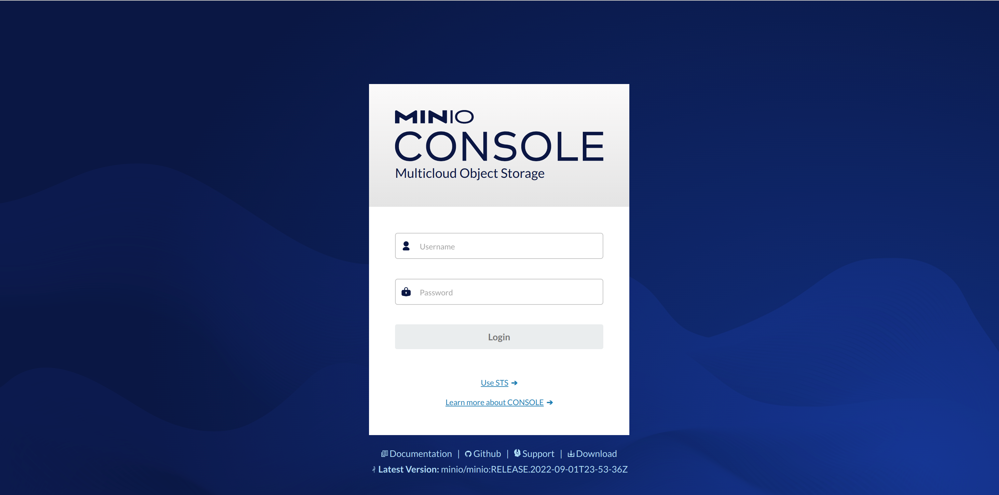 |
| --------------------------- |

| 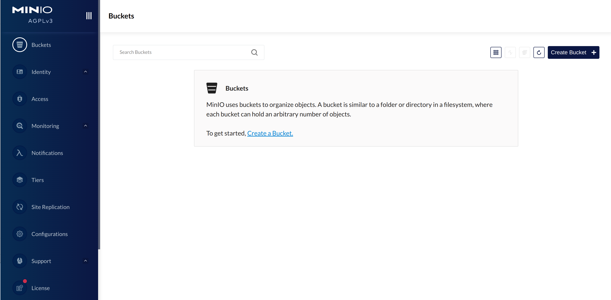 |
| ----------------------------- |

2. Create your new bucket using “Create Bucket” button.

| 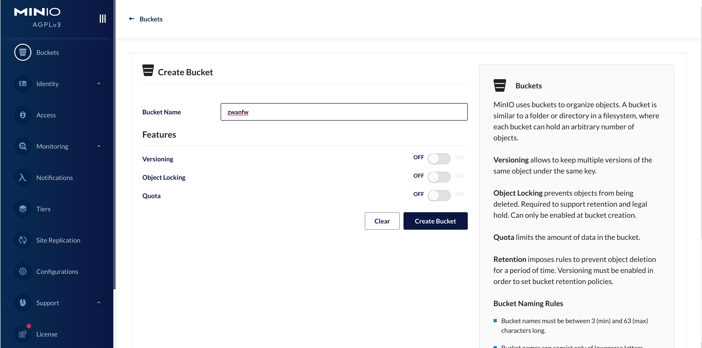 |
| ----------------------------- |

3. Click on “Buckets” and get the list of buckets.

| 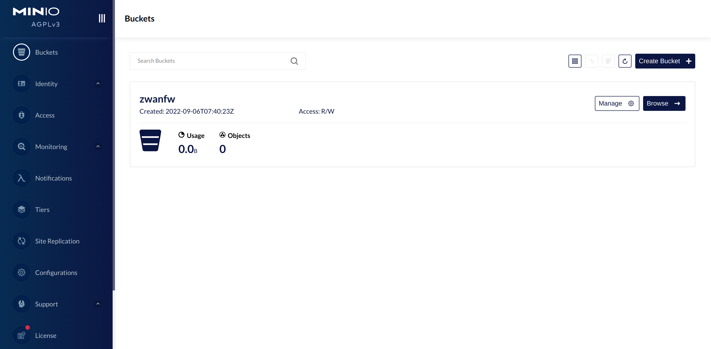 |
| ---------------------------- |

4. Click “Manage” button. Click edit icon in “Access Policy” and change the access policy of you bucket to “Public”

| 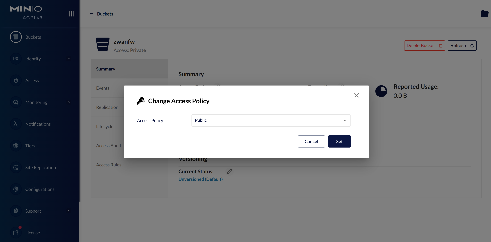 |
| ------------------------------------ |

5. Upload your firmware update file to your bucket by clicking “upload” button.

| 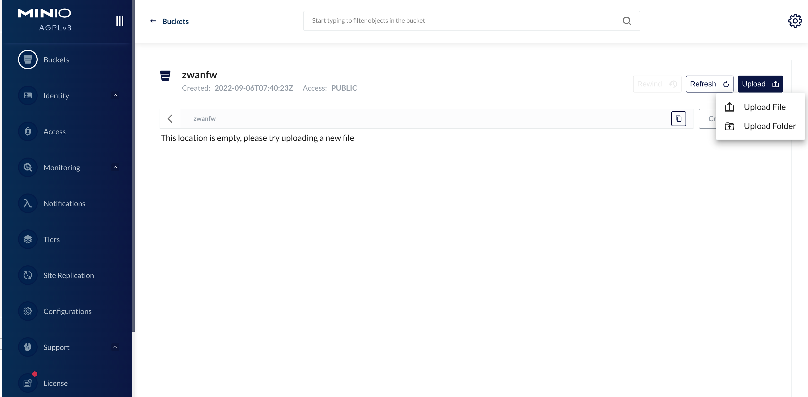 |
| ----------------------------------- |

| 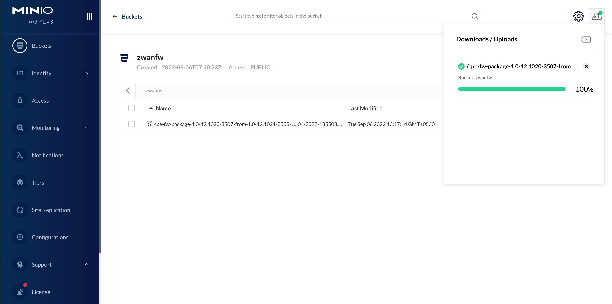 |
| ----------------------------------- |

6.  The uploaded firmware update file, downloaded link from minio object store should be in the following format,

    `https://<domain-name>:7080/minio/<bucket-name>/<filename>`

    `example:`

        `https://10.200.4.234:7080/minio/zwanfw/cpe-fw-package-1.0-12.1020-3507-from-1.0-12.1021-3533-Jul04-2022-185503.bin`

7.  Create the “manifest.json” file for the specific firmware version as follows,

| 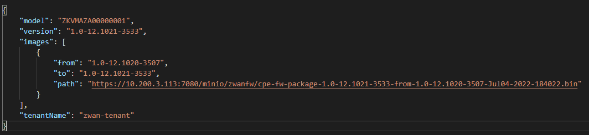 |
| ----------------------------- |

## **manifest.json content details:**

| Field      | Meaning                                                              |
| -------    | ----------------------------------------------------------------     |
| model      | CPE or bananapi model number                                         |
| version    | Lastest firmware version to be updated                               |
| images     | List of firmware update links                                        |
| from       | Current version of firmware in CPE                                   |
| to         | Lastest version of firmware to be updated in CPE                     |
| path       | Firmware update patch download path                                  |
| tenantName | (Optional) Name of the tenant to make firmware update tenant specific|

8. Upload the manifest.json to the same path, where the firmware update file was uploaded.

| 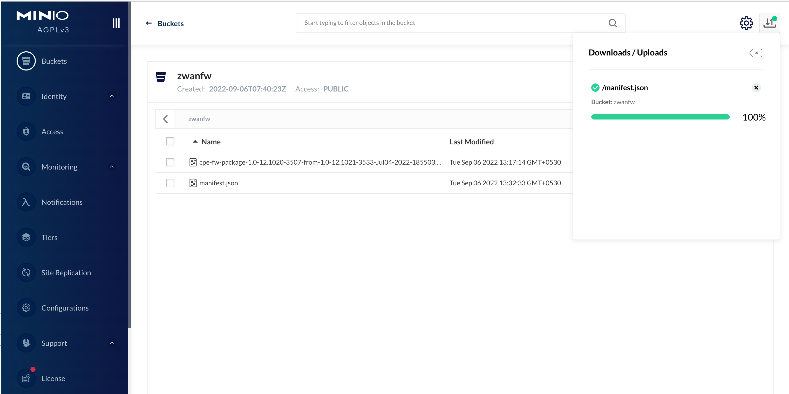 |
| ------------------------------- |

9.  Download path of manifest.json from the minio object store can be formed as follows,

    `https://<domain-name>:7080/minio/<bucket-name>/<filename>`

    `example:`

        `https://10.200.4.234:7080/minio/zwanfw/manifest.json`

10. Login to MSP page https://<domain-name>:7080 and select “Firmware” tab.

| 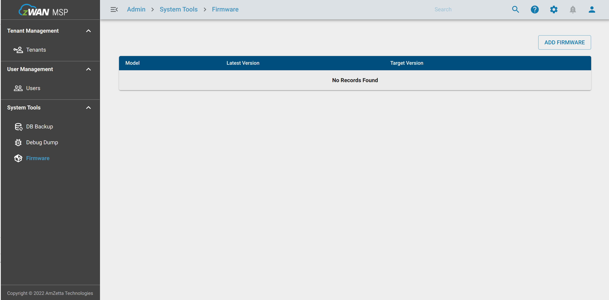 |
| ---------------------------- |

11. Click “ADD FIRMWARE” button. Copy and past the manifest.json URL link to “Add Firmware” window. Press validate button and press “ADD” button.

| 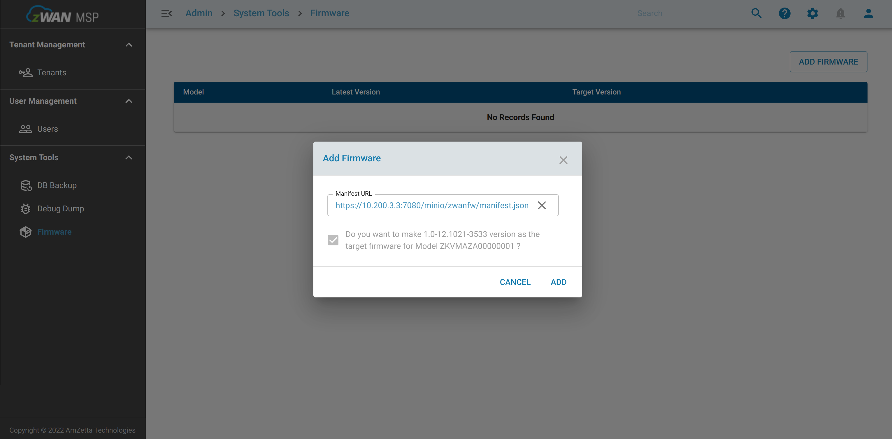 |
| ---------------------------- |

| 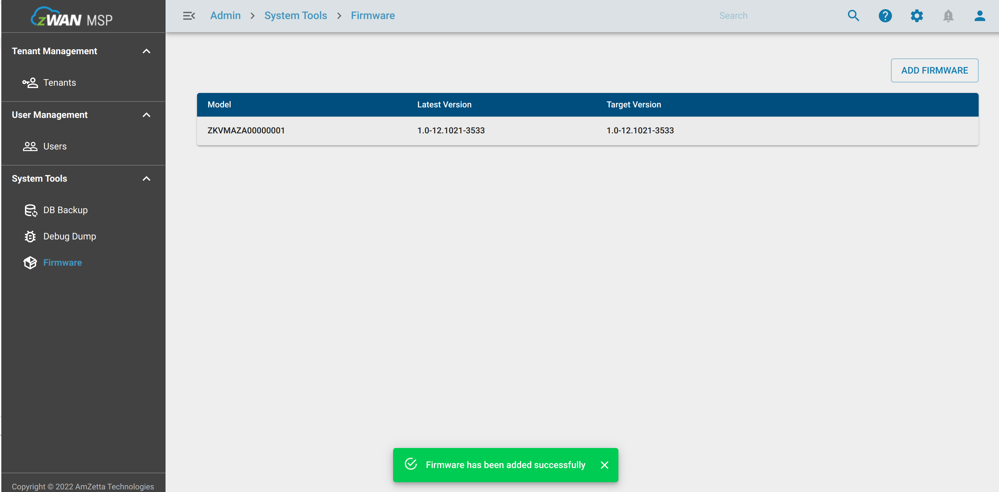 |
| ------------------------------ |

12. Login to the director page. https://<domain-name>:8443/<tenant-name>

| 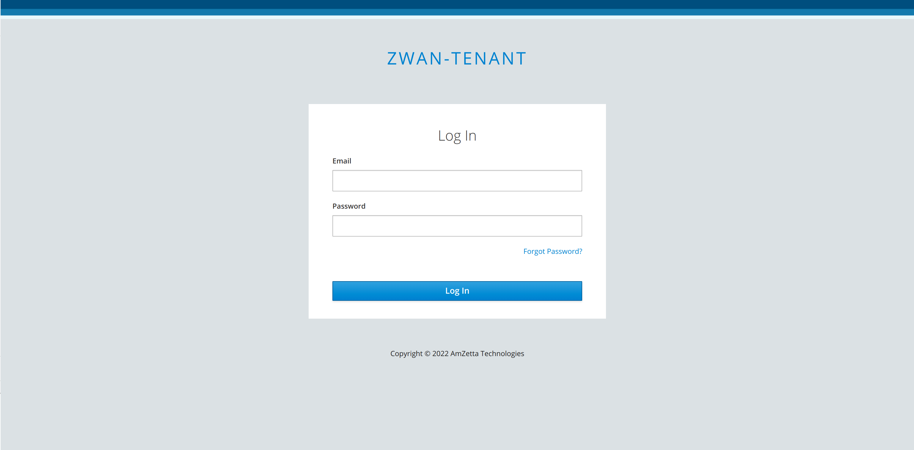 |
| ------------------------------ |

13. Click “Firmware Update” option. In this page following CPE / bananapi details can be viewed.

| CPE / Bananapi Details |
| ---------------------- |
| name                   |
| Model                  |
| Current Version        |
| Target Version         |
| Status                 |
| Retry                  |
| Message                |

14. Verify your “Current Version” of the firmware present in the CPE / bananapi board. In “Target Version”, it should show the version specified in the manifest.json file.

| 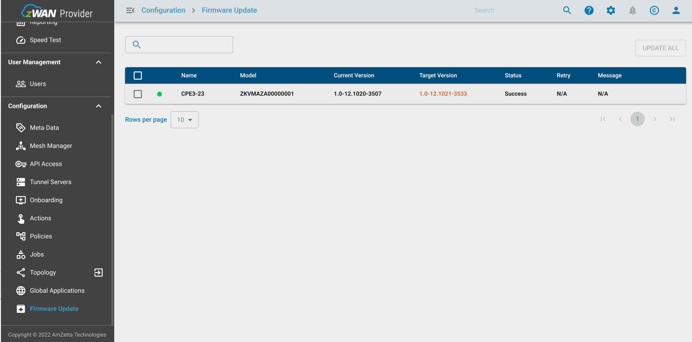 |
| ------------------------------------ |

15. Click on “Update” button to start update to the latest version of firmware. Watch the update status in “Messages” section.

| 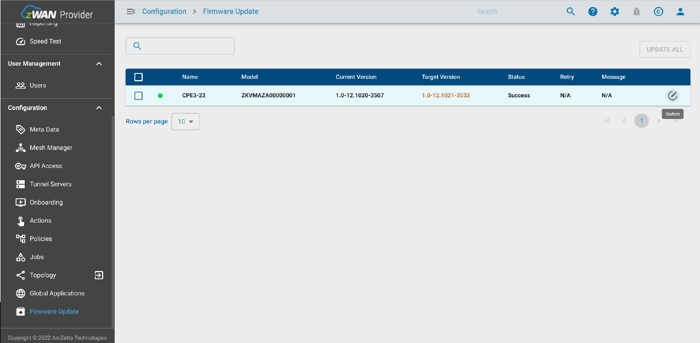 |
| ------------------------------- |

16. After clicking “Update” button, “Update Firmware” dialogue box will be prompted for conformation. Verify the firmware versions and click “Yes”.

|  |
| --------------------------------------- |

## **Download Started State:**

| 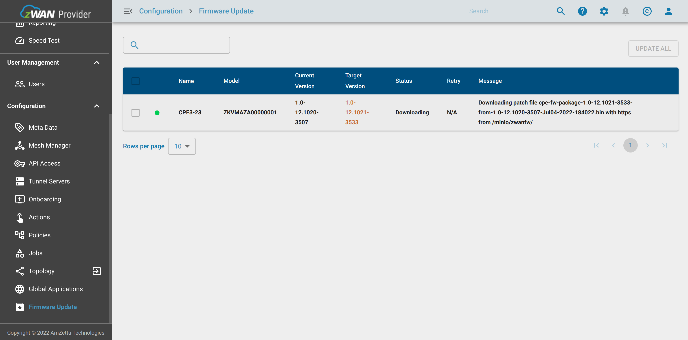 |
| ------------------------------------ |

## **Update Started State:**

| 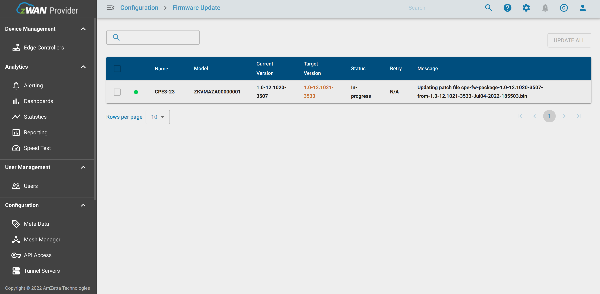 |
| --------------------------------------- |

## **Update Completed:**

| 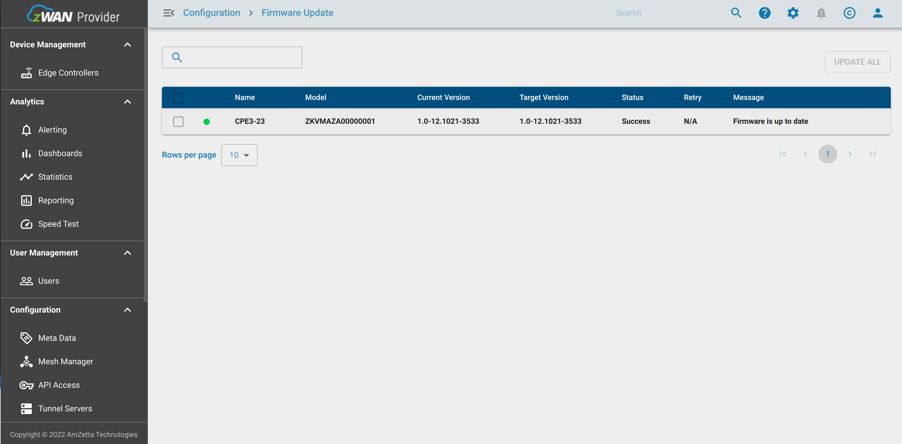 |
| ----------------------------------------- |

17. Check “Current Version” and “Target Version” are same after update “Status” is “Success”.
