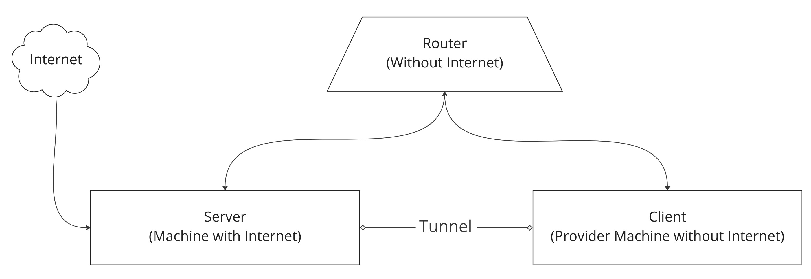

# Offline Internet Tunnel for Deployment

If the target director machine is not exposed to external internet. This document will help to deploy zWAN in that target director machine.



This Offline tunnel setup will have the following,

1. Closed network Router without internet.
2. Server Machine will have both internet and connected to closed network router.
3. Client Machine only connected to above Router, under closed network.

With this setup Internet will be provided from server to client via tunnel.

Tarball Name: offline_tunnel.tar.gz

Tarball files:

1. gen-server-cert.sh
2. gen-client-cert.sh
3. server.sh
4. client.sh
5. EasyRSA-unix-v3.0.6.tgz
6. openvpn_2.4.4-2ubuntu1_amd64.deb
7. resolvconf_1.79ubuntu10.18.04.3_all.deb
8. server_template.tar.gz
9. client_template.tar.gz

Server:

---

1. Copy offline_tunnel.tar.gz to server machine and extract.
2. Run gen-server-cert.sh to genarate the server key and certificate

   **`$ ./gen-server-cert.sh`**

   **Note:** The same offline_tunnel folder should be used for creating the client key and certificate

3. Edit server.sh under "User Configuration" section.

   **`$ vim server.sh`**

4. Specify the Interface name(e.g., eno1) through which internet is provided.

   **`WAN_IFACE='eno1'`**

5. Specify the SERVER_IP and SERVER_NETMASK

   **`SERVER_IP=192.168.100.1`**

   **`SERVER_NETMASK=24`**

6. Save and Run server.sh to create tunnel interface.

   **`$ sudo ./server.sh install`**

7. Verify "zwanvpn" interface created and a Server IPAddress assigned to it.
   Note the Server IPAddress to specify in client side.

   **`$ ip -br a`**

   **`zwanvpn          UNKNOWN        192.168.100.1/24`**

8. Run the following command to remove server tunnel interface.
   **`$ sudo ./server.sh remove`**

## Client:

```
Prerequisites:
  Following Ubuntu packages should installed in client machine.
    *  libpkcs11-helper1
```

1. Copy offline_tunnel folder from server machine to client machine.

   **Note:** We need the same offline_tunnel folder from server. Since the same server CA key and certifcate is needed to create client key and certificate.

2. Run gen-client-cert.sh with needed <client_name> to generate separate key and certificate for every client.

   **`$ ./gen-client-cert.sh <client_name>`**

   a) It will prompt to enter "Common Name". Verify the default Common Name displayed matches above <client_name> and press enter key.

   b) It will prompt to "Confirm request details:". Type "yes" and press enter key.

   **Note:** Create separate key and certificate for every client. Don't use same key and certificate for more than one client.

3. Edit client.sh under "User Configuration" section.
   **`$ vim client.sh`**
4. Specify the Server WAN IP (IP leased by the closed network router).

   **`WAN_IP=192.168.200.100`**

5. Specify the Server VPN tunnel IP.
   **`SERVER_IP=192.168.100.1`**
6. Specify the Client VPN tunnel IP and CLIENT_NETMASK to be assigned.
   **`CLIENT_IP=192.168.100.2`**
   **`CLIENT_NETMASK=24`**
7. Save and Run client.sh to create tunnel interface.

   **`$ sudo ./client.sh install <client_name>`**

8. Verify "zwanvpn" interface created and a Client IPAddress assigned to it.

   **`$ ip -br a`**

   **`zwanvpn          UNKNOWN        192.168.100.2/24`**

9. Verify internet working from the client machine
   **`$ ping google.com`**
10. Run the following command to remove client tunnel interface.

    **`$ sudo ./client.sh remove`**

## Deployment:

Once the server and client VPN tunnel is ready and able to access internet from client. Deployment can be initiated from the server.

**Note:**

Rerun server.sh or client.sh on following scenarios,

1. Machines rebooted
2. Tunnel not extablishing
