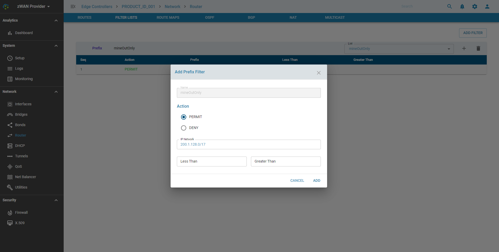
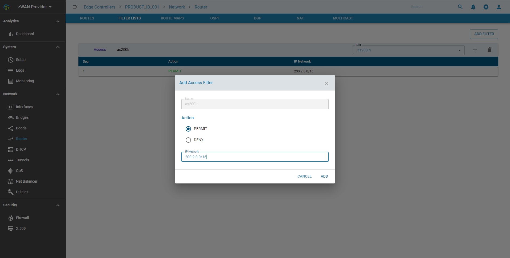

# Filtering

## Overview: 

Filtering is used for both input and output of the routing information. Once a filter is defined, it can be applied in any direction.

## Functionality:

Route Filters can be divided into 2 categories 

    1) Access Lists.
    2) Prefix Lists

Access List entries determine if networks are allowed or denied. Each Access List entry includes an action element (permit or deny) and a filter element based on criteria such as source address, destination address, protocol, and protocol-specific parameters. Access lists are used for packet filters.

Similarly Prefix List entries determine parts of networks which can be allowed or denied. A prefix is a porition of an IP Address, starting from the far left bit of the far left octet. By specifying exactly how many bits of an address belong to a prefix, you can then use prefixes to aggregate addresses and perform some function on them, such as redistribution (filter routing updates). Prefix lists are used for route filters.

Detailed information on each parameter is beyond the scope of the document as is part of understanding Filtering. Information on different configuration parameters can be found http://docs.frrouting.org/en/stable-7.3/filter.html

## Configuration Parameters
    
Add a Prefix List

Add an Access list

## Use Cases:
    
Access and Prefix Lists are mainly used in context with BGP and OSPF. 

## Known Limitations:

NA

## Future:

