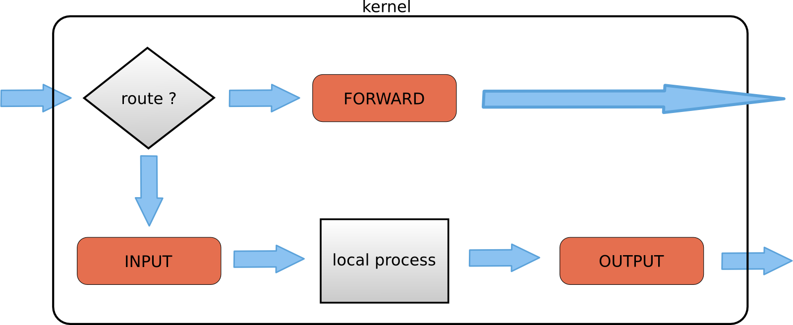
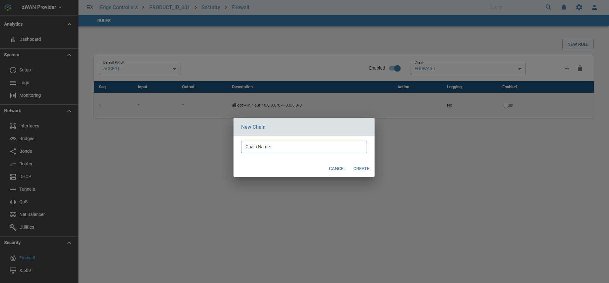
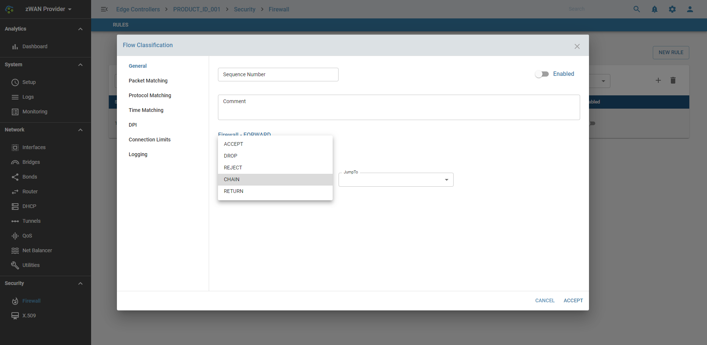
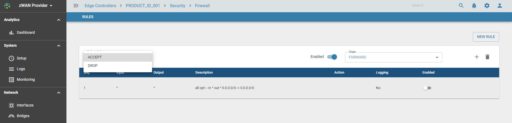

# Overview

Zwan offers a very rudimentary firewall for basic packet filtering. This is done using Netfilter and iptables. Packets can be filtered based on rules/conditions set on the packet headers and their correlation with connections or already transited packets. The default chains INPUT, FORWARD and OUTPUT are available. The ability to add custom or user defined chains which can be the target of the preset ones is also present. 
 
## Functionality

The flow classifier module is used to configure the firewall rules and determining whether to ACCEPT, DROP, REJECT, RETURN or Jump to a user define chain.

Refer flow Classification module for how to set Rules. Rules can be added the chains. System has three default (builtin) chains

Each chain is a list of rules for packets (traffic) that are followed in order.
1. INPUT - rules to determine which inbound traffic will be accepted or denied
2. OUTPUT - rules to determine which outbound traffic will be accepted or denied
3. FORWARD - rules to determine which traffic to be forwarded will be accepted or denied

Note:
*  INPUT chain - packets designated to Edge Controller will be checked against INPUT chain
*  FORWARD chain - packets routed through the Edge Controller will be checked against FORWARD chain
*  OUTPUT chain - packets originated at Edge Controller will be checked against OUTPUT chain
*  User can create Custom chain and add rules to it. Custom chain can be linked with the default Chain mentioned above.

Based on the filter, both incoming and outgoing packets are accepted or dropped. It can jump to a custom chain (which has further rules) before it is accepted or dropped.

### Add Chain

### Add rule

### Action
* Accept – This rule accepts the packets to come through the iptables firewall.
* Drop   – The dropped package is not matched against any further chain. When iptables drop an incoming connection to EC, the system trying to connect does not receive an error. It appears as if the system are trying to connect to a non-existing machine.
* Return – This rule sends the packet back to the originating chain so you can match it against other rules.
* Reject – The iptables firewall rejects a packet and sends an error to the connecting device.
* Chain  - Jump to a Chain which has further rules to check

## Default Policy

If no rule is set for that chain or no decision is made (since no matching rule for the packet in that chain), the sytem will take default policy for that chain, which is either ACCEPT or DROP. If the target is not set explicitly for a rule, the rule will take the default policy for that chain. 

## Usage

Firewall is designed to prevent unauthorized access to or from a Branch network. 

## Known Limitation

*  Upto 999 Rules per Chain
