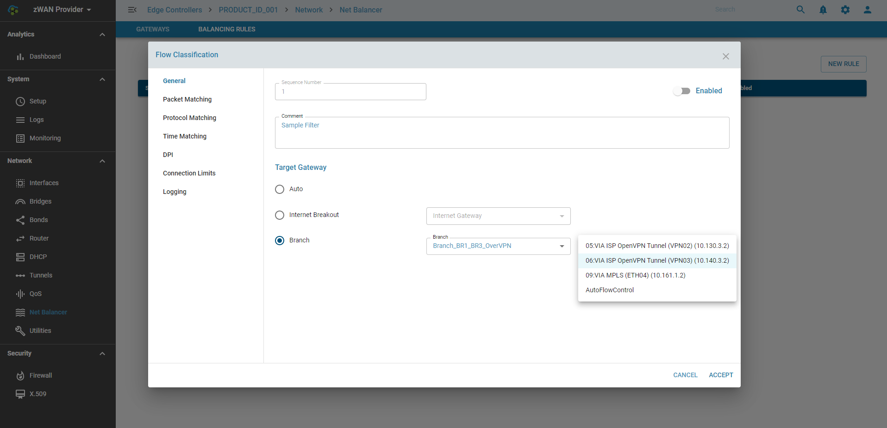

# Flow Classification

## Overview

The basic functionality of the Flow Classification is to apply various filter over network packet and take or assist to take an specific action if the network packets matches the particular rule. 

## Functionality

Flow Classification is used in the following Chains in ZWAN Controller:
1. Flow Optimizer ;  Chain name: NetBalancer
2. Firewall ; Chain name: Forward/Input/Output (or custom chain which is linked to the existing one)
3. Quality of Service (Traffic Shaping) ; Chain name:  QoS

Based on where it is used the target action will vary.  
 
Network Packet  -> Filter -> Action
 
### Routing - Flow Optimization:
In the case of Routing, the filter is applied over incoming packets.  If the packet matches the filter, then the action could be routing the those packet via a specific interface. The interface could be Ethernet Interface (or IPSec Tunnel interface) or an Gateway IP. 
 
### Bandwidth Control - QoS:
In the case of QoS, the output interface for a packet is already decided. Here the filter is used to control certain packet flow bandwidth usage. The target for this rule could be the Class Manager defined in QoS.
 
### Firewall
Based on the filter, both incoming and outgoing packets are accepted or dropped. It can jump to a custom chain (which has further rules) before it is accepted or dropped.

## Configuration Parameters:
 
What are the filters?
* Packet Header: Input Interface, Output interface, Source IP (range), Destination IP (range), Packet size, DSCP mark
* IP Protocol : Protocol number, Source Port (range), Destination  Port (range), TCP flags, ICMP type, 
* Connection State: new, established, related, invalid, untracked, notconnected
* DPI (third and fourth OSI layer)
* L7 (signature matching using regex)
* Time (days of the week and time of the day)
* Connection Limit and Bandwidth Usage etc.

### Support DPI List
* afp
* aimini
* ajp
* amazon
* amazonvideo
* amqp
* anydesk
* apple
* appleicloud
* appleitunes
* applejuice
* applepush
* applestore
* armagetron
* ayiya
* bgp
* bittorrent
* bjnp
* bloomberg
* capwap
* checkmk
* ciscoskinny
* ciscovpn
* citrix
* cloudflare
* cnn
* coap
* collectd
* corba
* crossfire
* csgo
* datasaver
* dce_rpc
* deezer
* dhcp
* dhcpv6
* diameter
* directconnect
* direct_download_link
* dnp3
* dns
* dnscrypt
* dofus
* doh_dot
* drda
* dropbox
* eaq
* ebay
* edonkey
* egp
* facebook
* facebookzero
* fasttrack
* fiesta
* fix
* florensia
* ftp_control
* ftp_data
* git
* github
* gmail
* gnutella
* google
* googledocs
* googledrive
* googlehangoutduo
* googlemaps
* googleplus
* googleservices
* gre
* gtp
* guildwars
* h323
* halflife2
* hotmail
* hotspotshield
* http
* http_activesync
* http_connect
* http_download
* http_proxy
* hulu
* iax
* icecast
* icmp
* icmpv6
* iec60870
* iflix
* igmp
* imap
* imaps
* imo
* instagram
* ip_in_ip
* ipp
* ipsec
* irc
* kakaotalk
* kakaotalk_voice
* kerberos
* kontiki
* lastfm
* ldap
* linkedin
* lisp
* llmnr
* lotusnotes
* maplestory
* mdns
* megaco
* memcached
* messenger
* mgcp
* microsoft
* microsoft365
* mining
* modbus
* mpeg_ts
* mqtt
* ms_onedrive
* mssql-tds
* mysql
* nats
* nestlogsink
* netbios
* netflix
* netflow
* nfs
* nintendo
* noe
* ntop
* ntp
* ocs
* ookla
* opendns
* openft
* openvpn
* oracle
* ospf
* pando_media_booster
* pandora
* pastebin
* playstation
* playstore
* pop3
* pops
* postgresql
* pplive
* ppstream
* pptp
* ps_vue
* qq
* qqlive
* quic
* radius
* rdp
* redis
* remotescan
* rsync
* rtcp
* rtmp
* rtp
* rtsp
* rx
* s7comm
* sap
* sctp
* sflow
* shoutcast
* signal
* sina(weibo)
* sip
* skype
* skypecall
* slack
* smbv1
* smbv23
* smpp
* smtp
* smtps
* snapchat
* snmp
* socks
* someip
* sopcast
* soulseek
* soundcloud
* spotify
* ssdp
* ssh
* starcraft
* stealthnet
* steam
* stun
* syslog
* targus
* teams
* teamspeak
* teamviewer
* telegram
* telnet
* teredo
* tftp
* thunder
* tiktok
* tinc
* tls
* tor
* truphone
* tuenti
* tvuplayer
* twitch
* twitter
* ubntac2
* ubuntuone
* unencrypted_jabber
* upnp
* usenet
* vevo
* vhua
* viber
* vmware
* vnc
* vrrp
* warcraft3
* waze
* webex
* websocket
* wechat
* whatsapp
* whatsappcall
* whatsappfiles
* whois-das
* wikipedia
* windowsupdate
* wireguard
* worldofkungfu
* worldofwarcraft
* xbox
* xdmcp
* yahoo
* youtube
* youtubeupload
* zabbix
* zattoo
* zeromq
* zoom

### Support L7 List
* 100bao : "100bao - a Chinese P2P protocol/program - http://www.100bao.com"
* aim : "AIM - AOL instant messenger (OSCAR and TOC)"
* aimwebcontent : "AIM web content - ads/news content downloaded by AOL Instant Messenger"
* applejuice : "Apple Juice - P2P filesharing - http://www.applejuicenet.de"
* ares : "Ares - P2P filesharing - http://aresgalaxy.sf.net"
* armagetron : "Armagetron Advanced - open source Tron/snake based multiplayer game"
* audiogalaxy : "Audiogalaxy - (defunct) Peer to Peer filesharing"
* battlefield1942 : "Battlefield 1942 - An EA game"
* battlefield2 : "Battlefield 2 - An EA game."
* battlefield2142 : "Battlefield 2142 - An EA game."
* bgp : "BGP - Border Gateway Protocol - RFC 1771"
* biff : "Biff - new mail notification"
* bittorrent : "Bittorrent - P2P filesharing / publishing tool - http://www.bittorrent.com"
* chikka : "Chikka - SMS service which can be used without phones - http://chikka.com"
* cimd : "Computer Interface to Message Distribution :  an SMSC protocol by Nokia"
* ciscovpn : "Cisco VPN - VPN client software to a Cisco VPN server"
* citrix : "Citrix ICA - proprietary remote desktop application - http://citrix.com"
* code_red : "Code Red - a worm that attacks Microsoft IIS web servers"
* counterstrike-source : "Counterstrike (using the new -Source- engine) - network game"
* cvs : "CVS - Concurrent Versions System"
* dayofdefeat-source : "Day of Defeat: Source - game (Half-Life 2 mod) - http://www.valvesoftware.com"
* dazhihui : "Dazhihui - stock analysis and trading; Chinese - http://www.gw.com.cn"
* dhcp : "DHCP - Dynamic Host Configuration Protocol - RFC 1541"
* directconnect : "Direct Connect - P2P filesharing - http://www.neo-modus.com"
* dns : "DNS - Domain Name System - RFC 1035"
* doom3 : "Doom 3 - computer game"
* edonkey : "eDonkey2000 - P2P filesharing - http://edonkey2000.com and others"
* exe : "Executable - Microsoft PE file format."
* fasttrack : "FastTrack - P2P filesharing (Kazaa :  Morpheus :  iMesh :  Grokster :  etc)"
* finger : "Finger - User information server - RFC 1288"
* flash : "Flash - Macromedia Flash."
* freenet : "Freenet - Anonymous information retrieval - http://freenetproject.org"
* ftp : "FTP - File Transfer Protocol - RFC 959"
* gif : "GIF - Popular Image format."
* gkrellm : "Gkrellm - a system monitor - http://gkrellm.net"
* gnucleuslan : "GnucleusLAN - LAN-only P2P filesharing"
* gnutella : "Gnutella - P2P filesharing"
* goboogy : "GoBoogy - a Korean P2P protocol"
* gopher : "Gopher - A precursor to HTTP - RFC 1436"
* gtalk : "GTalk :  a Jabber (XMPP) client"
* guildwars : "Guild Wars - online game - http://guildwars.com"
* h323 : "H.323 - Voice over IP."
* halflife2-deathmatch : "Half-Life 2 Deathmatch - popular computer game"
* hddtemp : "hddtemp - Hard drive temperature reporting"
* hotline : "Hotline - An old P2P filesharing protocol"
* html : "(X)HTML - (Extensible) Hypertext Markup Language - http://w3.org"
* http : "HTTP - HyperText Transfer Protocol - RFC 2616"
* httpaudio : "HTTP - Audio over HyperText Transfer Protocol (RFC 2616)"
* httpcachehit : "HTTP - Proxy Cache hit for HyperText Transfer Protocol (RFC 2616)"
* httpcachemiss : "HTTP - Proxy Cache miss for HyperText Transfer Protocol (RFC 2616)"
* http-dap : "HTTP by Download Accelerator Plus - http://www.speedbit.com"
* http-freshdownload : "HTTP by Fresh Download - http://www.freshdevices.com"
* http-itunes : "HTTP - iTunes (Apple's music program)"
* http-rtsp : "RTSP tunneled within HTTP"
* httpvideo : "HTTP - Video over HyperText Transfer Protocol (RFC 2616)"
* ident : "Ident - Identification Protocol - RFC 1413"
* imap : "IMAP - Internet Message Access Protocol (A common e-mail protocol)"
* imesh : "iMesh - the native protocol of iMesh :  a P2P application - http://imesh.com"
* ipp : "IP printing - a new standard for UNIX printing - RFC 2911"
* irc : "IRC - Internet Relay Chat - RFC 1459"
* jabber : "Jabber (XMPP) - open instant messenger protocol - RFC 3920 - http://jabber.org"
* jpeg : "JPEG - Joint Picture Expert Group image format."
* kugoo : "KuGoo - a Chinese P2P program - http://www.kugoo.com"
* live365 : "live365 - An Internet radio site - http://live365.com"
* liveforspeed : "Live For Speed - A racing game."
* lpd : "LPD - Line Printer Daemon Protocol (old-style UNIX printing) - RFC 1179"
* mohaa : "Medal of Honor Allied Assault - an Electronic Arts game"
* mp3 : "MP3 - Moving Picture Experts Group Audio Layer III"
* msn-filetransfer : "MSN (Micosoft Network) Messenger file transfers (MSNFTP and MSNSLP)"
* msnmessenger : "MSN Messenger - Microsoft Network chat client"
* mute : "MUTE - P2P filesharing - http://mute-net.sourceforge.net"
* napster : "Napster - P2P filesharing"
* nbns : "NBNS - NetBIOS name service"
* ncp : "NCP - Novell Core Protocol"
* netbios : "NetBIOS - Network Basic Input Output System"
* nimda : "Nimda - a worm that attacks Microsoft IIS web servers :  and MORE!"
* nntp : "NNTP - Network News Transfer Protocol - RFCs 977 and 2980"
* ntp : "(S)NTP - (Simple) Network Time Protocol - RFCs 1305 and 2030"
* ogg : "Ogg - Ogg Vorbis music format (not any ogg file :  just vorbis)"
* openft : "OpenFT - P2P filesharing (implemented in giFT library)"
* pcanywhere : "pcAnywhere - Symantec remote access program"
* pdf : "PDF - Portable Document Format - Postscript-like format by Adobe"
* perl : "Perl - A scripting language by Larry Wall."
* png : "PNG - Portable Network Graphics :  a popular image format"
* poco : "POCO and PP365 - Chinese P2P filesharing - http://pp365.com http://poco.cn"
* pop3 : "POP3 - Post Office Protocol version 3 (popular e-mail protocol) - RFC 1939"
* postscript : "Postscript - Printing Language"
* pplive : "PPLive - Chinese P2P streaming video - http://pplive.com"
* pressplay : "pressplay - A legal music distribution site - http://pressplay.com"
* qq : "Tencent QQ Protocol - Chinese instant messenger protocol - http://www.qq.com"
* quake1 : "Quake 1 - A popular computer game."
* quake-halflife : "Half Life 1 engine games (HL 1 :  Quake 2/3/World :  Counterstrike 1.6 :  etc.)"
* quicktime : "Quicktime HTTP"
* radmin : "Famatech Remote Administrator - remote desktop for MS Windows"
* rar : "RAR - The WinRAR archive format"
* rdp : "RDP - Remote Desktop Protocol (used in Windows Terminal Services)"
* replaytv-ivs : "ReplayTV Internet Video Sharing - Digital Video Recorder - http://replaytv.com"
* rlogin : "rlogin - remote login - RFC 1282"
* rpm : "RPM - Redhat Package Management packages"
* rtf : "RTF - Rich Text Format - an open document format"
* rtp : "RTP - Real-time Transport Protocol - RFC 3550"
* rtsp : "RTSP - Real Time Streaming Protocol - http://www.rtsp.org - RFC 2326"
* runesofmagic : "Runes of Magic - game - http://www.runesofmagic.com"
* shoutcast : "Shoutcast and Icecast - streaming audio"
* sip : "SIP - Session Initiation Protocol - Internet telephony - RFC 3261 :  3265 :  etc."
* skypeout : "Skype to phone - UDP voice call (program to POTS phone) - http://skype.com"
* skypetoskype : "Skype to Skype - UDP voice call (program to program) - http://skype.com"
* smb : "Samba/SMB - Server Message Block - Microsoft Windows filesharing"
* smtp : "SMTP - Simple Mail Transfer Protocol - RFC 2821 (See also RFC 1869)"
* snmp : "SNMP - Simple Network Management Protocol - RFC 1157"
* snmp-mon : "SNMP Monitoring - Simple Network Management Protocol (RFC1157)"
* snmp-trap : "SNMP Traps - Simple Network Management Protocol (RFC1157)"
* socks : "SOCKS Version 5 - Firewall traversal protocol - RFC 1928"
* soribada : "Soribada - A Korean P2P filesharing program/protocol - http://www.soribada.com"
* soulseek : "Soulseek - P2P filesharing - http://slsknet.org"
* ssdp : "SSDP - Simple Service Discovery Protocol - easy discovery of network devices"
* ssh : "SSH - Secure SHell"
* ssl : "SSL and TLS - Secure Socket Layer / Transport Layer Security - RFC 2246"
* stun : "STUN - Simple Traversal of UDP Through NAT - RFC 3489"
* subspace : "Subspace - 2D asteroids-style space game - http://sscentral.com"
* subversion : "Subversion - a version control system"
* tar : "Tar - tape archive. Standard UNIX file archiver :  not just for tapes."
* teamfortress2 : "Team Fortress 2 - network game - http://www.valvesoftware.com"
* teamspeak : "TeamSpeak - VoIP application - http://goteamspeak.com"
* telnet : "Telnet - Insecure remote login - RFC 854"
* tesla : "Tesla Advanced Communication - P2P filesharing (?)"
* tftp : "TFTP - Trivial File Transfer Protocol - used for bootstrapping - RFC 1350"
* thecircle : "The Circle - P2P application - http://thecircle.org.au"
* tonghuashun : "Tonghuashun - stock analysis and trading; Chinese - http://www.10jqka.com.cn"
* tor : "Tor - The Onion Router - used for anonymization - http://tor.eff.org"
* tsp : "TSP - Berkely UNIX Time Synchronization Protocol"
* unknown : "Unknown - Dummy pattern for old unmatched connections."
* unset : "Unset - Dummy pattern for unmatched connections that are still being tested"
* uucp : "UUCP - Unix to Unix Copy"
* validcertssl : "Valid certificate SSL"
* ventrilo : "Ventrilo - VoIP - http://ventrilo.com"
* vnc : "VNC - Virtual Network Computing. Also known as RFB - Remote Frame Buffer"
* whois : "Whois - query/response system :  usually used for domain name info - RFC 3912"
* worldofwarcraft : "World of Warcraft - popular network game - http://blizzard.com/"
* x11 : "X Windows Version 11 - Networked GUI system used in most Unices"
* xboxlive : "XBox Live - Console gaming"
* xunlei : "Xunlei - Chinese P2P filesharing - http://xunlei.com"
* yahoo : "Yahoo messenger - an instant messenger protocol - http://yahoo.com"
* zip : "ZIP - (PK|Win)Zip archive format"
* zmaap : "ZMAAP - Zeroconf Multicast Address Allocation Protocol"

### Flow Classification 

**Notes:**
* Can Enable/Disable a rule/filter 
* Can Sequence the order or rule/filter
* Lower Sequence is exercised first.

## Expected behaviour in the system:
Once a rule is successfully created (and enabled), the rule will be immeddiately applied on the network packets. Depends on where it is used, it will take the approprate action.

## Known Limitation
*  Currently only 999 rules can be added to a Chain

