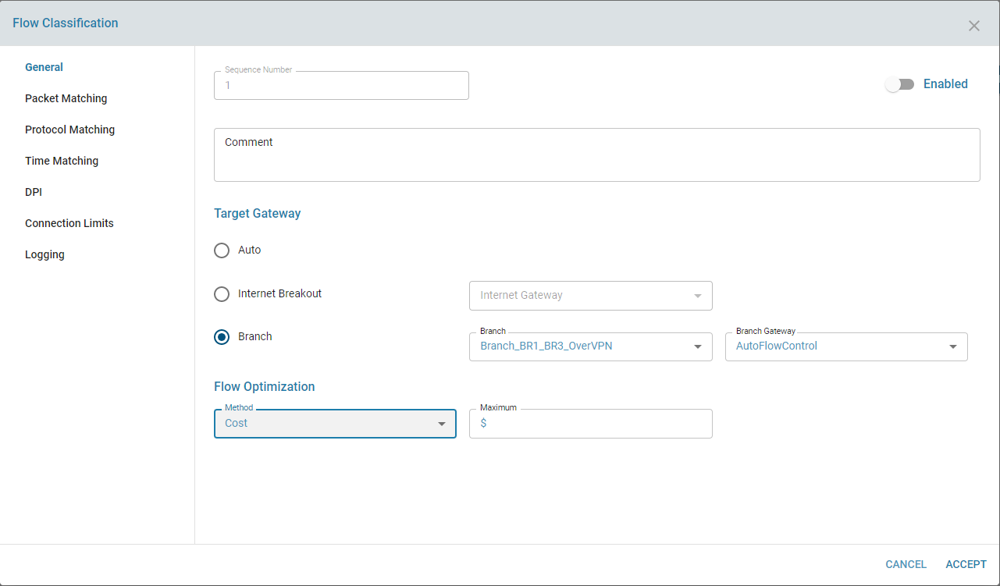

# Flow Optimizer

## Overview:

Flow optimizer works along with Traffic Steering and Flow Classification. Based on rules specified in Flow classification and based on Branch selected (Traffic Steering using  Load Balancer), Flow optimizer will automatically select the best path for a flow at a given time. 
 
## Functionality

The Auto Flow control could be based on line performance (with respect to latency, jitter, packet loss) or path affinity or available bandwidth or cost of the link at that given time. 
 
### Line Performance:
Each Branch to branch communication can happen over multiple path as defined in Load Balancer. Each path can encounter latency, jitter or packet loss arbitrarily somewhere in the connection between two branches. Whenever the disturbance in the path exceeds certain threshold set by the flow rule, it can reduce the quality of experience for those flow which uses that particular path at that time.  
 
Flow Optimizer, using TWAMP, constantly measures latency, jitter and packet loss between two endpoint of the connection. The connection could be SSL VPN tunnel, IPSEC tunnel, MPLS endpoints. The TWAMP results are updated time to time for all the connections exists in the SDWAN mesh topology.  For each connection, flow optimizer check the TWAMP result against the threshold limit for each flow that uses this connection currently. If the TWAMP result is within the threshold limit, no action is needed. If the TWAMP result exceeds the threshold limit, then flow optimizer looks for other connection (from the load balancer connection list) that satisfy the threshold limit for the affected flow. If a better path is found, flow optimizer will automatically change the flow to use the better connection (Gateway). 
 

 
 
 
### Path Affinity
 
The flow can be based on path preference. For each flow (rule), the order of path preference can be set. Flow optimizer will always try to use the first available path from the list. At given time, only if the paths in top order are down, it will use the next available path from the list. 
 

 
 
### Bandwidth
 
Flow optimizer uses the path that best satisfy the bandwidth requirement for that flow. If the available bandwidth of the path changes, then flow optimizer checks and dynamically changes the path for that flow so that its bandwidth requirement are met at its best.
 

 
### Cost
 
Based on Cost of the path, the flow optimizer can be adjust the flow to a particular path. 

## Expected behaviour in the system:
Once the filter and flow optimization parameters are configured, the service in the Orchestration server will select the appropriate network path. The current network path (**Gateway**) will be seen in the Balacing Rules.

It uses following Twamp result to make the decision:

Avereage outbound Latency, Outbound Jitter and Outbound Packetloss

## Known Limitation

* Current only flow optimization based on performance parameter is implemented. 
* Within performance parameter, currently the one with highest weight will be honored. Currently it does not try to homor all the parameters even though there is such a path exists.
* Bandwidth, cost, path affinity are not implemented

