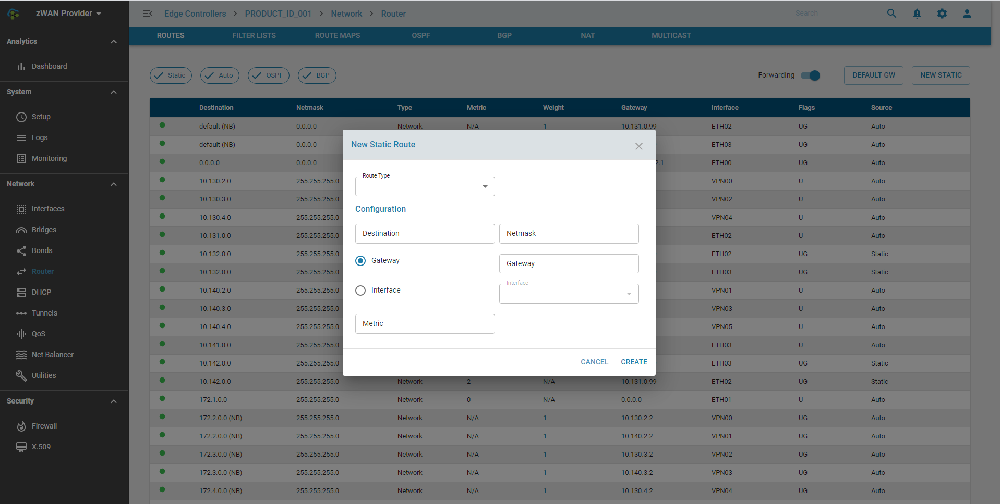

# Gateway

## Overview: 

A gateway is a router or a piece of networking hardware in a computer network, a key stopping point for data on its way to or from other networks.

## Functionality:

The following functionalities are supported

    1) Adding a default gateway
    2) Add and Delete a static route
    3) Listing of routes related to Auto, Static, OSPF, and BGP
    4) Enabling IP Forwarding

## Configuration Parameters

### Add a default gateway

### Add a Static Route

### List the routes from different protocols and IP Forwarding

## Use Cases:
    

## Known Limitations:

- Only **99** Static Routes can be created per ZWAN controller

## Future:

