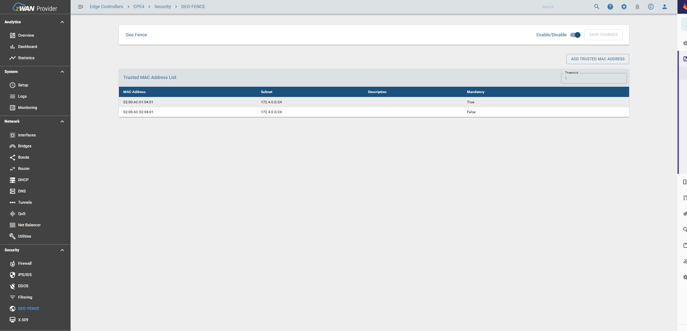
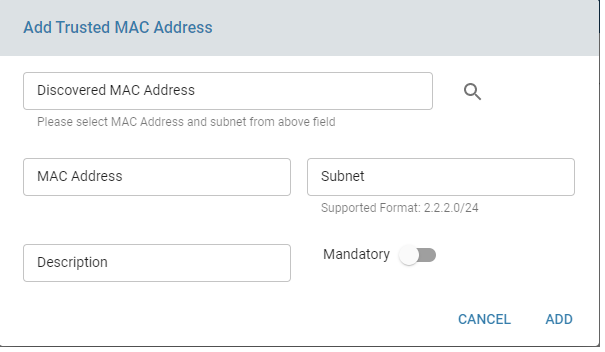
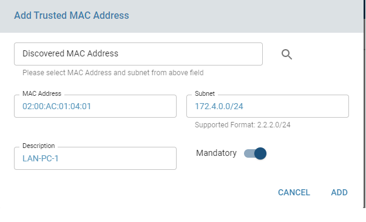
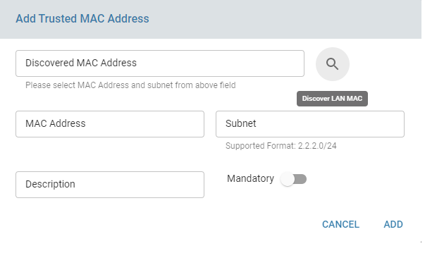
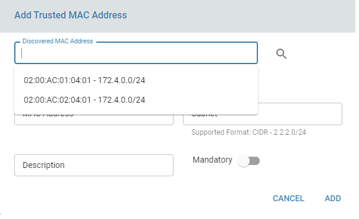
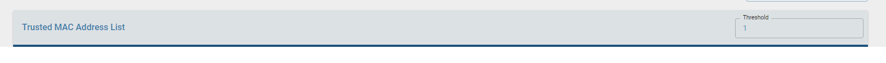
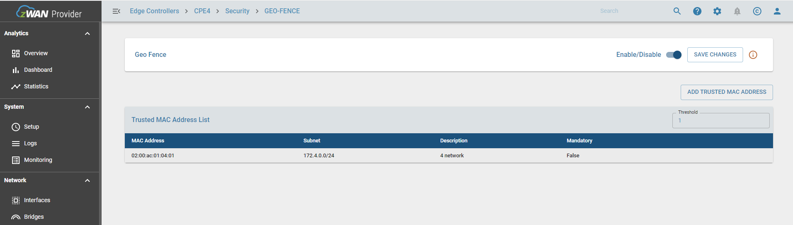
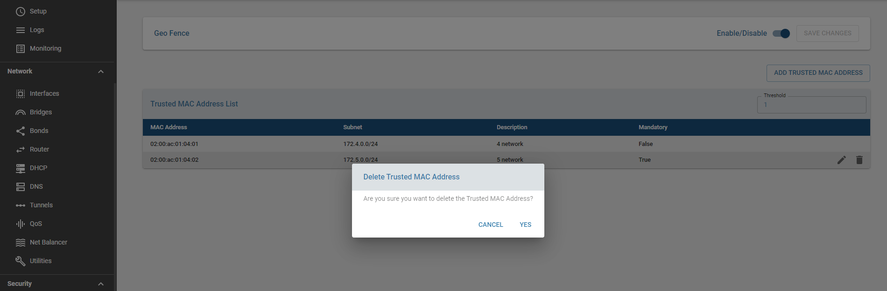
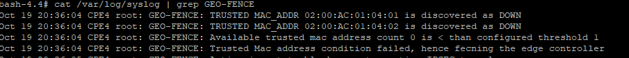
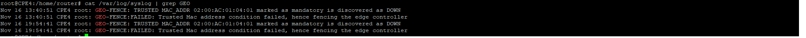

# GEO-FENCE

Geo Fencing is a security feature to create a virtual boundary region for a networking device to operate normally. If the virtual boundary condition is somehow compromised or not satisfied, the device should fence (functionality should be stopped). 

## Overview

Geofence is a virtual boundary for a real-world geographic area. It can be used enforced using different methods. The feature can be enabled by using WiFi based, GPS based, LTE based, or Trusted Mac address based. For now, we have implemented only Trusted Mac Address based geo fencing feature. This feature comes under the Security section and currently is only exercised during boot up of the edge controller.

Trusted mac based geo-fencing is triggered based on the following two conditions during boot up time.
1) If any one of the mandatory mac trusted mac address is not discovered.
2) If the number of trusted mac addresses added is less than the threshold mac address count configured.

## Functionality

For any changes in trusted mac address config, "SAVE CHANGES" to be executed.

The main functionalities include

   ### Enable/Disable Geo-Fence

   Enabling Geo-fence functionality can ve done by using enable button. This enables the geo-fence function, but under one condition. There should atleast one geo-fencing feature mode configured. So for now, atleast one trusted mac address should be added to the configuration.
   
   

   ###  Add Trusted MAC address

   Trusted Mac address can be added by clicking on the add trusted mac address button. A new dialog box opens up as follows.

 
   
   Two options are currently available to add trusted mac addresses

   1) Manual Entry of Trusted Mac address
      
   The required fileds are Mac address and Subnet in which the an IP is assigned to that Mac Address. An optional field of mandatory is added. If mandatory option is selected, then during reboot if the mandatory mac address is not discovered, geo-fencing will be triggered and the data path through the router will be closed.

   

   2) Discover Local LAN MAC address and select from the discovered list. OThe discovery process can take time as it depends on the number of LAN networks and number of systems in each network.A message will be displayed noting that discovery is in progress once discovery is initiated. Once discovery is complete, user can click on "Discovered Mac Address" text field and a drop down list will be displayed. User can select the desired mac address and its subnet and it auto populates the mac adress and subnet field in the dailog.

Once the mac address is added, user may need to click on add trusted mac address button to add more mac address to the trusted mac address field. 

Similary there is a threshold count field in the trusted mac config and if the threshold number of macs are not discovered, the data paths will be shutdown on the edge controller. User can change the threshold count, but it should be always equal to or less than the number of mac address added to trusted mac address list.

Only once save changes is clicked, the config will be applied on the edge controller.An warning icon will be displayed to denote that changes are not saved and prompting user to apply/save the changes.

   ### Delete MAC Address from the list

   The user can delete a mac address which is already added by selecting it and using the remove button as shown in the screenshot below. Once again changes will be applied only after clicking save changes after confirming the delete.

## Result

Once the trusted mac address is configured the page will resemble the below screenshot.

After a reboot if any of the trusted mac address condition is not met, the system will generate an alert if alert is configured and also notified in ELK dashboard. The CPE log will also log the following messages.

Log when mandatory trusted mac address is down

## Known Limitations

Feature is only supported for Trusted Mac address.
Feature will be only executed across reboot.

## Future Enhancements
Other geo-fencing features such as Wifi based, LTE based.