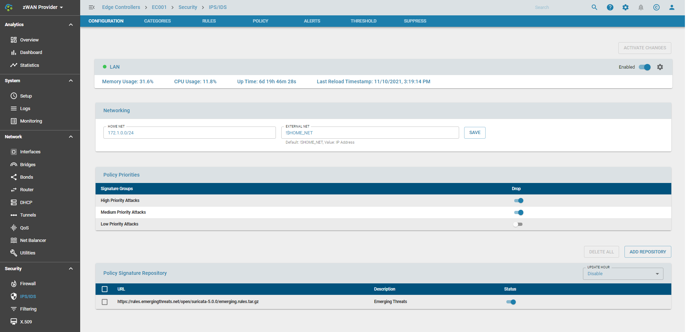

# IPS

## Overview: 

An intrusion prevention system is a form of network security system that works to detect and prevent known threats based on IPaddresses, patterns, protocols etc.. It can detect different type of attacks from different exploits, malware, viruses, worms etc.. 

Suricata Open-source is integrated with the EC stack. It is a high performance Network IDS, IPS and Network Security Monitoring Engine. It can be configured as a Intrusion Detection System (IDS) or a Intrusion Prevention System (IPS). 

These systems consume more memory and CPU as they have to analyze multiple streams and every packet flow. So its recommended that it be used in systems with atleast 2GB of RAM.

## Functionality:

1) IPS/IDS can be enabled or disabled on a global level. 
2) zWAN IPS/IDS monitors only the LAN Internet Traffic. It is taken that the firewall INPUT policy would be defaulted to DROP mode.
3) Tunnel traffic or B2B is treated as trusted by default and not monitored by the IPS/IDS service.
4) Specify fine grained Networking subnets to monitor within the LAN domain.
5) Import Signature repositories from different URLs either user given or from the provider at a given hour of the day or whenever a manual reload is triggered.
6) Specifying global policies which alert/drop for different type of attacks. Attacks are categorized into High, Medium and Low. High and Medium is recommended to be always set to drop mode. 
7) Policies can be defined based on a wide range of categories. A category can be enabled or disabled and the action can be set to alert or drop. Categories can be malware, phishing, exploit etc..
8) Policy states, action, description, protocol and ports can be viewed and tuned on a fine grained level.
9) Policies be defined based on regex match with rules or indivudal signature ids.
10) Alerts for a single day can be viewed or historical alerts can be viewed from OpenDistro
11) Thresholds can be set for alerts either globally or for induvidual signature ids.
12) Alerts can be suppressed
13) Prevent traffic from being scanned based on specific parameters. This also help in troubleshooting.
14) Ingress/Egress interfaces can be defined by the user in custom configurations

## Configuration Parameters

### IPS Configuration

It shows the current running status of the IPS. It can be running, reloading or in failed state. It also displays the last time a policies or signature database was reloaded. 
Whenever a change has been performed via any policy override, category, threshold, or suppress, the changes need to be activated by using the Activate Changes Button. 
It is strongly recommended that all the required changes are made together and finally click on activate changes. Clicking on Activate changes multiple times will force the IPS daemon to be reloaded often. When changes are being reloaded, policy changes are prevented for a short amount of time. It takes about 60 - 120 seconds or more for changes to get activated. 

### Configure Networking

HOME_NET is defined normally as the LAN subnet. So here the user would enter the subnet of the LAN interface.
EXTERNAL_NET is defined as all subnets other than the LAN subnet or HOME_NET. Since Internet has a large domain, it is recommended to keep the external subnet to !$HOME_NET

### Policy Priorities

Attacks are categorized into High, Medium and Low. High and Medium is recommended to be always set to DROP mode. By default all attacks will be alerted. If Drop is selected then it would both alert and drop. Dropping Low priority may have unintended effects so it can be further tuned based on environments. For example any ping traffic will be dropped.

### Advanced Settings

The queue settings can be modified when multiple cores are available on the hardware. It defaults to just 1 core at startup.

If Live Policy Reload has been selected, then the policies are reloaded live. If not the daemon is stopped and then started. Live Policy Reload is recommended only if the hardware has atleast 2GB of RAM.

### Policy Signature Repository

One or more signature repositories can be imported. These are specified using a URL. It is recommended that policies downloaded from Provider. The policies have to uploaded to the provider before it is configured. The signatures get downloaded either on a daily basis or a particular hour of the day or when a manual reload is triggered due to change in policies.
The below URL can be used to download the  ruleset from emerging threats if the EC has internet access. Please note that since this is an opensource URL, it may not be validated for an accurate ruleset and loading the daemon could fail. This can be used for testing. 
https://rules.emergingthreats.net/open/suricata-5.0.0/emerging.rules.tar.gz

### Categories

Signatures or Attacks are also classified based on categories. There are close to about 70 or more categories. They can be enabled or disabled or dropped either all together or on an induvidual basis. More information about each category can be found in https://tools.emergingthreats.net/docs/ETPro%20Rule%20Categories.pdf

### Rules

All the induvidual rules are listed here. There are about 30000+ rules of which over 23000 are enabled by default and in alert mode. Based on the priority attacks it is changed to DROP mode. The state of the rule can be seen. They can be either Enabled/Disabled/User Enabled/User Disabled.
The action can either be alert or drop
Signature ID is more commonly known as SID. 
Message explains further about the policy/attack
Protocol, Source/Destination Address and Ports give more detail on how the attack is detected.

The Rules can be filtered based on categories or priorities

### Policy

Here the rules can be overrided on a category level or based on induvidual SIDs. 
The order of application of policies are disable, enable and drop. So if a category is set to globally disabled and some SIDS have been enabled and action to drop, then those policies would get enabled. A policy can be enabled/disabled. Further more the default action of a policy can be changed to drop.

### Adding a Policy

Policies can be added to override the existing rule actions or state. These can be based on a regex, sid or a category/group

For example adding a regex to drop all the http rules if http traffic is not allowed by a firewall in front of us.

### Alerts

This page lists the alerts based on the policies/attacks which we detected. It give very fine grained details on the attack. The alerts show the data upto the last log rotation or last day. This is just a quick reference if a user wants to set a threshold or suppress an alert based on an attack which is happening at the moment. A threshold can be set for an alert using the + icon and a suppress can be set for an alert using x icon. Historical alerts can be viewed in OpenDistro

### Thresholds

Thresholds for alerts can be set on a global level or induvidual policy level. If an alert is triggered always then a specific threshold can be added for the same. Different type of threshold can be set, either based on threshold, limit or both. The alert can be triggered based on tracking by source or destination.

### Suppress

An alert for the policy can be suppressed if the requirement arises. The policy action is still enforced if its drop. The alert can be suppressed based on tracking by source or destination or even by a particular IP Network.

### Bypass Rules

In some scenarios, good traffic could get wrongly detected and blocked by IPS. In these scenarios, you can bypass those traffic from being directed to IPS. This is based on application, protocol or port or ip etc.. For example Microsoft strongly recommends that MSTeams related traffic be bypassed from scanning. So this configuration setting similar to a firewall rule, allows to add rules to bypass packets being scanned by IPS based on defined parameters. 

### Ingress and Egress Interfaces

IPS can be configured in 2 modes. Based on the mode the ingress and egress interfaces are chosen automatically or by the user

1) DEFAULT : In this mode, any WAN traffic which flows from the WAN interfaces (ingress) and gets forwarded to the LAN interfaces (egress) get scanned by IPS. This traffic is predominantly internet traffic from where the attacks originate.

2) CUSTOM : In this mode, the user is given the option to choose the Ingress and Egress Interfaces. This is mainly used in DC when the Internet traffic is routed via an interface connected to the DMZ (ingress interface) which then goes to a separate gateway. Since edge controllers may be limited in CPU and memory bandwidth, the user may decide to have IPS running centrally in the DC where processing power is easily available and can be added on demand. In this scenario all traffic including Internet from the EC's are routed to the DC and then out to the Internet. The return traffic is now sent to the EC's via their respective tunnels (VPN or VTI etc..) which would be categorized the egress interfaces.

For further documentation and information please refer the Suricata documentation or the videos.

https://suricata.readthedocs.io/en/suricata-6.0.0/what-is-suricata.html

## Use Cases:

IPS and IDS

## Known Limitations:

## Future:

