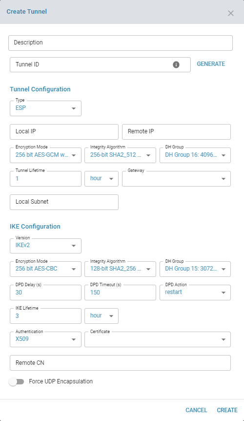

# IPSEC

## Overview:

IPsec is a framework of related protocols that secure communications at the network or packet processing layer. It can be used to protect one or more data flows between peers. IPsec enables data confidentiality, integrity, and authenticity of data communications across a public network.  IPsec provides a necessary component of a standards-based, flexible solution for deploying a network-wide security policy.

IPsec's method of protecting IP datagrams takes the following forms:

    - Data origin authentication
    - Connectionless data integrity authentication
    - Data content confidentiality
    - Anti-replay protection
    - Limited traffic flow confidentiality

IPSec consists of two main protocols:

### Authentication Header (AH):

In this protocol, IP header and data payload is hashed. From this hash, a new AH header is build which is appended to the packet. This new packet is transmitted via router where the router hashes the header and the payload. Both the hashes need to be exactly matched. Even a single bit is changed, the AH header will not match.

### Encapsulating Security Paylaod (ESP):

This is a security protocol to provide encryption and integrity to the data packets. The ESP is added after the standard IP header. As it contains standard IP header, it can be routed easily with standard IP devices. This makes it backwards-compatible with IP routers and even those devices that were not designed to operate with IPsec. ESP is performed at the IP packet layer. **It contains six parts of which two parts are only authenticated** _(Security Parameter Index, Sequence Number)_ **whereas the rest of the four parts are encrypted during transmission** _(Payload Data, Padding, Pad Length and Next Header)_. It supports multiple encryption protocols and is up to the user to decide which one to opt.

## Encryption Technologies

Generally IPsec supports two encryption modes.  Both modes have their own uses and should be used with caution depending upon the solution.

### Tunnel Mode:

This encrypts both the payload and the header. IPsec in tunnel mode is used when the destination of the packet is different than the security termination point. The most common use of this mode is between gateways or from end station to gateway. The gateway serves as a proxy for the hosts. So when the origin of the packets differs from the device that is providing security, tunnel mode is used.

### Transport Mode:

In this encryption mode, only the data portion of each packet is encrypted. This mode is applicable between end stations or between end station and gateway.

Our solution supports only **Tunnel** Mode.

## Internet Key Exchange (IKE) Security Protocol:

The Internet Key Exchange (IKE) provides security association management. IKE authenticates each peer in an IPsec transaction, negotiates security policy, and handles the exchange of session keys.

### IKE provides four capabilities:

    - Provides the means for parties to agree on which protocols, algorithms, and keys to use.
    - Ensures from the beginning of the exchange that you are talking to the right person.
    - Manages those keys after they have been agreed upon.
    - Ensures that key exchanges are handled safely.

_IKE is expected to continue to negotiate SAs and exchange keys automatically through public networks._

### IKE functions in two phases:

- **Phase 1:** Two IKE peers establish a secure channel for performing ISAKMP operations.
- **Phase 2:** The two peers negotiate general purpose security associations.

IKE provides two modes for the exchange of keying information and setting up IKE security associations.

    - Main mode [_Default_]
    - Aggressive Mode

### IKE LifeTime

How long the keying channel of a connection (ISAKMP or IKE SA) should last before being renegotiated.

**Default value:** _3h_

### Tunnel Lifetime

IPsec VPNs using IKE utilize lifetimes to control when a tunnel will need to re-establish. 
How long a particular instance of a connection (a set of encryption/authentication keys for user packets) should last, from successful negotiation to expiry; acceptable values are an integer optionally followed by s (a time in seconds) or a decimal number followed by m, h, or d (a time in minutes, hours, or days respectively) (default 1h, maximum 24h). Normally, the connection is renegotiated (via the
keying channel) before it expires (see margintime). The two ends need not exactly agree on lifetime, although if they
do not, there will be some clutter of superseded connections on the end which thinks the lifetime is longer.

**Default value:** _1h_

#### Recomended values for IKE and Tunnel lifetime
- IKE Phase -1 (ISAKMP) life time should be greater than IKE Phase-2 (Tunnel ) life time
- 3h (3 hour) is a common default and is normal value for Phase 1 and 1h (1 hour) is a common value for Phase 2

## Dead Peer Detection [DPD]

Dead Peer Detection (DPD) is a method of detecting a dead Internet Key Exchange (IKE) peer. The method uses IPsec traffic patterns to minimize the number of messages required to confirm the availability of a peer. DPD is used to reclaim the lost resources in case a peer is found dead and it is also used to perform IKE peer failover.

### DPD Delay

Defines the period time interval with which R_U_THERE messages/INFORMATIONAL exchanges are sent to the peer.  These are only sent if no other traffic is received. In IKEv2, a value of 0 sends no additional INFORMATIONAL messages and uses only standard messages (such as those to rekey) to detect dead peers.

**Default value:** _30s_

### DPD Timeout

Defines the timeout interval, after which all connections to a peer are deleted in case of inactivity.  This only applies to IKEv1, in IKEv2 the default retransmission timeout applies, as every exchange is used to detect dead peers.

**Default value:** _150s_

### DPD Action

Controls the use of the Dead Peer Detection protocol where R_U_THERE notification messages (IKEv1) or empty INFORMATIONAL messages (IKEv2) are periodically sent in order to check the liveliness of the IPsec peer. The values clear, hold, and restart all activate DPD and determine the action to perform on a timeout.  With clear the connection is closed with no further actions taken. hold installs a trap policy, which will catch matching traffic and tries to re-negotiate the connection on demand. restart will immediately trigger an attempt to re-negotiate the connection.

**Default value:** _none_ [disables the active sending of DPD messages]





## Supported Encryption Algorithm:

    Null encryption
    168 bit 3DES-EDE-CBC
    128 bit Blowfish-CBC
    192 bit Blowfish-CBC
    256 bit Blowfish-CBC
    128 bit AES-CBC
    192 bit AES-CBC
    256 bit AES-CBC
    128 bit AES-COUNTER
    192 bit AES-COUNTER
    256 bit AES-COUNTER
    128 bit AES-CCM with 64 bit ICV
    192 bit AES-CCM with 64 bit ICV
    256 bit AES-CCM with 64 bit ICV
    128 bit AES-CCM with 96 bit ICV
    192 bit AES-CCM with 96 bit ICV
    256 bit AES-CCM with 96 bit ICV
    128 bit AES-CCM with 128 bit ICV
    192 bit AES-CCM with 128 bit ICV
    256 bit AES-CCM with 128 bit ICV
    128 bit AES-GCM with 64 bit ICV
    192 bit AES-GCM with 64 bit ICV
    256 bit AES-GCM with 64 bit ICV
    128 bit AES-GCM with 96 bit ICV
    192 bit AES-GCM with 96 bit ICV
    256 bit AES-GCM with 96 bit ICV
    128 bit AES-GCM with 128 bit ICV
    192 bit AES-GCM with 128 bit ICV
    256 bit AES-GCM with 128 bit ICV
    Null encryption with 128 bit AES-GMAC
    Null encryption with 192 bit AES-GMAC
    Null encryption with 256 bit AES-GMAC
    128 bit Camellia-CBC
    192 bit Camellia-CBC
    256 bit Camellia-CBC
    128 bit Serpent-CBC
    192 bit Serpent-CBC
    256 bit Serpent-CBC
    128 bit Twofish-CBC
    192 bit Twofish-CBC
    256 bit Twofish-CBC
    128 bit CAST-CBC
    128 bit Camellia-COUNTER
    192 bit Camellia-COUNTER
    256 bit Camellia-COUNTER
    128 bit Camellia-CCM with 64 bit ICV
    192 bit Camellia-CCM with 64 bit ICV
    256 bit Camellia-CCM with 64 bit ICV
    128 bit Camellia-CCM with 96 bit ICV
    192 bit Camellia-CCM with 96 bit ICV
    256 bit Camellia-CCM with 96 bit ICV
    128 bit Camellia-CCM with 128 bit ICV
    192 bit Camellia-CCM with 128 bit ICV
    256 bit Camellia-CCM with 128 bit ICV
    256 bit ChaCha20/Poly1305 with 128 bit ICV

## Supported Integrity Algorithm:

    96-bit MD5 HMAC
    128-bit MD5 HMAC
    96-bit SHA1 HMAC
    160-bit SHA1_160 HMAC
    96-bit AES XCBC
    96-bit AES CMAC
    128-bit AES-GMAC
    192-bit AES-GMAC
    256-bit AES-GMAC
    128-bit SHA2_256 HMAC
    192-bit SHA2_384 HMAC
    256-bit SHA2_512 HMAC
    96-bit SHA2_256_96 HMAC

## Supported DH Group:

    DH Group 1: 768-bit group
    DH Group 2: 1024-bit group
    DH Group 5: 1536-bit group
    DH Group 14: 2048-bit group
    DH Group 15: 3072-bit group
    DH Group 16: 4096-bit group
    DH Group 17: 6144-bit group
    DH Group 18: 8192-bit group
    DH Group 19: 256-bit elliptic curve group
    DH Group 20: 384-bit elliptic curve group
    DH Group 21: 521-bit elliptic curve group
    DH Group 22: 1024-bit prime group with 160-bit subgroup
    DH Group 23: 2048-bit prime group with 224-bit subgroup
    DH Group 24: 2048-bit prime group with 256-bit subgroup
    DH Group 25: 192-bit elliptic curve group
    DH Group 26: 224-bit elliptic curve group
    DH Group 27: 224-bit brainpool elliptic curve group
    DH Group 28: 256-bit brainpool elliptic curve group
    DH Group 29: 384-bit brainpool elliptic curve group
    DH Group 30: 512-bit brainpool elliptic curve group
    DH Group 31: 256-bit elliptic curve 25519 group
    DH Group 32: 448-bit elliptic curve 25519 group

## Authentication:

Our solution support two types of authentication.

    - PSK [Pre-Shared Key]
    - X509 [The certificate file can be coded in either in PEM or DER format]

### PSK Secret:

A preshared secret is most conveniently represented as a sequence of characters, which is delimited by double-quote characters ("). The sequence cannot contain newline or double-quote characters.  Alternatively, preshared secrets can be represented as hexadecimal or Base64 encoded binary values. A character sequence beginning with 0x is interpreted as sequence hexadecimal digits. Similarly, a character sequence beginning with 0s is interpreted as Base64 encoded binary data.

**Example:** pre$haredKEY

### X509 Certificate:

X509 certificates are used to help users identify a secure connection and  X509 certificates create a key pair in order to bind a specific user to a certificate, ensuring privacy and legitimacy for users within companies or larger organizations. When a certificate creates a pairing, it also verifies the identity of the user it’s linking to. This two-pronged approach ideally works to make connections and sites more secure and less prone to Phishing attacks.

An X.509 certificate will always come with the following:

- A DN, or distinguished name, used to verify the identity of the user.
- A public key to tie to that user
- Information about the version of X.509 used by the certificate
- A serial number
- An issuer DN linking to the original purchaser of the certificate
- A digital signature
- Details about the certificate’s algorithm
- Optional extensions for enhanced security

Select the certificate from the imported list that needs to used in this site for authentication.

**REMOTE DN [Distinguished Name]** -> This field is optional.  This will be used as a filtering while establishing the tunnel connection. 

If **Remote DN** is configured the identity has to be confirmed by the certificate, that is, it has to match the full subject DN or one of the subjectAltName extensions contained in the certificate.

## Security Association (SA)

The concept of Security Associations (SAs) is fundamental to understanding and configuring IPSec. An SA is a relationship between two or more potential VPN endpoints, which describes how those endpoints will use security services (technologies and protocols) to communicate securely. In establishing each secure communication connection, IPSec can provide services for encryption, integrity, and/or authenticity services. Once the services are selected, the two IPSec peers must determine exactly which algorithms to use for each service, such as DES or 3DES for encryption and MD5 or SHA for data integrity.

Once the services are selected and the algorithms chosen to implement those services, the two peers must exchange or implement session keys required by the algorithms. Is this beginning to sound complicated? How can you keep track of all these choices and decisions? The security association is the mechanism IPSec uses to manage these decisions and choices for each IPSec communication session. A basic component of configuring IPSec services on a client, router, firewall, or VPN concentrator is defining SA parameters.

### IKE SAs versus IPSec SAs
Two types of SAs are used in configuring IPSec, just as there are two stages in establishing IPSec. IKE SAs describe the security parameters between two IKE devices, the first stage in establishing IPSec. IPSec SAs pertain to the actual IPSec tunnel, the second stage.

At the IKE level, a single IKE SA is established to handle secure communications both ways between the two peers.

At the IPSec level, SAs are unidirectional—one for each direction. A separate IPSec SA is established for each direction of a communication session. Each IPSec peer is configured with one or more SAs, defining the security policy parameters to use during an IPSec session. To establish an IPSec session, peer 1 sends peer 2 a policy. If peer 2 can accept this policy, it sends the policy back to peer 1. This establishes the two one-way SAs between the peers.

### IPSec Security Association (SA)

Each IPSec SA consists of security parameter values, such as a destination address, a unique Security Parameter Index (SPI), the IPSec transforms used, the security keys, and additional attributes, such as IPSec lifetime. The SPI value becomes a unique record identifier (key field) linked to the SA parameters in the Security Parameter Databases in the RAM of peer devices.

### State of an IKE Security Association (IKE_SA)

An IKE_SA passes various states in its lifetime. A newly created SA is in the state CREATED.  Below is the grant chart that shows all the state and its flow:

```
                 +-------------+
                 ¦   CREATED   ¦
                 +-------------+
                        ¦
    on initiate()--->   ¦   <----- on IKE_SA_INIT received
                        V
                 +-------------+
                 ¦ CONNECTING  ¦
                 +-------------+
                        ¦
                        ¦   <----- on IKE_AUTH successfully completed
                        V
                 +-------------+
                 ¦ ESTABLISHED ¦-------------------------+ <-- on rekeying
                 +-------------+                         ¦
                        ¦                                V
    on delete()--->     ¦   <----- on IKE_SA        +----------+
                        ¦          delete request   ¦ REKEYING ¦
                        ¦          received         +----------+
                        V                                ¦
                 +-------------+                         ¦
                 ¦  DELETING   ¦<------------------------+ <-- after rekeying
                 +-------------+
                        ¦
                        ¦   <----- after delete() acknowledged
                        ¦
                       \V/
                        X
                       / \
```

Below is the definition of each state and its color in UI:

- __CREATED :__    _IKE_SA just got created, but is not initiating nor responding yet. [**GRAY**]_
- __CONNECTING :__ _IKE_SA gets initiated actively or passively. [**ORANGE**]_
- __ESTABLISHED :__ _IKE_SA is fully established. [**GREEN**]_
- __PASSIVE :__ _IKE_SA is managed externally and does not process messages. [**GREEN**]_
- __REKEYING :__ _IKE_SA rekeying in progress. [**ORANGE**]_
- __REKEYED :__ _IKE_SA has been rekeyed (or is redundant). [**GREEN**]_
- __DELETING :__ _IKE_SA is in progress of deletion. [**RED**]_
- __DESTROYING :__ _IKE_SA object gets destroyed. [**RED**]_


## Use Cases:

- Once IPSEC tunnel is successfully created, it will create Virtual Tunnel Interface [**VTI**], example _VTI00_.
- With IPSec VTIs, users can provide highly secure connectivity for site-to-site VPNs.
- For MPLS: Use AH without forceudp (the assumption is MPLS is private and secure, so no encryption is required). If encryption is required in MPLS, use ESP
- for ILL: Use ESP with forceudp to handle intermediate NATs


## Known Limitations:

- Only **Tunnel mode** encryption is supported
- Only **PSK & X509** types of authentication supported
- AH mode: will work within same network. Cannot passthrough a NAT (it will affect the AH digest). It is good for MPLS line where the packet is not modified.
- ESP mode: In one to many mode: use x509, not PSK. x509 uniquely identifies the client and create SPI accordingly
- GCM mode (for x86):
    ike="aes128gcm16-prfsha256-ecp256!"
    esp="aes128gcm16-ecp256!"
    or
    ike="aes256gcm16-prfsha384-ecp384!"
    esp="aes256gcm16-ecp384!"
- AES mode (for ARM or x86):
    ike="aes128-sha1-modp1024!"
    esp="aes128-sha1-modp1024!"
    or
    ...


## Future: