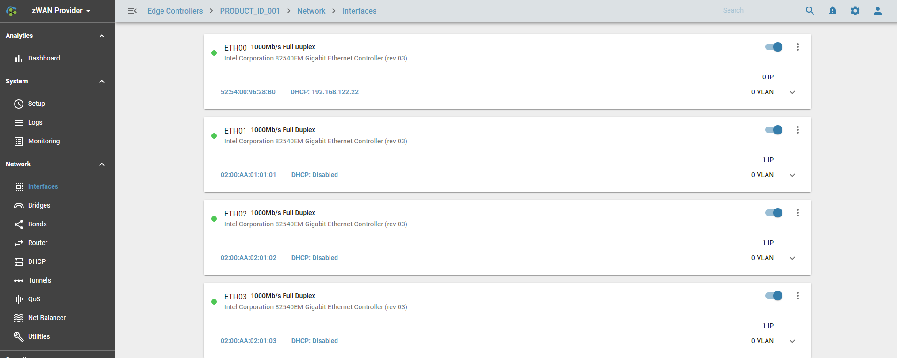
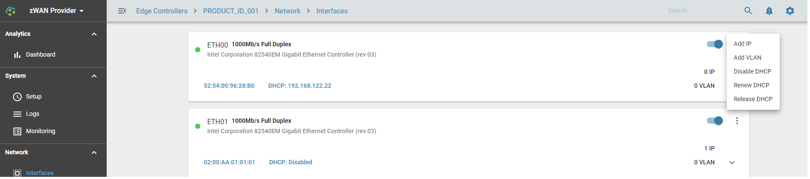
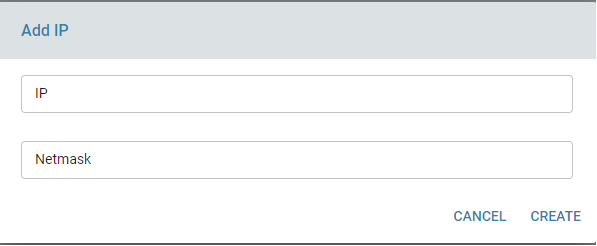

# Interfaces

## Overview: 

A network interface is point of interconnection between a computer/network device and a private or public network. A network  interface is generally a Network Interface Card, but it does not have to be physical. It can be virtual, a software simulting a network interface/device . Its the basic and main component of any networking device. Its through the interface any connectivity or flow of traffic is routed in and out of the device.

## Functionality:

In zWAN, interface is the main entry point and functional point in configuring most of its functionalities. Interfaces are named as ETH00, ETH01, ETH02 etc. 

Some of the functionalities provided for interfaces in zWAN are as follows

1) Adding a static IP
2) Edit/Modify a static IP
3) Remove the static IP
4) Create VLAN ( Virtual Lan interfaces) on interfaces
5) Assign static IP to the VLAN
6) Acquire DHCP IP from a DHCP server for the interface
7) Release the DHCP IP
8) Renew DHCP IP
9) Enable/Disable an Interface

A single interface can be assigned multiple static IP's depending on the need. To set a static IP on an interface, the network IP and its netmask should be provided. After configuring a static IP a unique ID will be assigned to the interface for that particular IP. This unique ID should be used to edit/delete the static IP.

To acquire a DHCP IP on an interface, use Enable DHCP function and once DHCP IP is acquired, the user has the option to release the IP or renew the IP. User also has the option also to disable the DHCP if not needed.

VLAN functionalities will be explained under the VLAN section.

## Configuration Parameters

Network IP
Netmask 
UP/DOWN Interface
Twamp Responder: True/False, If this interface IP should part of twamp measurements and need to run as a responder for the corresponding IP

## Results

Status color codes are depicted as Green and Red.
GREEN: Indicates interface is active and UP
RED: Indicates interface is DOWN

## Use Cases:
    
User can assign IP, or acquire DHCP IP from a DHCP server and then connect to the required network device using the IP. Interface is the main entry point or exit for any incoming or outgoing data on the edge controller. VPN or IPSEC tunnels are created on top of the interfaces.

## Known Limitations:

IPv6 is not supported.

## Future Enhancements:

IPV6 suport future will be added later.

More information regarding the data usage, statistics, errors, failures can be displayed along with basic interface information.

Information regarding whether that a particular interface is part of bridge or bond should be displayed in UI. This particular information is available in the API using memberOf field in interface schema.

