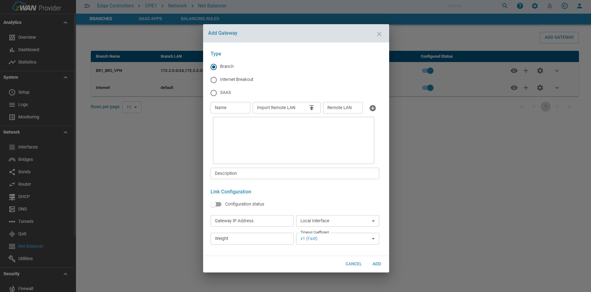
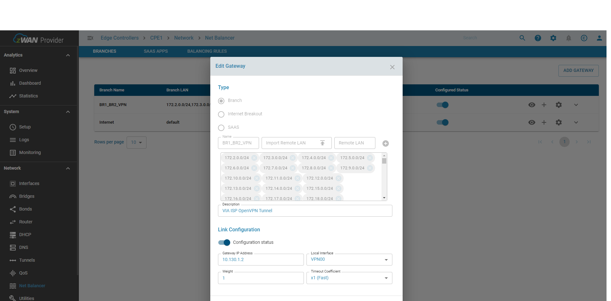
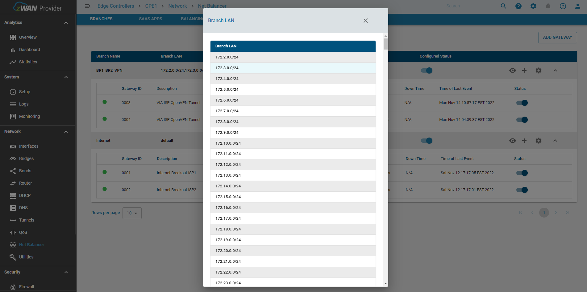
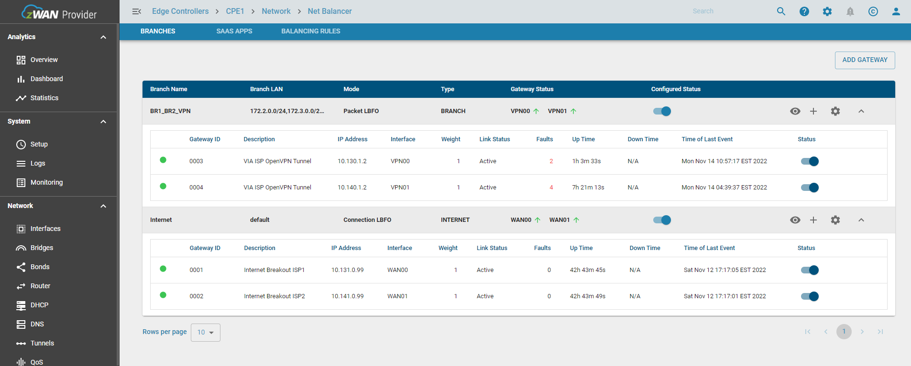
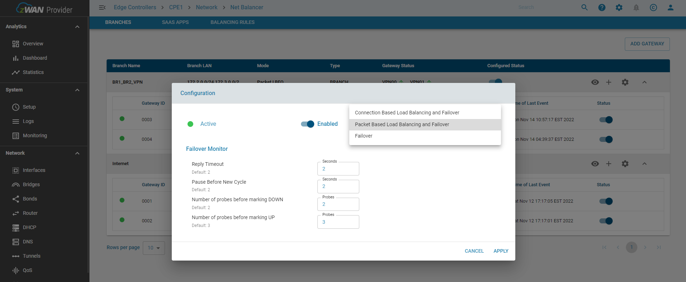

# Load Balancer

## Overview 

Traffic Steering is used when the router is configured with multiple internet connections or tunnels for reasons such as balancing outgoing LAN traffic, maintaining network redundancy and faults for one or multiple lines. The LAN traffic is distributed by using 2 weighted round-robin methods

        1) Connection Based Load Balancing :  
                This is flow based balancing where each flow is assigned an outgoing interface and for the lifetime of the flow that interfaces is used unless there is a failure detected. This is mainly for WAN interfaces where the NAT connections need to be maintained for the end to end flow.

        2) Packet based Load Balancing : 
                This is packet based where each packet can be assigned to a different outgoing interface. This can be used only with Tunnels as NAT is not involved.

Traffic can also be steered through a single interface. The detection of traffic is done by the flow classifier module, which offers multiple ways of detecting traffic like 5-tuple, nDPI, Web Categories, etc..

## Functionality

It supports 3 modes of traffic

        1) Branch : Gateways can be grouped based on the one or more LAN networks to form a separate load balancing group. The LAN networks can be either specified as a new line separated file.
        
        2) Internet breakout : Any traffic which does not belong to the branches or are Internet bound are forwarded to the default internet gateways

        3) SAAS breakout : When Internet breakout traffic is directed towards the DC via the tunnels, the user can still designate trusted traffic from SAAS applications like teams, salesforce etc to be steered directly to the Internet via the WAN interfaces. 
 
Each load balancing group can be configured in one of the 3 modes

        1) Load balancing ->  Branch, Internet breakout & SAAS Breakout
        2) Packet balancing -> Branch & Internet breakout with tunnels
        2) Failover -> Branch, Internet breakout & SAAS Breakout
 
Failover monitoring is done by either monitoring the liveliness of the physical interface or the gateway IP address or manually configured Failover IPs to verify the absence of routing issues. The reliability of the latter can be influenced by the network level congestion and their response times. So proper calibration is required for the same. There are multiple parameters which are used to avoid transiet failure detection like 

        1) Number of probes before marking DOWN
        2) Number of probes before marking UP
        3) Pause Before New Cycle
        4) Reply Timeout

SAAS breakout

SAAS apps can be configured via the SAAS apps page. This is a selection from the nDPI apps. The user is given the flexibility to determine which app can be trusted or not. Once configured any application designated as a SAAS app, when detected is sent via the SAAS breakout gateway. 

Internet breakout and SAAS breakout can share the same interfaces. SAAS breakout can be created only using interfaces designated as WAN.

*Please note nDPI detection can happen for the first packet or later in the flow, but deciding a gateway or interface can happen only if the application determination can be made from the first packet. As nDPI is only for internet applications maintaining the flow is very important so as to not break the NAT connections. First packet application detection can only have from an IP database. For example a TLS application flow can be detected after about 11 packets. So here packet redirection will not work even though the app was detected later on. 

## Configuration Parameters

### Add a Load Balancer gateway

### Edit a Load Balancer gateway

### View the branch subnets configured for a single branch

### View the Load Balancer gateways

### Configure the Load Balancer

    
## Use Cases:
    
To classify and steer traffic over dedicated links.

## Known Limitations:

- Editing the remote LAN is not supported
- The number of gateways supported depends on the underlying hardware

## Future:

 
