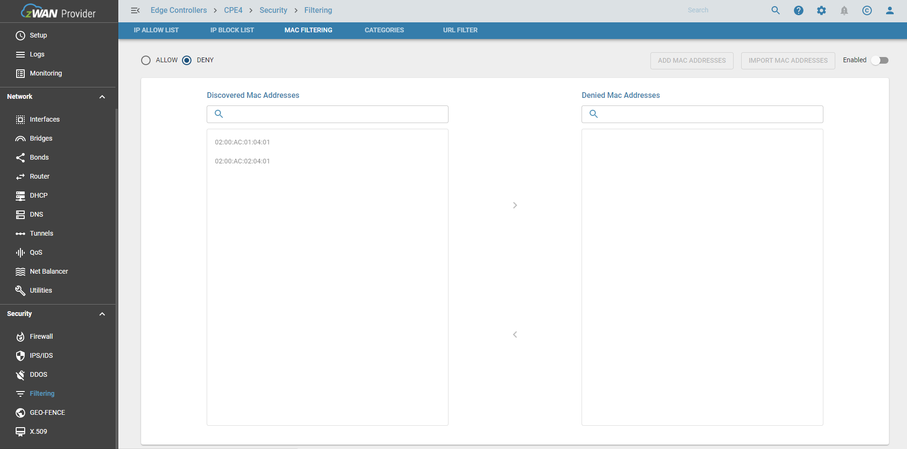
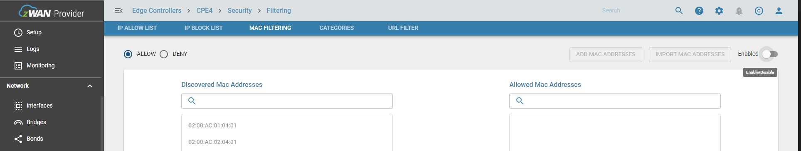
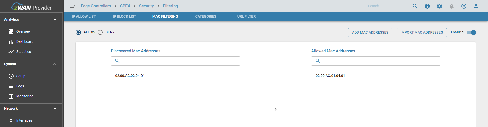
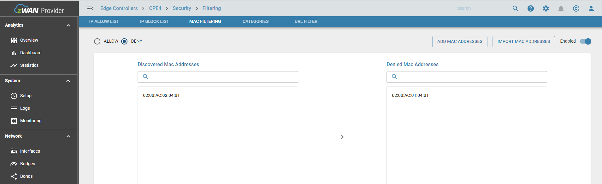
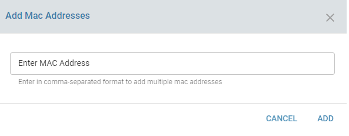
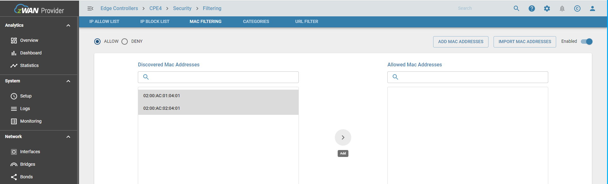
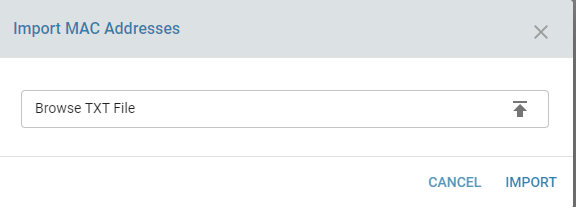
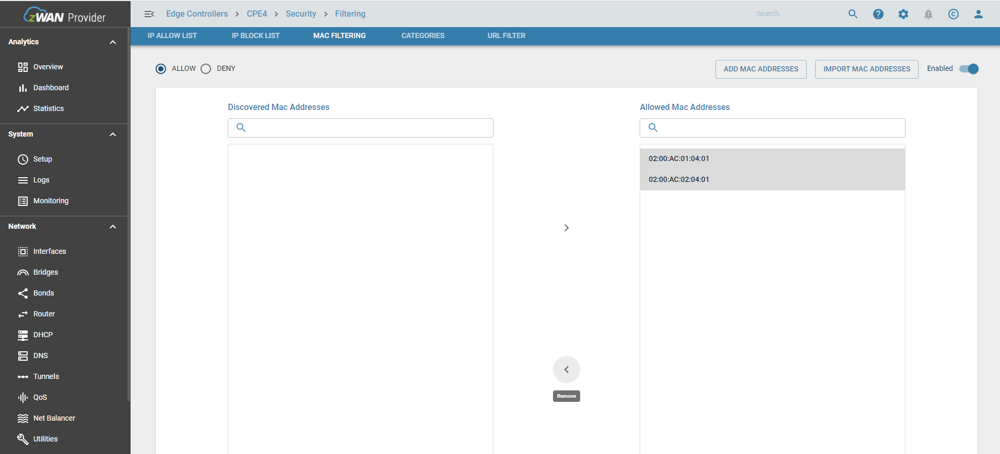

# MAC FILTER

Mac filtering enables the administrator to limit/control the traffic from LAN CPE’s routed through the zWAN CPE. Users can configure mac filtering with either of the two actions ALLOW/DENY. MAC filter list a global list of mac addresses maintained in zWAN edge controller to either allow or deny internet traffic orginated from those MAC addresses through the edge controller.

## Overview

Mac filtering is another feature to efficiently route/restrict internet traffic to/from  edge controller. Once Mac filtering is enabled, the user needs to select the action to be performed. User can either manually add the MAC Addresses to the list to perform the action specified when configuring mac filter. This page is added under Filtering section of the UI as a separate tab next to allowlist and block list. The UI will also display the discovered/available MAC address in the page



## Functionality

The main functionalities include

   ### Enable/Disable Mac Filter functionality

   Enabling MAC filter functionality can ve done by using enable button. This enables the mac filtering with an already configured list of mac address.If there is no mac address available, the user can add the desired mac addresses and the action (allow/deny) to be performed on those addresses. The same button can be used to disable the feature. By enabling the feature, an mac address based IP set is created and attached to the forward chain and all the mac address which matches the IPSET will be allowed or deinied based on the action.
   
   

   ###  Select Action

   MAc filtering allows 2 actions. Allow or Deny. It can be changed anytime. If the action is allow, then only the added mac address in the allowed list will be able to route the traffic through edge controller. If action is deny, every packets other than packets orginated from the denied mac address will be allowed to route through the edge controller. So the user should select the action wisely.
   ie:
   ```
      If Action is Allow, then only the macs in the allowed list will be allowed.
      If Allowed list is empty, functionality will be like default DROP ALL
      If Action is Deny, then only the macs in the denied list will be denied
      If Denied list is empty, functionality will be like default ACCEPT ALL
   ```
    
 
 
   
   ### Add MAC Address to the list

   There are different ways to add mac address to mac filter list

   1) User can add multiple mac address  manually using the add macaddress button and use comma separated format if he/she intends to add more than one entry.



   2) User can select the mac address from the discovered mac address list displayed in UI. 



   3) User can import mac address from a text file which is in a comma sperated format if there are many mac address and updated in a file.



 Once added the added mac address will be displayed on the right table of the page based on the action applied.

   ### Delete MAC Address from the list

   The user can delete single or multiple address which is already added by selecting it and using the remove button as shown in the screenshot below.



## Result

As mentioned in overview, once mac's are added and action is selected, the routing of LAN internet traffic will happen based on the condition applied.

## Known Limitations

## Future Enhancements
