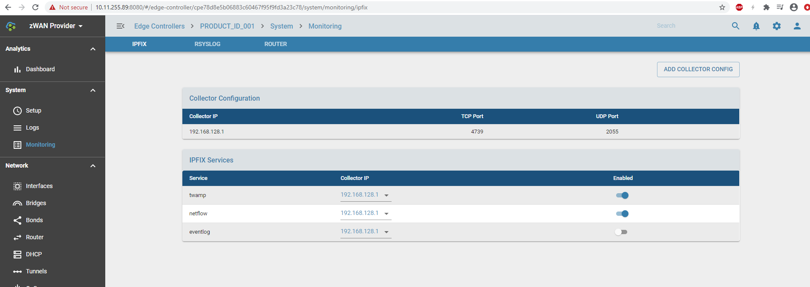
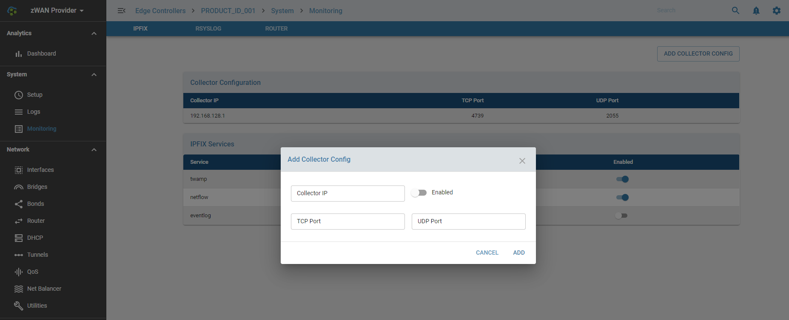
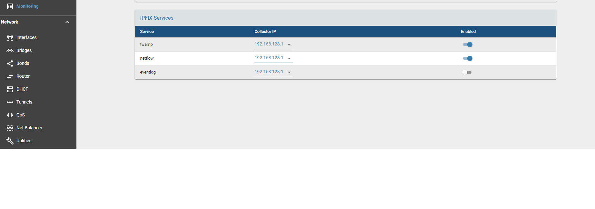

# IPFIX

## Overview

Monitoring, analysing and taking corrective/preventive action is a very important feature in any innovative, centrally managed critical data savvy technical solution. zWAN is no different in that aspect. Critical and time sensitive data flows through zWAn edge controllers once configured. Any failure, disruption, downtime or data loss can result in loss of business, monitory loss and chaos in today's networking world. Time and data is valued more than anything. An efficient networking solution should be able to monitor, collect, analyse, report and auto correct itself. To enable that monitoring tools are needed.

*IPFIX*

ZWAN edge controller support IPFIX protocol version 9. It collects all the forward traffic to/from LAN/WAN and exports to the IPFIX collector running at ZWAN Provider node. The ipfix module handles sending the flow, twamp results, eventlogs to the configured reporting or collecting server. The collecting server can then be used to create user friendly visualizations in any reporting server services such as Prometheus, ELK etc. 

## Functionality

*Collector*

Collector is the reporting server to which the ipfix data is forwarded. It is the task of the collector to collect the data, save, manipulate and visualize it in a user friendly view. One such collector supported in zWAN SDWAN solution is ELK server. Collector can be configured by adding collector config option. The parameters used to configure collector are Collector IP, UDP port or TCP port or both. Enabled option is used to enable or disable sending data to the configured collector. The tcp or udp port number depends on the which the collector is configured to receive the forwarded data from all edge controllers.
 
 

*Services*

The services sections allows the administrator to decide what kind of data to be forwarded to the collector server. The user can enable or disable the service from sending the data to the desired collector IP. The configurable options for services are to enter the destination collector IP, the particular service data should be forwarded.  Twamp service uses UDP port to send the twamp sender performance test session results to the collector IP. User can configure multiple collector, so service can select the desired collector to configure the service in ipfix. Another important service which is supported is netflow. This is a very critical service which logs and reports the flow data to the reporting server.  

 

## Result

Once the ipfix services are configured to forward the data to the collecting server such as ELK, the user can verify the same in Kibana.

## Known Limiatations

NA

## Future Enhancements

Eventlog is currently not supported. The support will be added in future releases.