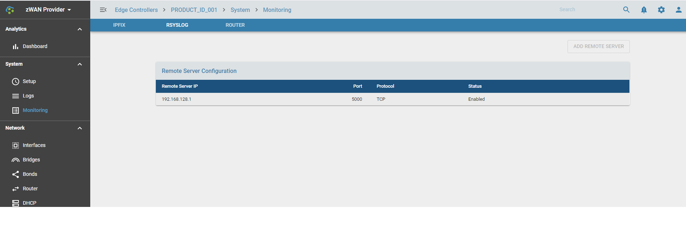

# Remote syslog

## Overview

Monitoring, analysing and taking corrective/preventive action is a very important feature in any innovative, centrally managed critical data savvy technical solution. zWAN is no different in that aspect. Critical and time sensitive data flows through zWAn edge controllers once configured. Any failure, disruption, downtime or data loss can result in loss of business, monitory loss and chaos in today's networking world. Time and data is valued more than anything. An efficient networking solution should be able to monitor, collect, analyse, report and auto correct itself. To enable that monitoring tools are needed.

*RSYSLOG*
 
Remote syslog is another monitoring feature in zWAN edge contoller. The critical and crucial system logs can be configured to be forwarded to the reporting server so that automation and corrective action can be taken from the centralized control server based on the serverity. 

## Functionality

The remote server logging can be configured by adding the remote server using the "ADD REMOTE SERVER" button. The configurable parameters are remote server IP, the port number and whether to send the remote logs via TCP or UDP protocol. The enabled option can be used to enable or disable forwarding the syslog messages to the remote server.

 

## Result

Once the rsyslog is configured to forward the data to the collecting server such as ELK, the user can verify the same in Kibana.

## Known Limitations

NA