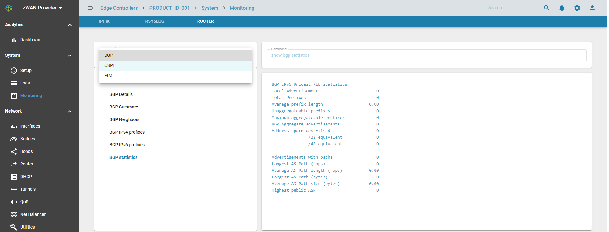
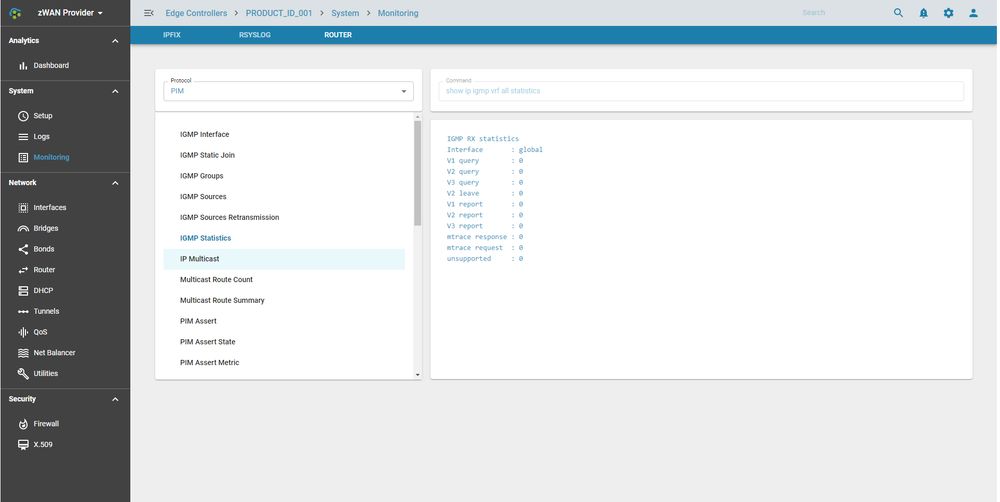

# Router

## Overview

The state, status, detail, summary and statistics of the dynamic routing protocols such as BGP, OSPF, PIM and IGMP can be viewed here by executing the relevant commands.

## Functionality

### Select the Dynamic Routing protocol

### Select the command to view the status information

## Use Cases:

To view detailed information on the state of the routing protocols once its configured

## Known Limitations:

NA

## Future:
