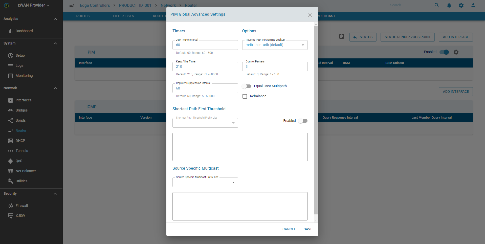
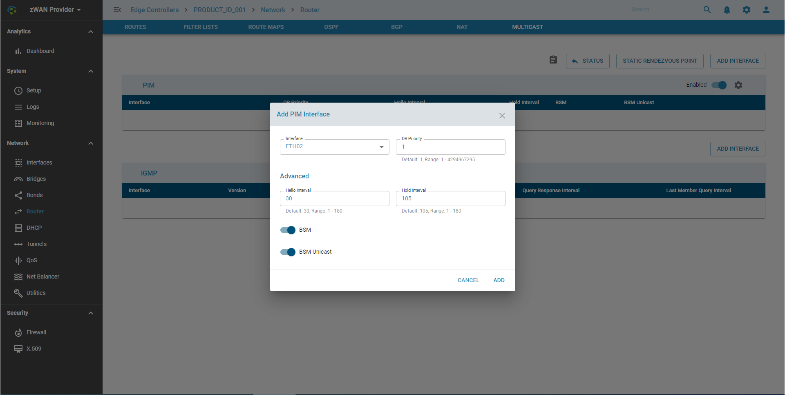
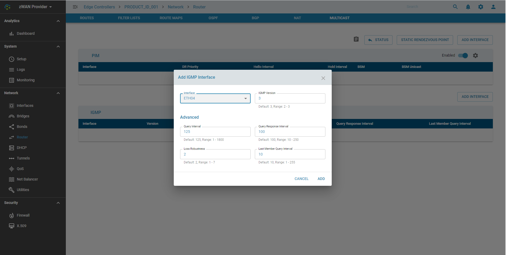

# Multicast - PIM

## Overview: 

Multicast provides an efficient method for delivering traffic flows that can be characterized as one-to-many or many-to-many. 

## Functionality:

PIM is a Protocol Independent Multicast that provides the multicast functionality. It is termed protocol-independent because PIM does not include its own topology discovery mechanism, but instead uses routing information supplied by other routing protocols. PIMD has support for PIM-SM, IGMP v2 and IGMP v3.

Protocol Independent Multicast - Sparse-Mode (PIM-SM) is a protocol for efficiently routing Internet Protocol (IP) packets to multicast groups that may span wide-area and inter-domain internets. The protocol is named protocol-independent because it is not dependent on any particular unicast routing protocol for topology discovery, and sparse-mode because it is suitable for groups where a very low percentage of the nodes (and their routers) will subscribe to the multicast session.

PIM Sparse Mode (PIM-SM) explicitly builds unidirectional shared trees rooted at a rendezvous point (RP) per group, and optionally creates shortest-path trees per source. PIM-SM generally scales fairly well for wide-area usage

The Internet Group Management Protocol (IGMP) is a communications protocol used by hosts and adjacent routers on IPv4 networks to establish multicast group memberships. IGMP is an integral part of IP multicast and allows the network to direct multicast transmissions only to hosts that have requested them. IGMP is used on IPv4 networks

Detailed information on each parameter is beyond the scope of the document as is part of understanding PIM & IGMP. Information on different configuration parameters can be found http://docs.frrouting.org/en/stable-7.3/pim.html

## Configuration Parameters

### Configuring PIM  

### Adding a PIM Interface

### Adding an IGMP Interface

## Use Cases:

PIM-SM is commonly used in IPTV systems for routing multicast streams between VLANs, Subnets or local area network
IGMP can be used for one-to-many networking applications such as online streaming video and gaming, and allows more efficient use of resources when supporting these types of applications.

Examples of Multicast deployments
https://vxplanet.com/2019/09/18/implementing-multicast-routing-between-nsx-edges-and-dellemc-networking/
https://forum.netgate.com/topic/139218/sonos-speakers-and-applications-on-different-subnets-vlan-s/20

## Known Limitations:

NA

## Future:

