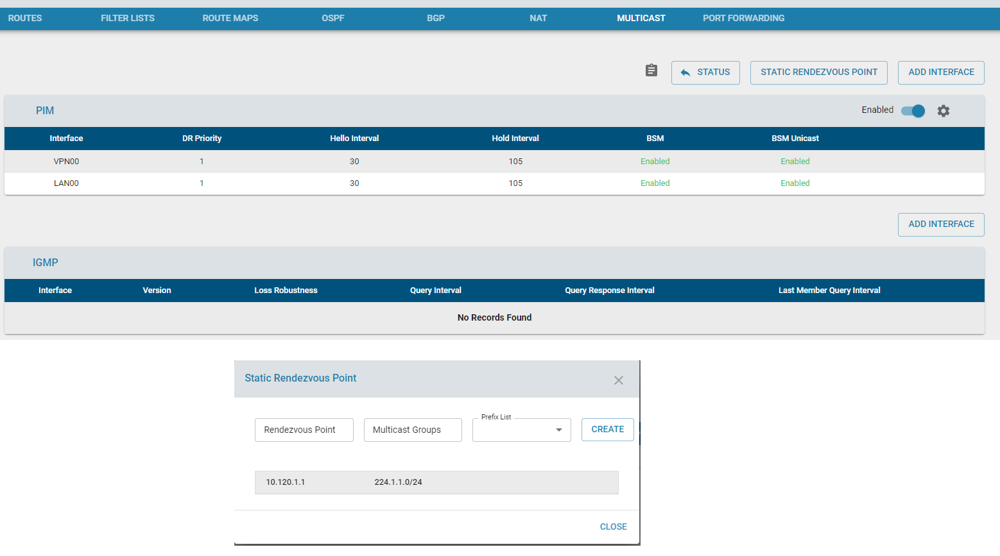
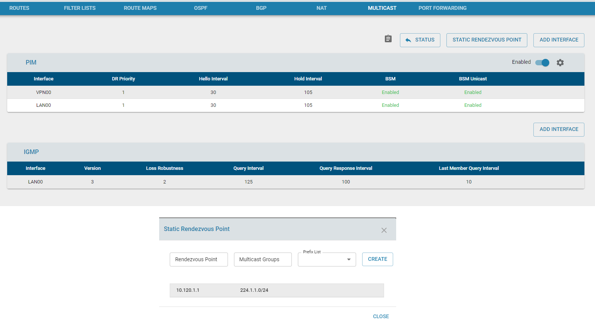

# Setup

PIM tutorial: multicast over SSLVPN Tunnel

1 DC-EC and 2 Branch-ECs

1 Server behind DC EC and 1 LANPC behind each Branch EC

    server---DC------BR1---LANPC1
             |------BR2---LANPC2

          
          
multicast IP used for this tutorial:  224.1.1.1

## Lan Configuration

    Server (eth00:192.168.64.100) ---------> DC-EC (LAN00: 192.168.64.1)
    LanPC1 (eth00:192.168.65.100) ---------> BR1-EC (LAN00: 192.168.65.1)
    LanPC2 (eth00:192.168.66.100) ---------> BR1-EC (LAN00: 192.168.66.1)

## VPN Tunnel Configuration

    DC-EC (VPN00:10.120.1.1) ---------> BR1-EC (VPN00: 10.120.1.2)
                             ---------> BR1-EC (VPN00: 10.120.1.3)

## Netbalancer
DC-EC:

    BR1 (192.168.65.0/24) via VPN00
    BR2 (192.168.66.0/24) via VPN00

BR1-EC:

    DC (192.168.64.0/24) via VPN00 

BR2-EC:

    DC (192.168.64.0/24) via VPN00 

# Multicast Configuration

DC: 
Configure Static Rendezvous Point (sample raw config: ip pim rp 10.120.1.1 224.1.1.0/24)

    Add VPN00 Interface to PIM
    Add LAN00 Interface to PIM
    Since DC' server is multicast sender, no need to add LAN00 to IGMP

BR1: 
Configure Static Rendezvous Point (sample raw config: ip pim rp 10.120.1.1 224.1.1.0/24)

    Add VPN00 Interface to PIM
    Add LAN00 Interface to PIM
    Add LAN00 Interface to IGMP (as IGMP join request from LANPC need to be send to Rendezvous Point which is running at DC-EC)

BR2:
Configure Static Rendezvous Point (sample raw config: ip pim rp 10.120.1.1 224.1.1.0/24)

    Add VPN00 Interface to PIM
    Add LAN00 Interface to PIM
    Add LAN00 Interface to IGMP (as IGMP join request from LANPC need to be send to Rendezvous Point which is running at DC-EC)

# Config LANPC behind Branches

## autojoin to multicast network

### LANPC behind BR1

Assume, enp2s0 is the interface connected to BR-EC LAN00 and has IP 192.168.65.100

    disable the icmp_echo_ignore_broadcasts on lan interface (enp2s0)
        echo 0 > /proc/sys/net/ipv4/icmp_echo_ignore_broadcasts

    join multicast group 224.1.1.1
        ip addr add 224.1.1.1/24 dev enp2s0  autojoin

    set igmp version 3
        echo 3 > /proc/sys/net/ipv4/conf/enp2s0/force_igmp_version
        
    verify multicast join
        ip -f inet maddr show dev enp2s0
        2:      enp2s0
            inet  224.1.1.1
            inet  224.0.0.251
            inet  224.0.0.1

### LANPC behind BR2
Do the config similar to other LANPC

# Multicast test from DC's Server

Send multicast packet from DC's Server and check reply comes from LANPC from both the branches

    ping 224.1.1.1

        64 bytes from 192.168.65.100: icmp_seq=2294 ttl=63 time=1.79 ms
        64 bytes from 192.168.66.100: icmp_seq=2294 ttl=62 time=2.27 ms (DUP!)
        
        64 bytes from 192.168.65.100: icmp_seq=2295 ttl=63 time=1.65 ms
        64 bytes from 192.168.66.100: icmp_seq=2295 ttl=62 time=1.81 ms (DUP!)

