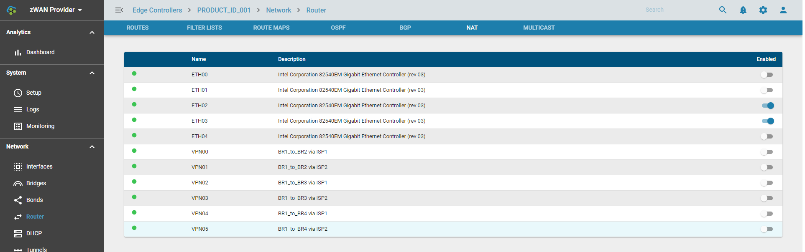

# NAT

## Overview: 

Network address translation (NAT) is a method of remapping an IP address space into another by modifying network address information in the IP header of packets while they are in transit across a router. The technique was originally used to avoid the need to assign a new address to every host when a network was moved, or when the upstream Internet service provider was replaced, but could not route the networks address space

## Functionality:

NAT can be enabled on an interface.  

## Configuration Parameters

Enable/Disable NAT

    
## Use Cases:

It provides privacy as the device IP address, sending and receiving the traffic, will be hidden.

## Known Limitations:

NA

## Future:

