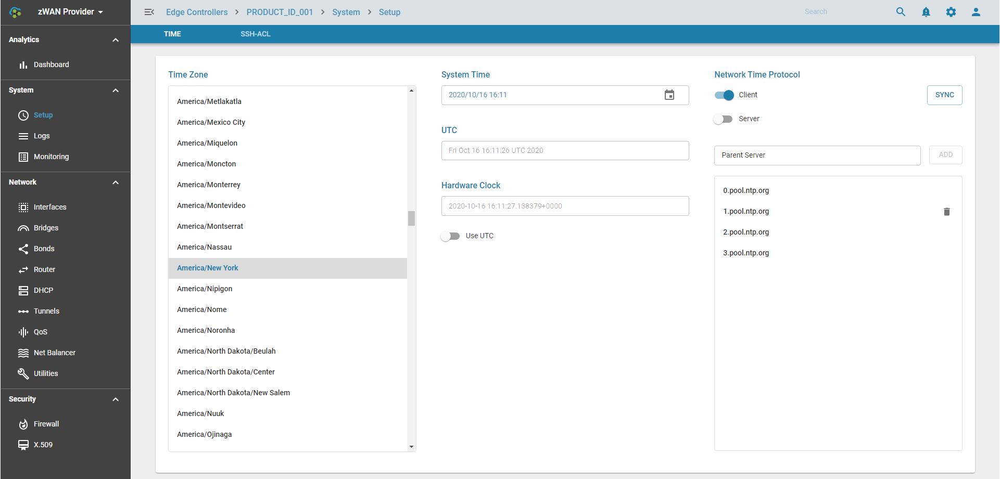

# NTP

## Overview: 

Network Time Protocol (NTP) is a networking protocol for clock synchronization between computer systems over packet-switched, variable-latency data networks.

## Functionality:

1) NTP can be configured in Server mode or Client Mode or both. NTP servers can be configured when configured in client mode
2) Timezone can be configured based on the geographic location of the ZWAN Router
3) System Time can be also configured. It can be synced to UTC.

## Configuration Parameters

### Timezone, System time,  & NTP

 
## Use Cases:

Maintain time synchronization    

## Known Limitations:

## Future:

