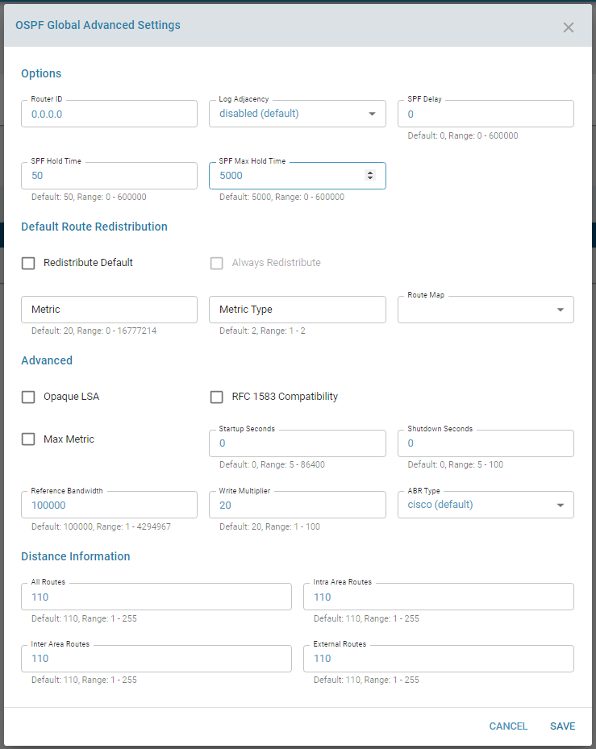
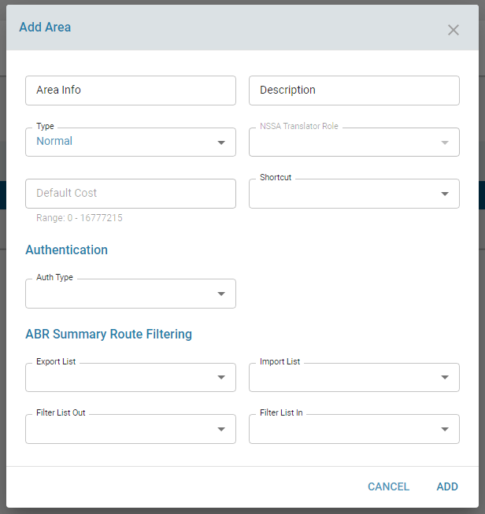
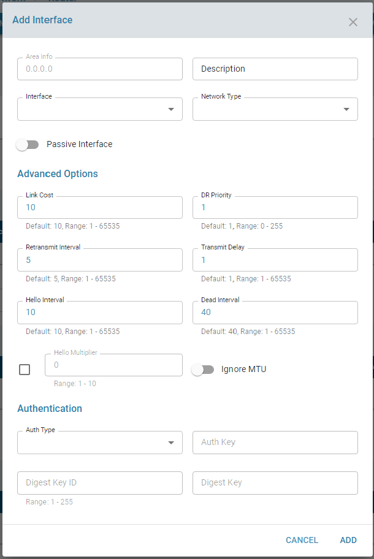
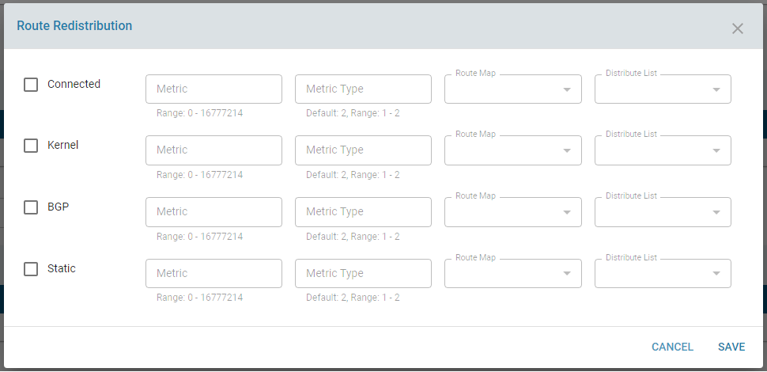

# OSPF

## Overview:

The OSPF (Open Shortest Path First) protocol is one of a family of IP Routing protocols, and is an Interior Gateway Protocol (IGP) 
for the Internet, used to distribute IP routing information throughout a single Autonomous System (AS) in an IP network. 
The OSPF protocol is a link-state routing protocol, which means that the routers exchange topology information with their nearest neighbors.

## Functionality:

OSPF can be used both for LAN and WAN network. When used for LAN network, ZWAN can make a mesh routing across Branch LAN networks. 
When used in WAN interface, it can be used for Peering.  ZWAN uses OSPF to Peer the Edge Controller to Provider Edge.

When OSPF peering is made, it will make dynamic route to the ISP or MPLS PE edge node.

Detailed information on each parameter is beyond the scope of the document as is part of understanding the protocol. 
Information on different configuration parameters can be found http://docs.frrouting.org/en/stable-7.3/ospfd.html.

## Configuration Parameters

The OSPF service needs to be in enabled state.A unique router ID need to be specified  and is commonly set to a local private address.

### Areas
OSPF provides for the protocol to be broken up into multiple smaller and independent link-state areas. 
Areas in OSPF are collections of routers grouped together. With the exception of area border routers(ABR), OSPF routers in one area don’t neighbor with routers in other areas.

### OSPF interfaces
Interfaces used to exchange information with OSPF neighbors have different types. 
Two important OSPF interface types:
1. broadcast interface is connected to a shared network, like Ethernet.
2. point-to-point interface is connected to a link where there can only be a single OSPF router on either end, such as a WAN link or a purpose-built Ethernet link.

### Redistributing routes into OSPF
Redistributing routes into OSPF from other routing protocols or from static will cause these routes to become OSPF external routes. 

## Use Cases:
    
OSPF testcases using the deploy framework can be referred from
    https://gitlab.amzetta.com/sdwan/zwan-cpe/tree/development/common/zeroshell/testscripts/deploy/OSPFLabs

These were created based on the following testcases "netkit-labs_ospf.tar" from Netkit labs. The tar file is attached in the same folder

## Known Limitations:

NA

## Future:

## Reference:
1. http://docs.frrouting.org/en/stable-7.3/ospfd.html
2. https://www.auvik.com/franklyit/blog/ospf-protocol-explained/
3. https://docs.netgate.com/pfsense/en/latest/vpn/openvpn/multi-wan.html#openvpn-multi-wan-ospf
4. 
