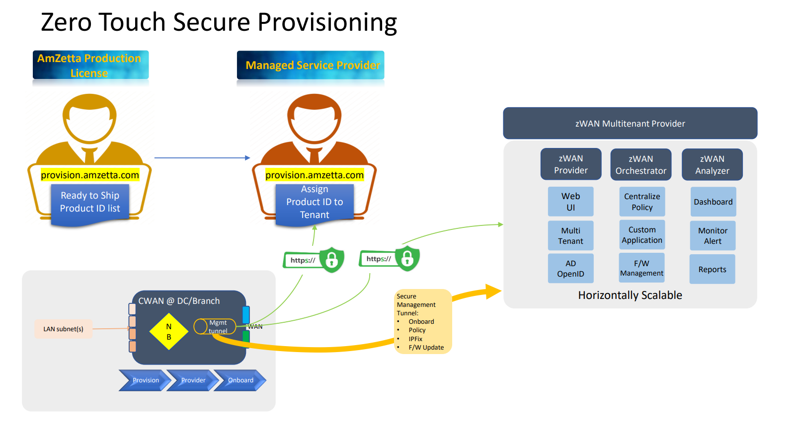
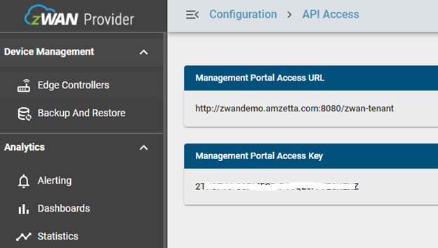
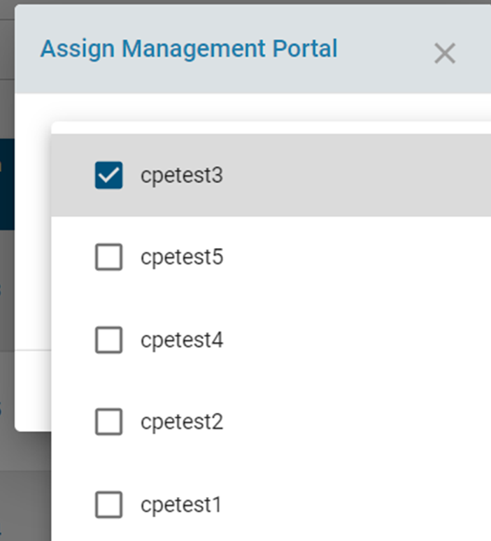
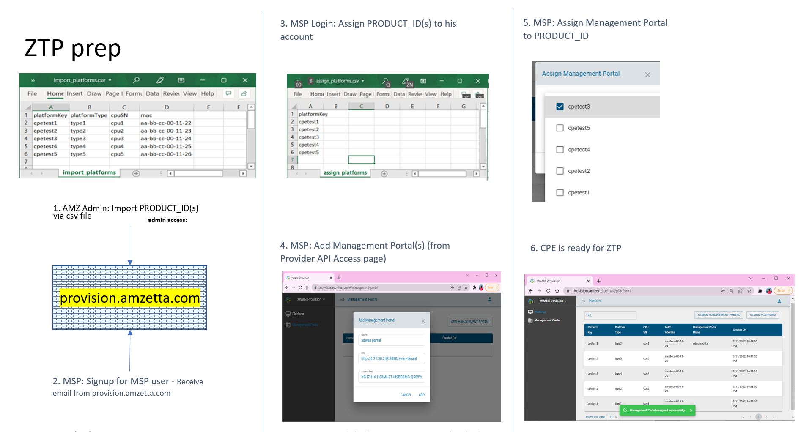

# Zero Touch Secure Provisioning:

## Amzetta Provision Server:
1)	Provision Server maintains the Produce ID of each ECs. 
2)	All the Edge Controller is flashed with latest firmware image when the EC unit clears Manufacturing Diag.  EC is pre-configured with Provisioning Server URL and Access Key.  Similarly, each EC is uniquely identified by Product ID (format:- ModelNo:UUID) and it is written to the Unit’s eMMC. 
3)	During the Manufacturing Verification process or at latest stage, this Produce ID is exported in to Provision Server (Managed by Amzetta ) running in Cloud using the Amzetta Admin Account.
4)	Thus, Provision Server will maintain the Global List of all EC units by its Product ID
 

## MSP:
5)	Each MSP must register to the Provision Server and get MSP credentials
6)	From Amzetta, MSP will be given a list of Product ID (of the EC) which he/she can manage.
7)	Using MSP access credential of the Provision Server, MSP will import the Product IDs that are assigned for this MSP
8)	MSP runs the Director (Provider) Server to manage the EC in MSP premises.
    a.	Director (Provider) will have multiple Tenants.
    b.	Each Tenant is uniquely identified by MGMT Portal Access URL and ACCESS KEY
    

    
9)	Next, MSP will add the Tenant MGMT Portal Access URL and access key into Provision Server. MSP can add multiple such Tenant information to Provision Server. 
    

    
10)	Next, MSP maps the EC (PRODUCT ID) to a Particular Tenant

### Flow:

## ZTP - Edge Controller:
Once the EC is powered up, it will reach the Provision Server and get the Director (Provider) Management URL and Access Key. Using this information it will send onboard request to Director (Provider). All ECs that are waiting to be onboarded can be seen at Director (Provider) UI. 
Once the EC is listed under Director Tenant Management, admin of the Tenant can onboard the EC. During the onbaord process, the EC can be grouped using various Tags for management reasons. 
Once the EC is onboarded, the unique SSL Certificate will be generated for that EC and it will be pushed to the EC securely. EC will use the certificate and establish SSLVPN Management Tunnel with Director for futher Configration (like, Auto Policy, Ondemand Policy or Manual Configuration via Director UI)

