# zWAN Policies with Different Privileges

**Overview**

This feature allow the user to create user with different policy privileges, review policy and apply policy.

**User creation with Create and Apply Policy Privilege**

1. Go to users page and click Add user
2. Give the valid user details, expand the advanced option
3. Select Create Policy Query, Create Policy Mutation,Apply Policy Query, Apply Policy Mutation, and add it.

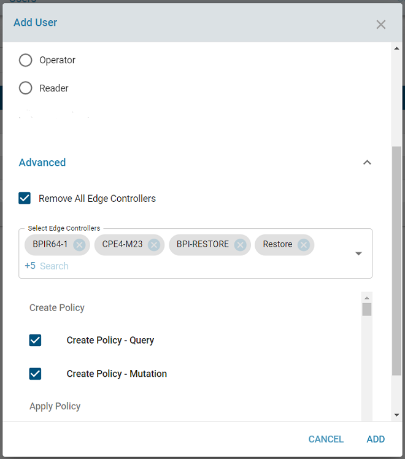

4. Email will be sent for review to the configured email recipient in SMTP configuration.

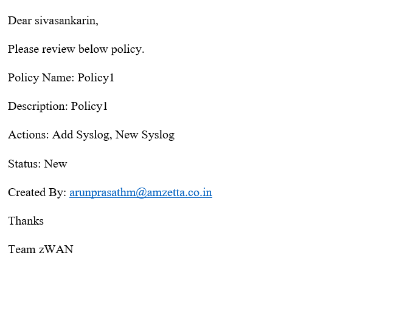

**Policy Status Before review**

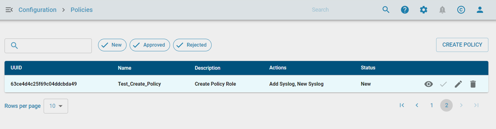

**User creation with Review Policy Privilege**

1. Go to users page and click Add user
2. Give the valid user details, expand the advanced option
3. Select Create Policy Query, Create Policy Mutation, Review Policy Query, Review Policy Mutation, and add it.
4. Login with the created user which has review privilege.

**Review Policy **

1. Go to policies page, select the policy for review.
2. Click the eye icon for review

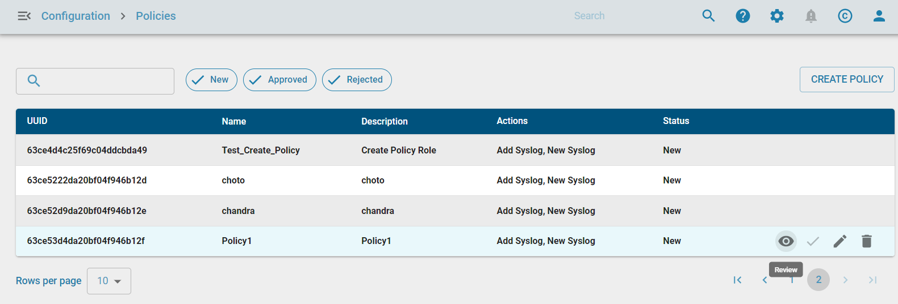

**Approve Policy**

Give the review comment and approve it.

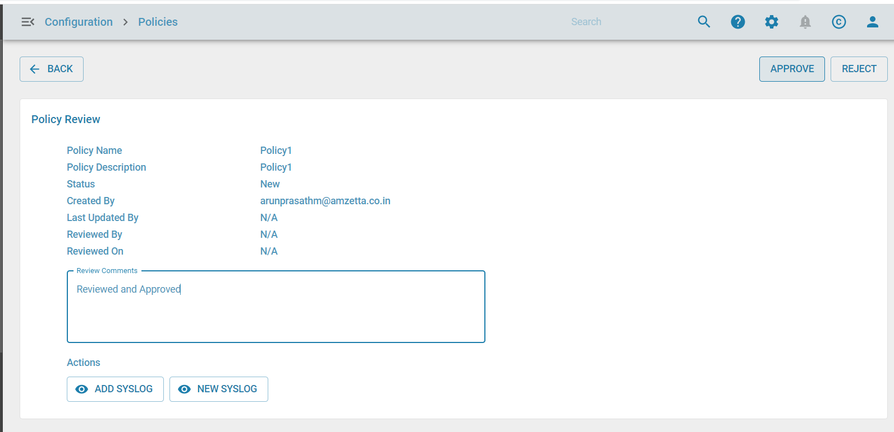

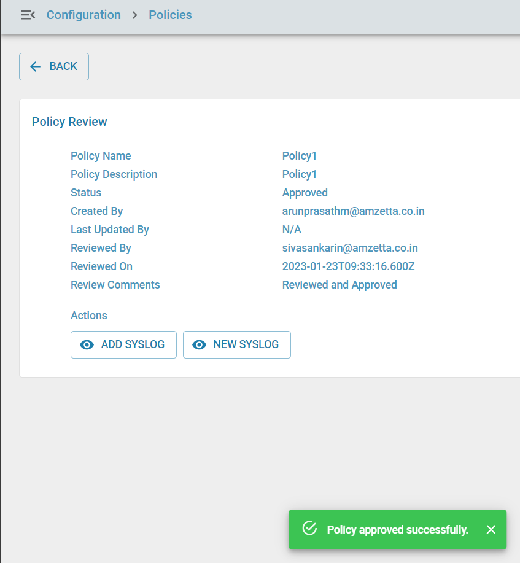

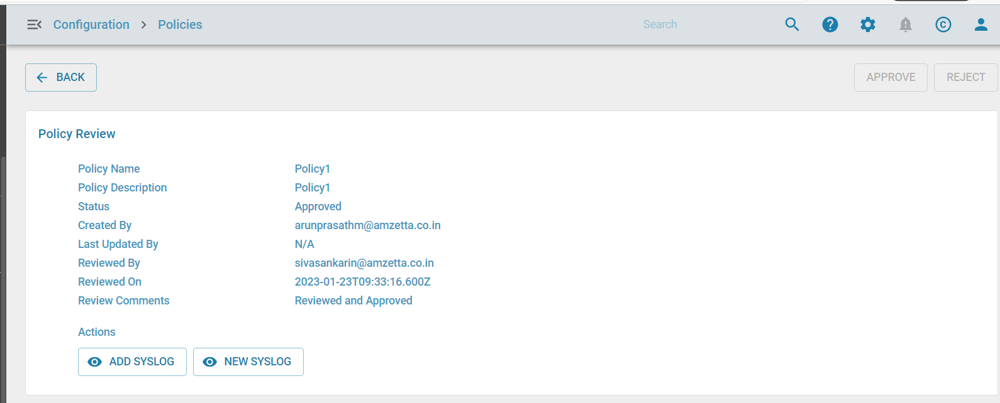

**Reject Policy**

Give the review comment and Reject it.

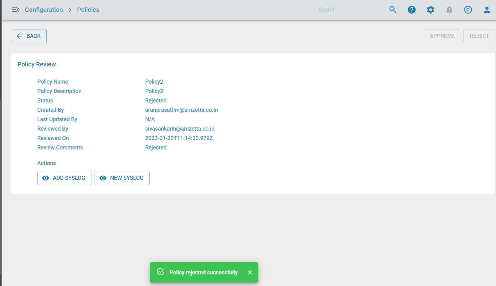

**Policy Status After Review Approval**

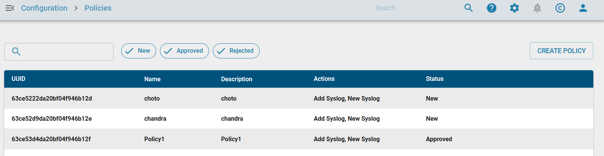

After policy reviewed email sent to the policy creator.

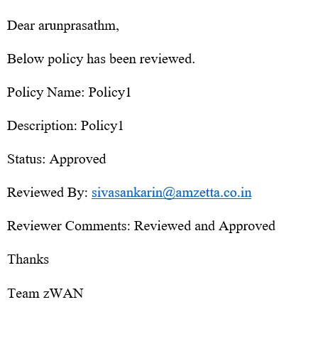

**Policy Status After Review Rejected**

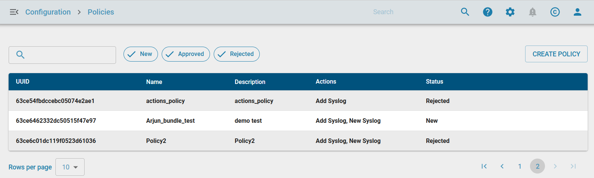

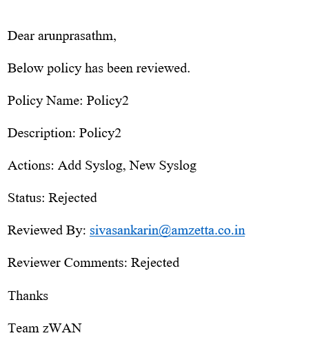

**Apply Policy After Approval**

1. Login to the user which has create and apply privilege after approval.
2. Go to policies page, select the policy which is approved

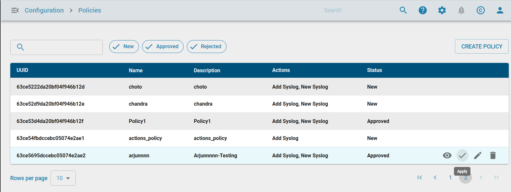

3. Apply the policy.

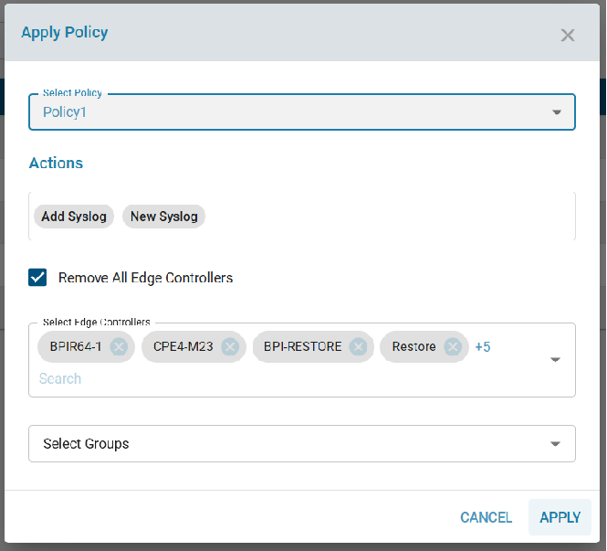

