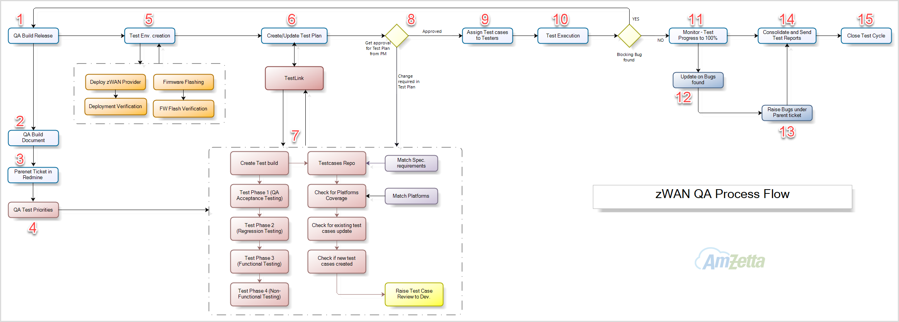

## **zWAN QA Work Flow Explained**

### **1.  QA Build Release**

Development teams – Provider and Firmware are releasing build for QA Testing.
Srikumar is coordinating to get final QA builds and hands to Provider-QA and Networking-
QA teams.

### **2.  QA Build Document**

QA Build document will be shared by Srikumar with necessary information as listed below
to start QA testing.

    1. FW and Provider Builds FTP location
    2. Changelog/Release notes
    3. Parent ticket assigned to QA
    4. Functional Areas to be covered in the released build

### **3.  Parent creation** 

Parent ticket shall be created for the build testing. This ticket will be used to raise and link all the findings observed during the test cycle at one place.

### **4.  QA Test Priorities**

The Test Priorities should contain following,

    1. Functional Areas to be covered in the released build.
    2. Platforms to be covered in the released build test cycle.
    3. Customer interested functional areas in case for Demo build testing

### **5.  Test Environment setup**

    1. Download the QA build files mentioned in the ussftp location
    2. Check for md5sum for the Firmware builds
    3. Deploy the Provider source on the target QA Provider server
        3.1 Verify errors/failures during deployment process and deployment logs
        3.2 Verify login into default tenant
        3.3 Verify MSP admin login
        3.4 Verify creating second tenant and login
    4. Verify errors during flashing Firmware process on targeted platforms
        4.1 Verify boot process errors in first and sequenct boots
        4.2 Verify Onboarding into the Provider deployed in the previous steps
        4.3 Verify the MGMTVPN status and accessing from Provider UI

### **6.  Create/Update Test plan**

QA Lead shall login into TestLink -> zWAN QA and create a Test plan for the released build version

### **7.  Create Build Release in TestLink**

Once Test plan has created, create Build/Release under the same Test plan with appropriate build versions (Provider release tag & FW version)    
Further add test cases to the Build/Release created,

    1. Add/remove test cases
    2. Add the test cases to be covered along with platforms selected
    3. Check for changes required in the existing test cases
    4. Check for new test cases to be covered in the current build release
    5. Add new test cases in Test Repositary matching with Functional Specification
    6. Share the test cases to corresponding Module Owner to review
    7. Once the review is done, add the test cases to the current test plan

### **8.  Test Plan Approval**

Share the test plan to Srikumar to review the test cases added & test duration estimation
and get approval mail to proceed further.

If changes required, update the test plan accordingly and resend it for approval.

### **9.  Test cases assignment**

Once the testplan has approved, assign the test cases to QA testers in TestLink.  

### **10. Test Execution**

QA testers will start execute the assigned test cases on the target platforms.

**If blocking bug(s) found, the develoment teams will get communicated as soon as possible and test cycle will put on hold til next QA build release.**

Test execution duration consists of following phases, 

     Phase 1: QA Acceptance Test
        
        QA will execute the minimal set of basic test cases to qualify the released for further QA testing

     Phase 2: Regression Test

        QA will test the fixes reported in the previous QA builds

     Phase 3: Functional Test

        QA will validate all of core functional test cases

     Phase 4: Non-Functional Test

        QA will validate the remaining non-functional test cases such as Tunnel throughputs, Performance, 
        Inter-operability performance between pfsense firewall,Speedtests on LTEs, Firmware boot time, Firmware stress test, GVM scans etc

### **11. Test Cycle monitoring**

QA Lead will monitor the test progress and get progress status updated to all stake holders via email.

### **12. Bugs/Sightings Updation**

QA Lead will keep update on the severity bugs found in the test cycles on every day basis.

### **13. Raising Bugs/Sightings/Feature Requests**

All the bugs/Sightings will be created in Redmine under the parent ticket and assigned to respective module developers.

QA Lead will ensure all the findings has been logged in the Redime.

### **14. Consolidated Test Report**

Once the test cycle has completed with 100%, QA Lead will consolidate all Bugs/Sightings/Feature requests found during the test cycle with current status from Redmine.

All the stake holders should go thru’ the QA findings and update the status/proceedings.

### **15. Test Cycle Closure**

Once review done on the final test report, the Test cycle and Parent ticket should be closed in TestLink and Redmine respectively.