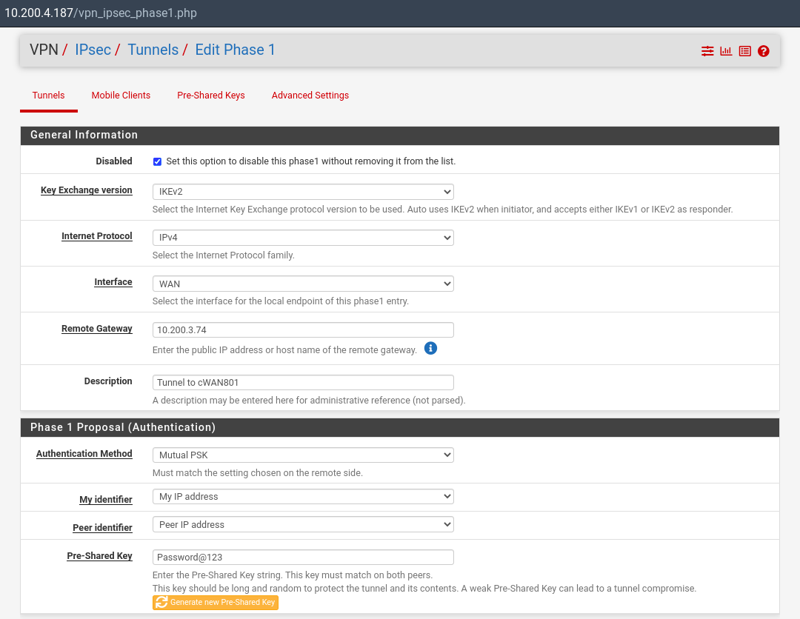
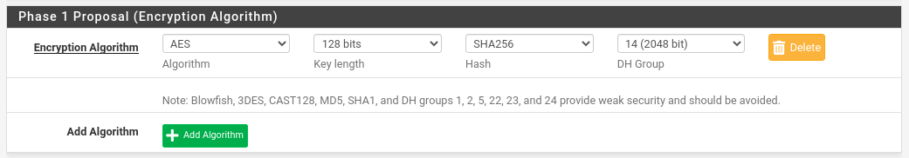
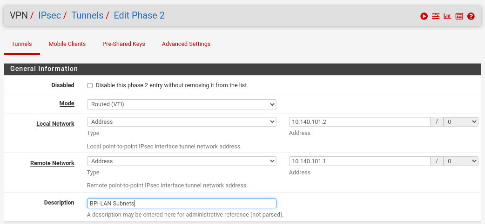
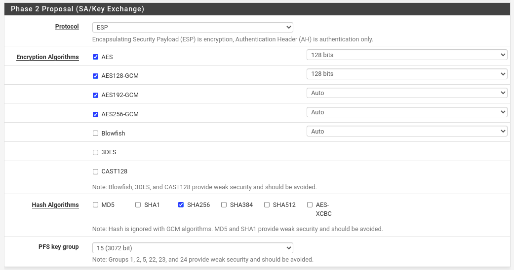
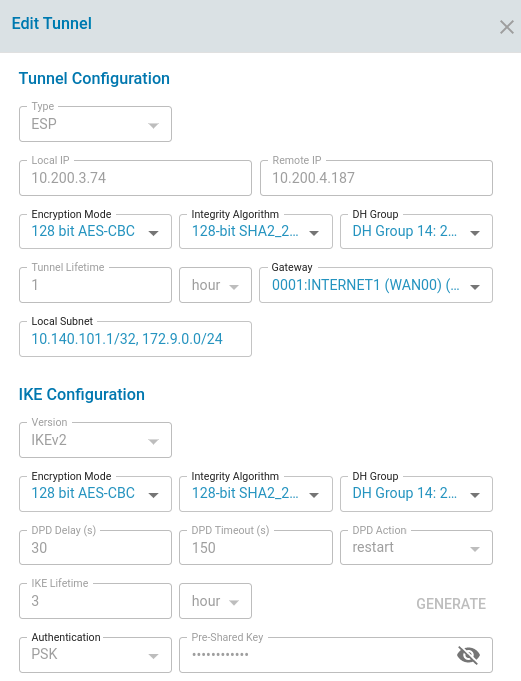
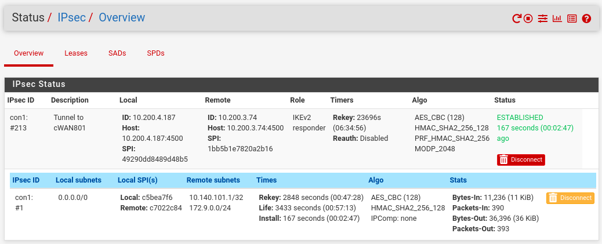
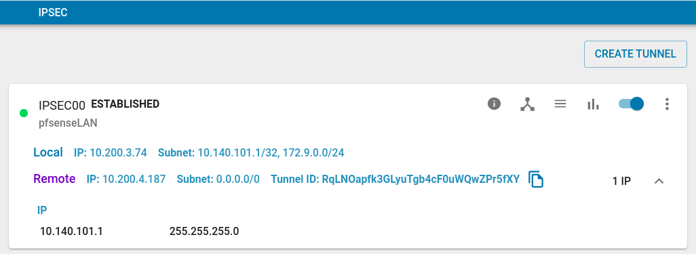
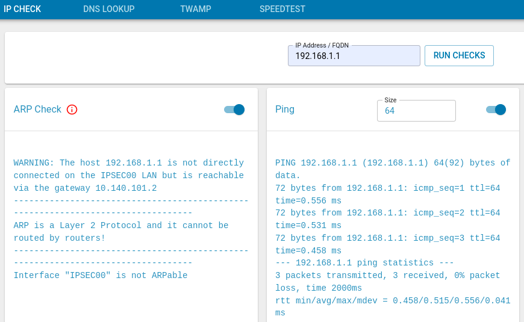
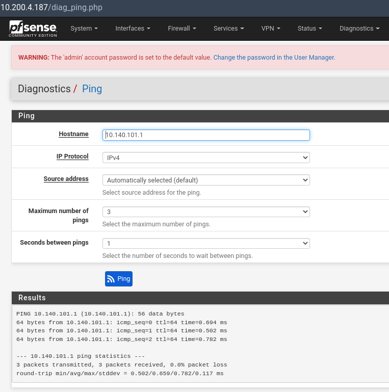

## This document explains installing pfSense on x86 Hardware and configuring IPsec(VTI) for tunnel connectivity to zWAN CPEs.  

### Pre-requisites:

1. x86 Desktop with 2 Ethernet ports
2. 1x for WAN Interface
3. 1x for LAN Interface
4. 1x ThinClient as LAN PC
5. USB Pen drive 

### Installing pfsense:

1. Download latest stable pfsense ISO from https://www.pfsense.org/download/
2. Flash into USB Pendrive using [Etcher](https://docs.netgate.com/reference/create-flash-media.html#using-etcher) tool
3. Insert the Pen drive into x86 Desktop and boot from the Pen drive
4. Follow the on screen instructions to complete the installation

### Configure WAN/LAN Interfaces in pfsense:

Once the installation is completed, set the WAN and LAN interface accordingly from them Setup Menu.

### Login to pfsense Web Configurator:

1. Open a Web browser in work laptop where WAN IP of pfsense is reachable
2. Enter the WAN IP address of the pfsense
3. Pfsense web configrator will loaded and propmted to login
4. Enter Admin as username and pfsense as password

### Configure IPsec (routed VTI) from pfsense Web Configurator:

1. Go to VPN menu and choose IPsec
2. Click on Add P1 button and fill the IPsec Phase 1 details as shown below,

3. Click on Save button
4. Click on Add P2 button and fill the IPsec Phase 2 details as shown below,

5. Click on Save button

### Configure IPsec in zWAN:

1. Login into zWAN Provider and Go to zWAN CPE where IPsec tunnel has to created to pfsense
2. Create IPsec tunnel that matches Phase 1 and Phase 2 configurations

3. Create Branch for pfsense with its LAN Sunbets and Click on Enable button
4. Observe that the IPsec tunnel will be ESTABLISHED and NB Branch will be in UP status

### Check for LAN PC Communications:

5. In zWAN, Go to Utilities -> PING CHECK and check for ping to LAN PC IP of pfsense

 

6. In pfsense, Go to Diagnostics -> ping -> check for ping to LAN PC IP of zWAN CPE

7. Verify file copying between LAN PCs
8. Verify UDP/TCP streams of iperf between LAN PCs and check for throughput and packet loss

### Reference links:
1. https://docs.netgate.com/pfsense/en/latest/vpn/ipsec/index.html
2. https://docs.netgate.com/pfsense/en/latest/vpn/ipsec/routed-vti.html
3. pfsense installation video guide: https://youtu.be/9I6Gtgl5OzA 
