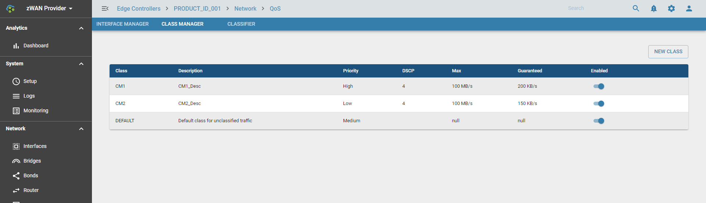

# Overview

Zwan Traffic Shaping for each interface is achieved using QoS classes. The interface could be Ethernet, VPN, Bond or Bridge.

## Funtionality

QoS Class has one ore more Flow Classification Rules and the Shaping parameters called Policy which includes bandwidth limit and priority. One or more such QoS Classes are applied to an interface. When packet flows through the interface, it will go through each QoS Class one by one and its rule one by one until the packet matches with a rule. If the packet match the filer specified in the rule, then it will honor the Bandwidth limit set which was contained by the QoS Class.

To put it simple:
*  Create one or more flow classification rule
*  Create QoS Class with bandwidth control (like maximum bandwidth and guaranteed bandwidth) and priority
*  Associate the Flow Classification rule to the QoS Class.
*  Then add the one of more QoS class to an interface.
*  QoS Class within an interface can be enabled or disabled. Make sure appropriate QoS Class is enabled for that Interface.
*  Qos for an Interface can be enabled or disabled. Make sure it is enabled.
*  Make sure all the changes are saved

### QoS Policies: 

*  Priority (high or low) - high priority Class gets more priority while traffic shaping
*  Guaranteed minimum bandwidth - Specify minimum bandwidth guaranteed for a QoS Class
*  Maximum Bandwidth - Specify minimum bandwidth guaranteed for a QoS Class
*  DSCP marking - Optionally set DSCP marking. Packets that uses this QoS Class, will have DSCP mark specified here

### QoS Rule: 

Refer Flow Classification section for Rules. Set one of the QoS class manager as Target for the rule.

### Configuration steps

Define QoS classes (under Class Manager): name, assign Priority (Low/Medium/High), DSCP marking and set maximum and guaranteed bandwidth limits

Define one or more Flow Classification Rule for each QoS Class

Assign one or more QoS Classes to an Interface (under Interface Manager)

* Enable (or disable) QoS Class and QoS for Interface.
 

* Set Global Bandwidth for an Interface (Maximum and  Guaranteed B/W) (under Interface Manager) 

Make sure all the Bandwidth specified in QoS Class manager is within the limit of an Interface.

## Usage
QoS Class manager is used for Traffic Shaping. Packet belong to particular QoS class can take more precedence and get guaranteed bandwidth when the Interface has more packets to process. QoS class manager helps the Traffic Shaping module to sort the collision and prioritize the packet processing based on priority and bandwidth specified in QoS Class manager.

## Known Limitation

