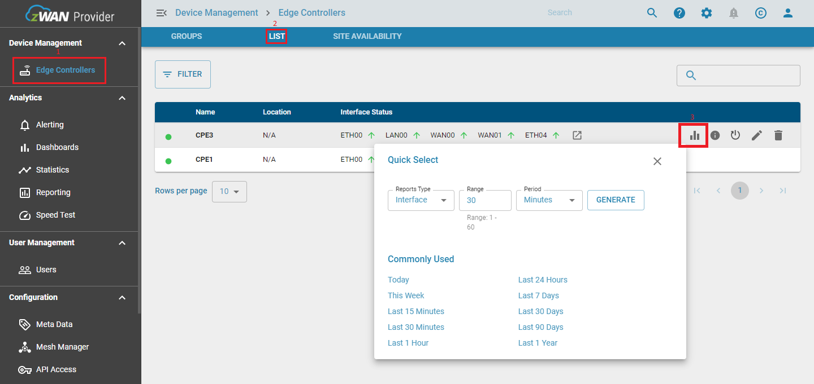

# Reporting
The reporting feature lets you generate the PDF report and print them on demand. To use reports, a user must have the correct permissions for all the types, for example, permission to access different charts like Overall edge controller's report, Single edge controller's report and Group of edge controller's report. 
Reports can be generated either by selecting a time range and the report type, or it can be selected from an already defined "Commonly Used" time range. Once the user clicks on "Generate Report", a new window will open which will load the visuals for the selected time range.  
Users must wait for all the charts to load, after which the "Print Dialog" will be displayed, and users can select either to print or save the report as PDF.

We are having 5 different types of reporting categories which are listed below:  

- System  
- Interface  
- TWAMP  
- Application  
- Firewall Log  
- Log  
- Bandwidth  

### System
Generates system report for individual or a group of edge controllers. This includes CPU and memory utilization and the time series chart for each over a selected time range. Measuring the utilization of the hardware resources within each device in your organization is key to evaluate both the efficiency of devices and the impact of resource consumption on end-user experience. Users that perceive their devices as slow usually suffer from scarcity or misuse of two basic system resources: memory and CPU processing power.

### Interface
Generate the Tx/Rx Bytes report to view the number of bytes and packets that have been sent and received through the interface. The chart also reports the status of the interface, either up or down. The data is collected for the all the network interfaces in the edge controller and displayed in separate charts which are "bytes" and "packets" specific.

### TWAMP
The Two-Way Active Measurement Protocol (TWAMP) is used to measure network performance parameters such as latency, bandwidth, and packet loss by sending probe packets and measuring their experience in the network.  
  
| Terms       | Definitions                                                                                                                                     |
| -------------- |   ----------------------------------------------------------------------------------------------------------------------------------------------- | 
| Latency        | Latency is a measure of delay. In a network, latency measures the time it takes for some data to get to its destination across the network. It is usually measured as a round trip delay - the time taken for information to get to its destination and back again. |
| Jitter         | Network jitter is congestion generated by millions of internet connections. |
| Packet Loss    | When accessing the internet or any network, small units of data called packets are sent and received. When one or more of these packets fails to reach their intended destination, this is called packet loss.|

### Application
Defines two types of application  
- **Custom Business Application**  - Charts which display the statistics of the Global applications listed under the provider UI menu. The statistics analyze the data transfer details between sender and receiver.  
- **ISP Application** - Defines the traffic details of all the applications running through the internet service provider interface.  

### Firewall Log  
Firewall logs contain Interface Status, Firewall logs and Event logs.  
 
| Terms       |Definitions                                                                                                                                     |
| -------------- |----------------------------------------------------------------------------------------------------------------------------------------------- |
| Link Status    | Link status defines the health conditions of the network interfaces. |
| Firewall Log   | Firewall is a network security application that monitors incoming and outgoing network traffic and decides whether to allow or block specific traffic based on a defined set of security rules. The network traffic rules supported is Input, output, forward and custom rule chain |

### Logs
Logs contains 2 different category System logs and Event logs.  
  
| Terms       |Definitions                                                                                                                                     |
| -------------- |----------------------------------------------------------------------------------------------------------------------------------------------- |
| Event Log      | Reports events over a period of time for the event types like net balancer, system event and traffic steering. |
| Syslog         | Displays the system logs from specific edge controllers in a tabular format.  

On click of the **Generate report** for the Log report, the page is redirected to the Logs and Event dashboard. Here the user can select a specific time range and use the  **Formatted** option to download the Syslog and Event logs.  
**Raw** will generate a csv report without converting the columns, that is, if the data contains the date in epoch format it will remain in this format, while in formatted version it will be converted to proper date time format.  

>NOTE: The time range cannot be modified for report of “Log” type from the Reporting page. User needs to “Generate Report” and then select the time range.  

### Bandwidth
Contains two categories  
- **Bandwidth usage for WAN and MGMT interface** - Allow analyzing the usage of WAN and MGMT interface in the time-series scale. Top Application gives the application usage on a time-series scale.  
- **Top Data usage for Client, Server, and Edge Controller(s)** - Tabulate the top client, top server, and top edge controller(s) with bytes and packets for the WAN and MGMT interface.  

### Report Generation  
Reports can be generated in three separate ways:  
1. Overall (For all the edge controllers[ECs]).  
2. Single EC.  
3. Group of ECs.  

#### 1. Overall:  
- Select the Reporting tab under Analytics menu item in the provider UI page.

- Quick Select dialog appears.

- Select the required Report Type, Range, and Period. And Select “GENERATE REPORT”.

     
Figure 1: Generate Overall Report.

- You can also select the ‘Report Type’ and select the ‘Commonly Used’ (period) to generate Report.

     
Figure 2: Generate Report using Commonly Used Period.

- The report Visual web page will appear. Users must wait for the print dialog to appear.

- To save the report as PDF, select “Save as PDF” from Destination drop drown list and select “Save.”

     
Figure 4: Save Report as PDF.

#### 2. Single device:  

- Select the Edge Controller under Device Management in the Provider UI.

- Select the LIST on the top of Provider page. It will display the all the On-boarded devices in the Provider.

- Click the Quick Select icon, of the respective device for which you need to generate the report.

     
Figure 2.1: Navigating to Single EC report.

- Select the required Report Type, Range, and Period.
- Select or Click “GENERATE REPORT”.

     
Figure 2.2: Single EC Report Generation.
 

- Else select the ‘Report Type’ and select the ‘Commonly Used’ (period) to generate Report.

     
Figure 2.3: Single EC Report Generation by Commonly used period.

- The report web page will appear. Users must wait for the print dialog to appear.

- To save the report as PDF, select “Save as PDF” and select “Save”.

#### 3. Group of ECs.

- Select the Edge Controllers menu item under Device Management in the Provider UI. 
- Select the “GROUPS” tab on the top of page.
If there are no groups, follow the below mentioned steps to create a group of edge controllers.
- Select the ADD GROUP icon.

     
Figure 3.1: Navigating to Add Group.

- Add Group dialog appears. In the “Add Group” dialog enter the required details.
1.	Name.
2.	Description.
3.	Name Matching Pattern. 
4.   Key and value under Meta data.
- Select the “Add.”

     
Figure 3.2: Creating Group.

- Verify “Group has been added successfully” dialog has appeared.

>NOTE: While onboarding the CPE mention the Key and value from the "Add Group" dialog to add the CPE to the group.

     
Figure 3.3: Group creation Success.

- Click the Quick Select icon, of the respective Group for which you need to generate the report.

- Select the required Report Type, Range, and Period. And Select the GENERATE.

     
Figure 3.4: Report Generation for a group of ECs.

- Else you can select the ‘Report Type’ and select the ‘Commonly Used’ (period) to generate report.

     
Figure 3.5: Report generation by Commonly used period.

- The report Visual web page will appear Users must wait for the print dialog to appear.
- To save the report as PDF, select “Save as PDF” and select “Save.”