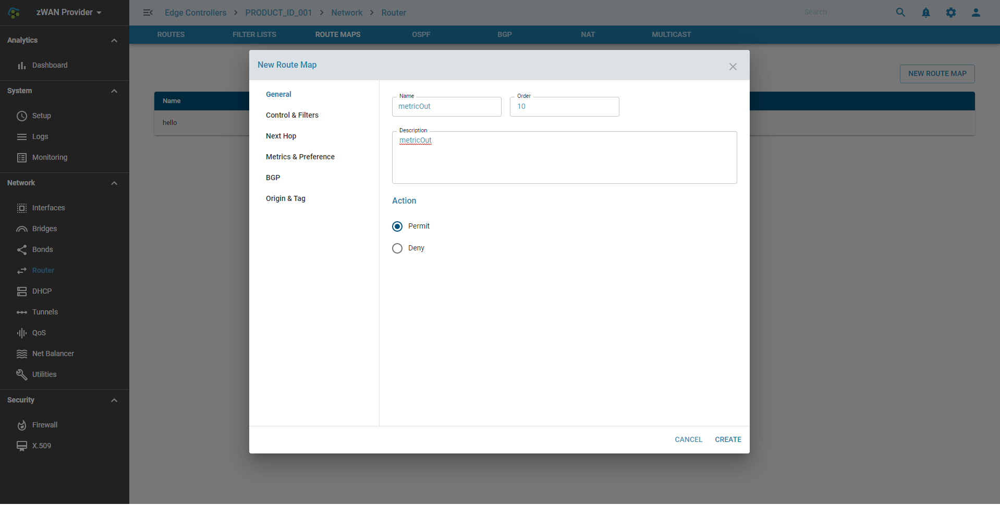

# Route Maps

## Overview: 

Route Maps provide a means to both filter and/or apply actions to route, hence allowing policy to be applied to routes. 

## Functionality:

Route Maps are an ordered list of route map entries. Each entry may specify up to four distinct sets of clauses from the list below:

    1) Matching Conditions
    2) Set Actions
    3) Matching Policy
    4) Call Action
    5) Exit Policy

Route Maps can also match based on critieria set by the Access and Prefix filters. Properties of routes can be modified based on a specific criteria being matched. 
It can also control whether specific routes can be accepted from neighbours or are distributed to neighbors. 

Detailed information on each parameter is beyond the scope of the document as is part of understanding Route Maps. 
Information on different configuration parameters can be found http://docs.frrouting.org/en/stable-7.3/routemap.html

## Configuration Parameters
    
A Route Map allows you to check for certain match conditions and set a value (optionally). 
A Match and Set can be applied for the same section, as they are not mutually exclusive.

## Use Cases:
    
Route Maps are mainly used in context with BGP and OSPF to adjust various properties of routes.

## Known Limitations:

NA

## Future:
