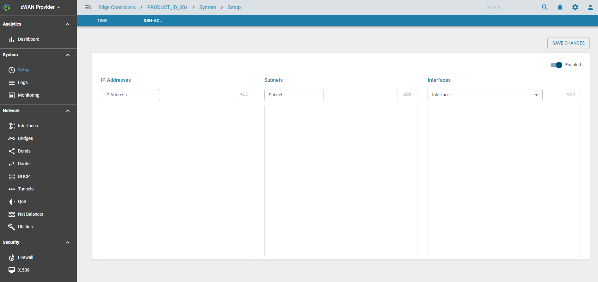

# SSH ACL

## Overview

SSH access control list allows or restricts SSH access to the zWAN edge controller device. The SSH access control list can be configured and controlled from the provider. The feature will be helpful for debugging and other restricted access to the edge devices. We can also disable SSH access to the device completely. 

## Functionality

The access can be granted based on the following fields
IP: Allow access to list of IP addresses.
Subnets : Allow SSH access to specific subnet or domain.
Interfaces : Allow SSH access only on a particular interface.
 
The below screenshot shows the UI config page for the SSH access control list of the zWAN edge device.

## Result

After adding the IP/Subnet/Interface to the list it will be displayed in the corresponding section of the above UI. By default everything is allowed if not enabled. Only the enabled IP/subnet/Interface traffic wil be allowed to access the edge controller after enabling the feature

## Know Limitations

Subnet validation is not performed.The user has to provide the valid provide the correct subnet.

IPv6 is not validated

## Future Enahancements

NA
