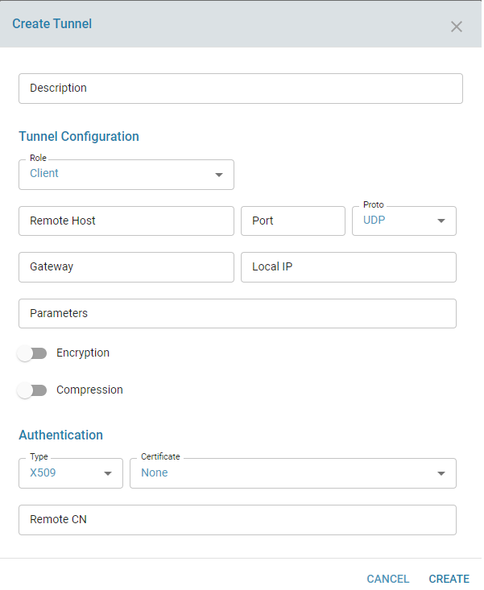
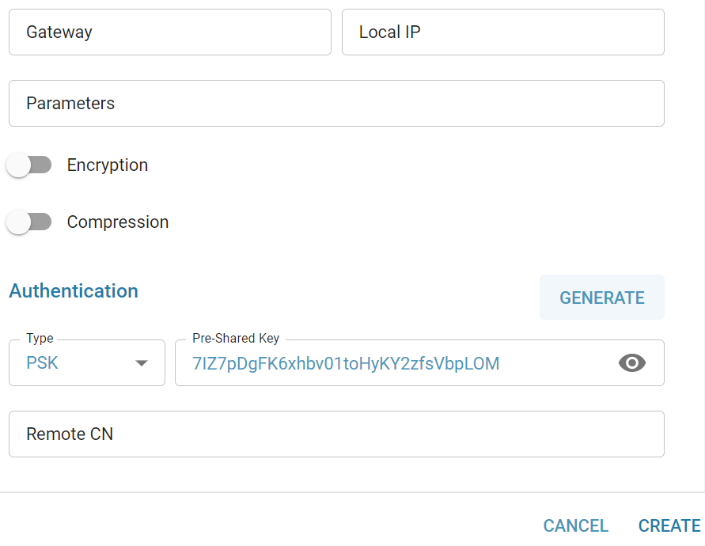
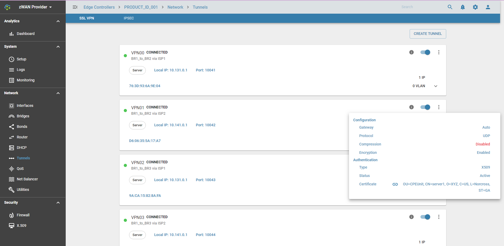

# SSL VPN

 
## Overview
 
A SSL based VPN can run in TAP and TUN mode. TAP mode work in L2 layer and TUN mode work in L3 layer. In ZWAN configuration, VPN is created in TAP mode with an option to assign an IP address so that it has the flexibility to run either in L2 or L3 layer.  By creating an Ethernet (Layer 2) connection between the two LANs, in addition to routing, bridging, bonding, VLAN are also possible over the VPN Tap interface.
 
In order to establish VPN connection between two endpoint, both X509 CA Certificate (a common certificate) and then host specific certificate are imported. One end works in Server mode and another end works in Client mode. Server listen on a particular Local IP:Port and Client connects the Server IP (Remote IP):Port from a Local IP.  The overlay protocol for VPN tunnel could be either TCP or UDP. The underlay data transferred over the tunnel can be encrypted and compressed. 

## Functionality
### Authentication

#### x509 Certificate based authenticaton
SSL VPN is mutual authentication. Server authenticates Client and vice versa.  Server can accept any Client connection as long the both use same CA certificate and the Host certificate are generated and signed by the same CA certificate. Additionally, peer connection can be filtered based on Certificate Common Name (CN).
 
Important note: If the CA private key (and Cert) is compromised, then malicious user can generate host certificate using the CA certificate and get into the RSA infrastructure. If the CA private key is compromised, then it must the deleted from all the ZWAN Controller.  If the host private key is compromised, then it must the added to the CRL (discussed in detail in  X509 section)

#### Pre Shared Key authentication
Pre-Shared Key (PSK) is a client authentication method that uses a string as a passphrase of printable ASCII characters, to generate unique encryption keys for each remote VPN client. PSK is not the default authentication method when creating a VPN tunnel endpoit, x509 is the standard and stronger. Make sure both side has same PSK.

 

### Supported Encryption
AES-256-CBC
 
### Compression
LZO real-time compression algorithm is used; data is compressed in an adaptive manner. 

## Configuration Parameters:

* When configured as server role, specify local ISP IP address and local port; 
* whereas in Client role, specify local ISP IP, and remote (server) ISP IP or Hostname and Port.
* The port must be unique and should not be conflict with other VPN tunnel configuration in the same edge controller.
* Peer mutual authentication will be based on either X.509 Certificate or Pre Shared Key (PSK)
* When X509 authentication is choosen, peer connection can be filtered based on Certificate Common Name (**Remote-CN**)
* PSK can be generated from UI. Use the same PSK both side (by copy/paste).
* User can enter their PSK or Generate a new one in SSLVPN/IPsec creation menu itself. 
* Refer openvpn manpage for any optional custom parameters.

### Tunnel Creation:

### Generate PSK:

### Tunnel Info:
Here,
*  VPN tunnel can be  enabled/disabled
*  VPN tunnel can be deleted
*  ADD IP or VLAN to the tunnel interface

 

## Expected behaviour in the system:
Once VPN tunnel is successfully created, it will create VPN tap interface, example VPN00. This VPN tap interface can be used for Bond, Bridge or can assign IP. VLAN can be created on top of VPN Tunnel interface.

## VPN tunnel interface status
VPN interface has the follownig states:

* WAIT          -- Waiting for initial response from server/client.
* AUTH          -- Authenticating with server.
* CONNECTED     -- Initialization Sequence Completed. 
* RECONNECTING  -- A restart has occurred.
* CONNECTING    -- OpenVPN's initial state.
* EXITING       -- A graceful exit is in progress.
* DOWN          -- SSL VPN is disabled

SSLVPN Color Status in UI:
* GREEN: WAIT, AUTH, CONNECTED, RECONNECTING
* RED: CONNECTING, EXITING
* GRAY: DOWN

## Management port for VPN Tunnel

Management socket is created for each tunnel for debugging. To access the debug port:

Example: 
root@CPE2:~# ps ax | grep openvpn
 
 5002 ?        Ss     2:17 openvpn --dev VPN00 --dev-type tap --local 10.131.0.2 --remote 10.131.0.1 --port 10041 --proto udp --tls-client --dh /etc/ssl/dh.pem --capath /etc/ssl/certs/trusted_CAs --cert /var/register/system/net/interfaces/VPN00/TLS/cert.pem --key /var/register/system/net/interfaces/VPN00/TLS/key.pem --float --keepalive 1 17 --script-security 3 --management **127.0.0.1 34000** --daemon VPN00_L2L --cipher AES-256-CBC --down /root/zwan-cpe/common/zeroshell/scripts/vpn_mii --mute-replay-warnings

root@CPE2:~# nc 127.0.0.1 34001
>INFO:OpenVPN Management Interface Version 1 -- type 'help' for more info
state
1603005200,CONNECTED,SUCCESS,,10.141.0.1,10042,10.141.0.2,10042
END
help

## Tunnel Usage
In SDWAN, tunnels are used in Load Balancer. It can work without Load Balancer too. Load Balancer groups multiple VPNs that connects to the same branch. On top of the tunnel functionality its adds Load Balancing and Link fault tolearance to the Branch to Branch connections.

## Known Limitation
* Currently only 99 SSL VPN tunnel can be created per ZWAN controller. 
* Server modes currenly accepts only one VPN Client. It only interconnects 2 Branch LANs. 
* Gateway field is unused

