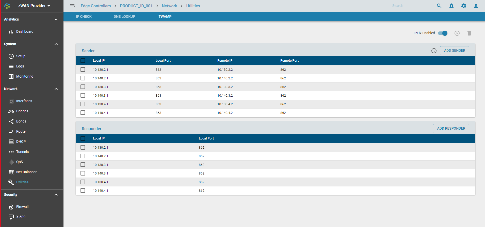
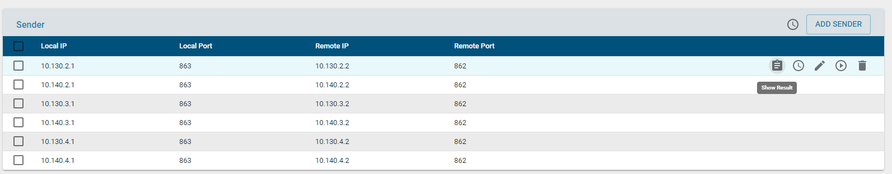

# Twamp

## Overview

Two-Way Active Measurement Protocol otherwise known as  TWAMP is an open protocol for measurement of two-way metrics. 
The minimum and max latencies and jitter can be calculated based on the test session. The information collected is analysed by an analyzer module to tune the network based on the SLA and perform efficient load balancing, QoS and flow classification of the zWAN edge controller devices. The periodicity of running the test sessions can be configured from the provider. The twamp scheduler module running in the edge device then run the test sessions based on the parameters configured. The test sessions has optional parameters to set socket options such as Type of service , DSCP, Do not fragment etc. The collected measurement will be updated to ipfix collector for the analyzer to process and take corrective action if needed.
 
In zWAN, the roles of Control-Client and Session-Sender are  implemented in one host referred to as the Initiator, and the roles
of Server and Session-Reflector are implemented in another host referred to as the Target. Initiator will be configured in one end of VPN/IPSec tunnel of a zWAN edge device and Target can be configured on the other end of the tunnel in another edge device. The roles can be toggled.
 
              Initiator                                  Target
          +-----------------+                     +--------------------+
          | Control-Client  |<--TWAMP-Control-->  |    Server          |
          |                 |                     |                    |
          | Session-Sender  |<--TWAMP-Test------> |  Session-Reflector |
          +-----------------+                     +--------------------+
 
This architecture supports the TWAMP standard. The Initiator establishes the test session with the Target through the TWAMP-Control protocol.  After the session is established, the Initiator transmits test packets to the Target.  The Target follows the Session-Reflector behavior of TWAMP. The  Session-Reflector simply reflects the incoming packets back to the Sender while copying the necessary information and generating sequence number and timestamp values.

## Functionality

In zWAN twamp measurements are taken between sender and responder. Here sender is the initiator and responder is the target. A default responder will be always spawned for every VPN tunnel or IPSEC when configured if the responder flag is enabled. Configuring responder for VPN tunnel is little different compared to IPSEC tunnel. In VPN 'twampResponder' should be set to true when configuring the VPN IP where-as in  IP-SEC tunnel, the twampResponder should be set while creating the tunnel. The twamp responder will be listening on IPSEC/VPN tunnel IP and port 862. Other than VPN and IPSEC tunnels, user can create twamp responder and sender between any local IP/Port and remote IP/Port combination which are inter-reachable. If CPE are on-boarded from orchestration layer and the topology is defined from the orchestration server the corresponding responder and sender sessions will be created part of the orchestration. Below screenshot depicts the same. It denotes sender sessions and responder sessions configured as two separate sections which are configured from orchestrator.

 
The twamp measurement session is always initiated from the sender. Sender can be configured and customized with the parameters such as the number of packets, interval between the packets and padding, time to live, do no fragment, DSCP, Type of service parameters. Sender configurable parameters are as in the below screenshot. The session can be run in foreground or background mode as some test sessions can take time to complete and some completes faster based on the parameters used to run the test session. Once the test runs successfully, the result will be displayed in the sender session tab. Twamp also can be configured to send the test results to reporting server through ipfix service. Twamp sessions can be configured  to run periodically by configuring schedules. The scheduler will be explained further in below sections. Ho

Each sender session tab UI will have the following functionalities.

1) Results: This displays the results of the last test session run.
2) Session Schedule: Configure separate schedule for that particular session if desired to. There is always an option to run global schedule for all the sessions configured if global schedule field is enabled while creating the sender session. 
3) Edit/Modify: Modify the parameters of the selected session.
4) Run: Run the the configured session 
5) Delete: Delete the configured session

## Configurable parameters 

The configurable parameters for each twamp session are as follows
Type of service : Allowable parameters are displayed in the drop down table
Interval: Interval in which 
Packet Count : number of packet to be used for sampling
DSCP : Differentiated Services Code Point, The allowable options are displayed in the drop down table.
Do not Fragment: Whther the packets should be fragmented or not.
Time to Live: Time to Live, [1..128]
Global Schedule: Whether the session should be added to global schedule
Run mode: Whther to run in foreground or background mode
IPV6: IPV6 IP or not

Sender can be configured and created as new session by using the 'Add Sender' button in UI.

 ## Results

Once twamp sender/responder session is created, a corresponding unique ID will be generated using local IP/local Port, remote IP/remote Port combinations. This unique ID will referred for further modify or delete operations of the created sessions.

The twamp results will be displayed only from the sender config tab. The results will have the information regarding inbound/outbound/roundtrip latencies, jitter and packet loss for each session. It will also display the minimum, maximum and average latencies.
 
The results of a particular twamp session will be as follows.
 

  
  
## Known Limitations

1) The packet drop percentage may report negative values and this has to be debugged further.
2) Some of the sender session config paramters suck as DSCP, ToS, Do not Fragment etc are not validated fully as this may need backend network support.
3) CPU usage is reported as high when multiple twamp sessions are run.
4) The round trip values is not the exact sum of inbound and outbound values in twamp results.
5) For every tunnel or source IP, we need to create a sender config.
6) Responder does not report results.

## Use cases

Twamp measurements values is used in Auto Flow control. Auto Flow control use the twamp reaults to compare the outgoing network line and switch to best performing line.
Twamp can used to measure the performance of each line to decide the which path should be selected for flow if autoflow control is not opted.
Twamp can also be used debug line performance if any glitches or issues are reported.

 