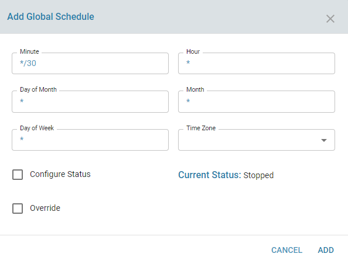

# Twamp Scheduler

## Overview

Twamp Scheduler is a service which helps administrator to configure and run twamp sender sessions periodically as a schedule. This is usefull to measure and record the performance of each line periodically. Scheduler gives the flexibilty to measure the performance of every lines configured to granularity of every minute, every hour, every week, every month etc. The scheduler can be configured only for sender configuration sessions.zWAM provides two options in part of twamp scheduler.Global and Per session schedule which wil be explained in the sections below.

## Functionality

Twamp scheduler can be configured globally or a per session basis. If the global schedule option is enabled, that particular session will be run whenever the global schedule periodicity kicks in. User can create separate session schedule at higher or small granularity than the global schedule.

*Global Schedule*

Every time a sender config session is created, there is an option to specify whether it should be added to the global schedule. Global schedule is configured by default to run every 15 minutes in every edge controller. But there is an option to edit the default global schedule parameters. The options to configure global schedule are mentioned in the below screenshot. The options to configure the scheduler are to run the session any minute of the hour, any hour of the day, any day of the month, any month of the year, any day of week and the timezone based on which the scheduler should run the sender session. The user can temporarily disable the scheduler using the configure status option. The override option is used to avoid conflicts when separate session schedule is configured and to denote that both schedule can run if both are configured. The current status denotes status of the schedule as the name suggest. The default global schedule is configured to run every 15 minutes.

*Session schedule*

Every twamp session created can have separate and unique schedules if the admin wants to. This schedule is useful to test the line performance at finer granularity. This will be really helpful for debugging, if any outgoing line is having performance issues. The configurable parameters are kind of similar to global schedule.

Other functionalities available in the scheduler for twamp are as follows

1) Add a new global/session schedule
2) Edit modify the global/session schedule
3) Stop/Resume the global/session schedule temporarily.
4) Delete the global/session schedule
5) Change the timezone of the configured global/session schedule

## Configurable Parameters

Common or allowable fields for 'Minute' option are as follows.

              Minute of the hour:  Range: 0-59, eg: 1, 1,2,3, 1-5, */2, *

Common or allowable fields for 'Hour' option are as follows.

              Hour of the day: Range: 0-23, eg: 1, 1,2,3, 1-9, /7, *

Common or allowable fields for 'Day of Month' option are as follows.

            Day of the month: Range: 1-31, eg: 1, 1,2,3, 1-9, /5,  *

Common or allowable fields for 'Month' option are as follows.

              Month of the year: eg: January, February,  Jan,Feb, *

Common or allowable fields for 'Day of week' option are as follows.

              Day of week: eg: Sunday, Monday, *    

Timezone option can be selected from the drop down list of supported time zones in the edge controller

If override option is enabled, then that corresponding session should be run part of the schedule even if there is a seperate global or session schedule configured

## Results

Once the scheduler is configured, the twamp sessions will be run at the configured time intervals. The twamp results can be checked to verify whether the session was run at that particular time. Also the current status in the scheduler page will display whether the scheduler is runnig or stopped temporarily or did not start after a power cycle.

## Use Cases

Flow optimizer from the orchestration layer uses the twamp scheduler to measure the performance of each line by running twamp session periodically and auto tune the flow.

Twamp scheduler can be configured to run twamp sessions to debug any particular line if there is a issue in performance or user notices other erratic behaviours related to a specific connection or session.

## Known Limitations

If the Edge controller is restarted, a query or mutation should be fired to the node module for the scheduler to start. Otherwise current status of the schedule may report as "Stopped". User can use configure status to start the schedule

