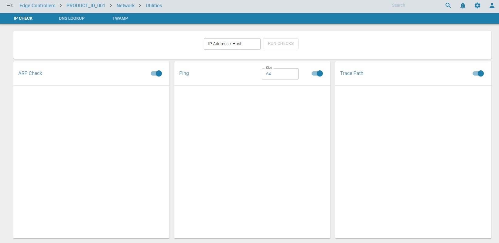
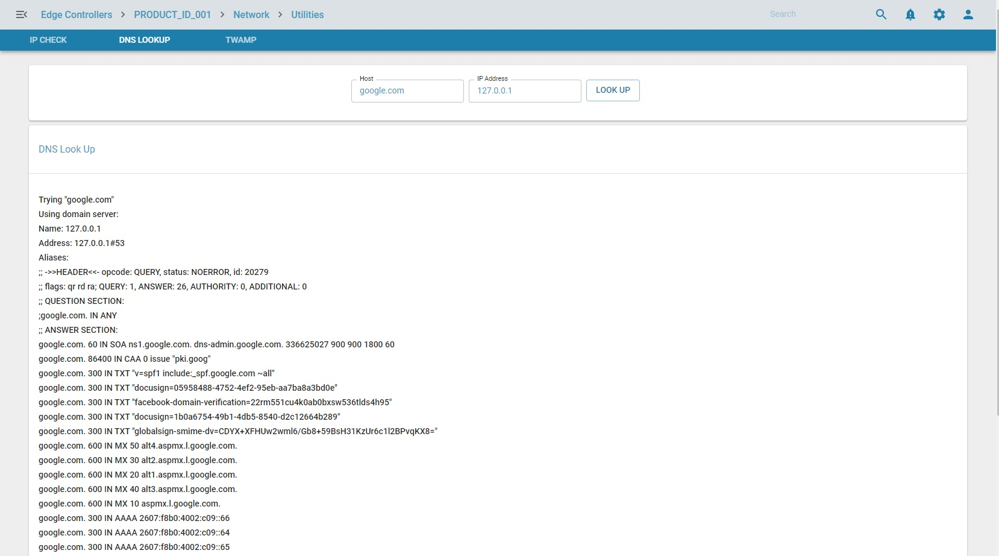

**Overview** 

zWAN edge devices is equipped with some debugging and troubleshooting utilities These utilities helps to troubleshoot any network connectivity/accessibility related issues to/from the edge device. These are very critical in debugging and isolating any issues on the edge devices. The utility functionalities can be run from a remote location such as provider which further helps to alleviate the need for a technician to go the customer location.

**Functionality**
Following are the current functionalities available in Utilities. More functionalities can be added to the list as we enhance the feature list.

ARP Check: ARP Check is a utility used for Duplicate address detection. It sends an ARP request to the specified address. It will not send ARP request if the specified address is already in the ARP table or is in a different subnet

Ping: ping utility is used to check the specified address is accessible from the zWAN device. It provides information such as how long it takes a packet to get from one  network device to the other. It can also be used to test supported packet size through the entire network to reach the destination end device.

Tracepath: Tracepath is used to trace path of the specified destination address discovering MTU along its path. It displays the supported MTU along with the maximum hops it took to reach the destination.

DNS Lookup: This utility queries the Domain Name system to obtain the domain name or IP address or any other specific DNS record.

Utilties UI page is show below

DNS lookup UI page is shown below

**Future Enhancements**

Other debug utilties can be added in future. eg; File copy test utility 

**Use cases**

These utilities are used to debug the reachabilty and understanding the route path of remote systems or server.

This wil be helpfull in debugging and configuring edge controller functionalities

**Known Limitations**

Tracepath can take time or timeout if the server to be reached is not accessible from the edge controller or reachabilty of the server is very slow

Please note ping and arpcheck mutation could take 10  and tracepath can take 30 seconds.

If ping has failure in reaching ip, the error will be logged in message. If success the output will be populated. Same if true for other utilities