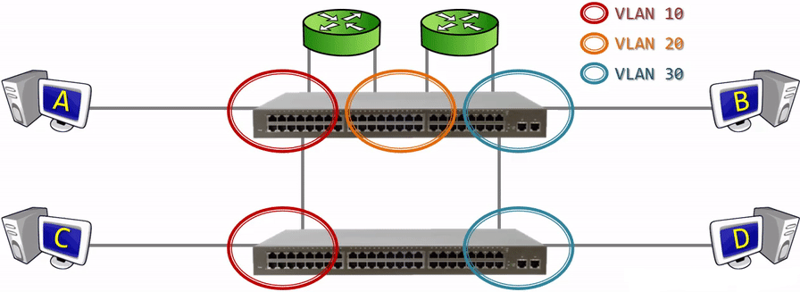
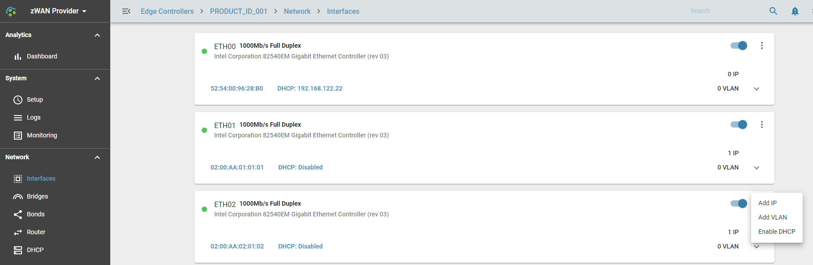
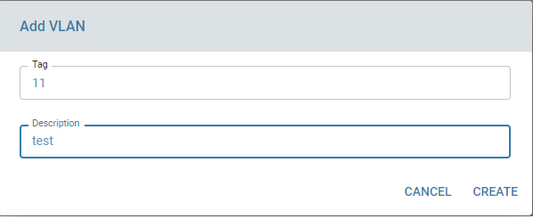
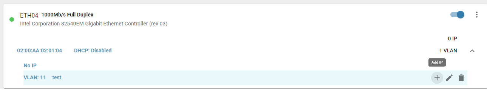
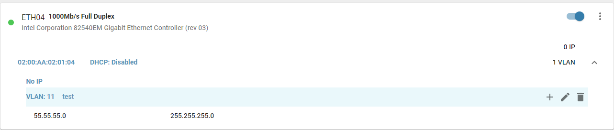

# VLAN

## Overview: 

Virtual local area networks, or VLANs, have become important as network complexity has exceeded the capacity of typical local area networks (LANs). Originally, a LAN connected a group of computers and associated devices to a server via cables in a shared physical location (hence the term “local”). Many LANs now connect devices via wireless internet, rather than Ethernet, although most LANs use a combination of both connectivity types. Over time, organizations have grown in their networking needs, requiring solutions that enable networks to grow in size, flexibility, and complexity. 

VLANs circumvent the physical limitations of a LAN through their virtual nature, allowing organizations to scale their networks, segment them to increase security measures, and decrease network latency. 

*What is a VLAN and what is its purpose?*

In essence, a VLAN is a collection of devices or network nodes that communicate with one another as if they made up a single LAN, when in reality they exist in one or several LAN segments. In a technical sense, a segment is separated from the rest of the LAN by a bridge, router, or switch, and is typically used for a particular department. This means that when a workstation broadcasts packets, they reach all other workstations on the VLAN but none outside it. 

This simplifies many of the potential complications caused by LANs, including excessive network traffic and collisions. When two workstations send data packets at the same time on a LAN connected via a hub, the data collides and is not transmitted properly. The collision propagates through the entire network, meaning that the LAN is busy and requires users to wait until the collision has been fully transferred throughout the network before it is operable again—at which point the original data must be resent. 

VLANs reduce the incidence of collisions and decrease the number of network resources wasted by acting as LAN segments. Data packets sent from a workstation in a segment are transferred by a bridge or switch, which will not forward collisions but will send on broadcasts to every network devices. For this reason, segments are called “collision domains” because they contain collisions within the bounds of that section.

However, VLANs have more functionality than even a LAN segment because they allow for increased data security and logical partition. Remember, a VLAN acts as a single LAN although it only makes up a segment. This means that the broadcast domain of a VLAN is the VLAN itself, rather than each network segment. Additionally, the partitions do not have to be defined by the physical location of the network devices. They can be grouped instead by department, project team, or any other logical organizational principle. 

Reference: https://www.solarwindsmsp.com/blog/what-are-vlans

## Functionality:

zWAN provides most of the VLAN functionalities such as creation of multiple VLAN's on a single interface. Every VLAN will be assiocated with VLAN tag. After assigning an IP to the VLAN a unique ID will be assigned to IP.

1) Add VLAN : Create a VLAn with a tag ID and give description.

2) Edit/Modify VLAN : Only description can be edited after creating a VLAN

3) Delete any existing VLANs

4) Set Static IP for a VLAN : User can assign static IP to the VLAN created. It is same as adding IP to the interface.

5) Edit/Modify static IP of VLAN
6) Delete static IP of VLAN

## Configuration Parameters

VLAN tag ID : Range 1-4094

Desrcription of the VLAN

Static IP address for VLAN

Netamsk for the static IP

## Result

Once a VLAN is created and IP Is assigned, the details will be listed under interface section

Organizations benefit greatly from the advantages of VLAN usage, including increased performance, more flexibility in network configuration and workgroup formation, and reduced administrative efforts.

## Use Cases:

 Interdepartmental teams on the same VLAN to facilitate a high volume of data sharing. Marketing, sales, IT, and business analysts can work together to achieve high-stakes objectives most efficiently when network segmentation facilitates flexible teamwork.     

## Known Limitations:

No DHCP IP support, Currently IPv6 is not supported

## Future Enhancements:

IPv6 support may be added in the future

