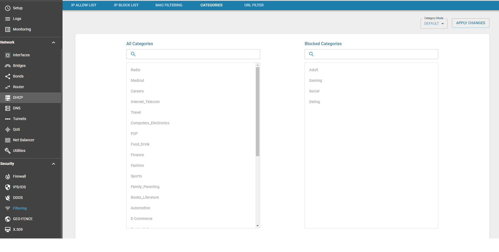
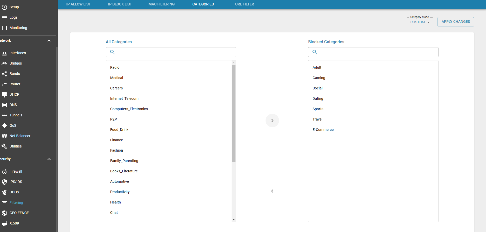
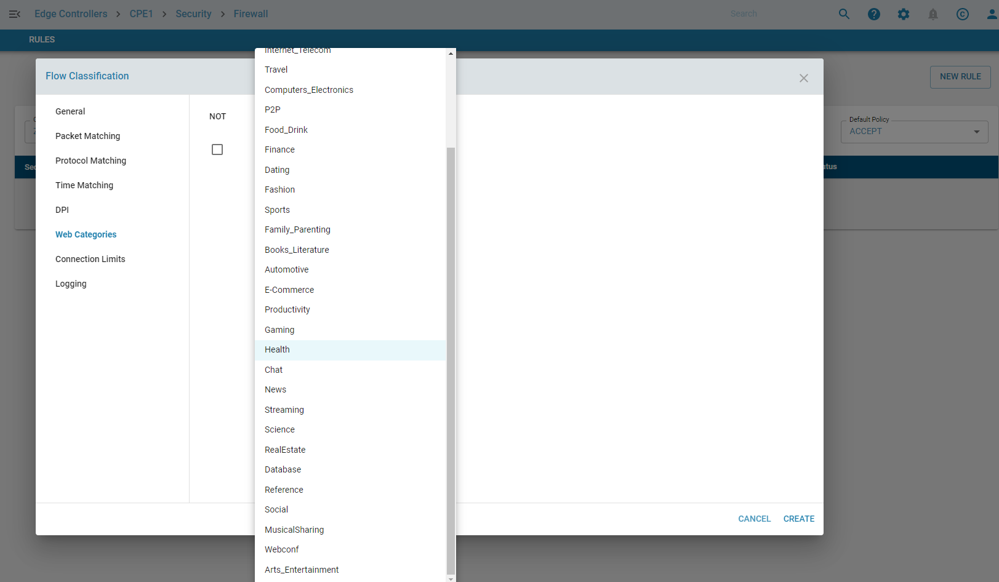
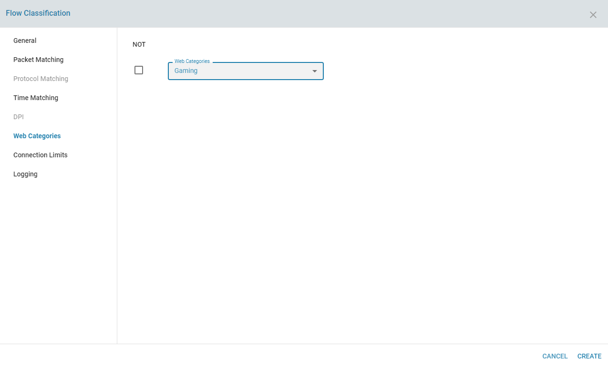
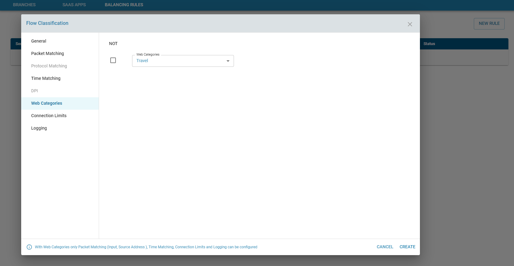

**Overview** 

zWAN edge devices categorizes Internet traffic into multiple categories such as Gaming Social Arts Chat Sports etc.. These categories can then be used for functionalities like firewall and packet steering.

**Functionality**

Following are the current functionalities available with the Web Categorization

The categories are currently defined as 

        Radio
        Adult
        Medical
        Careers
        Internet_Telecom
        Travel
        Computers_Electronics
        P2P
        Food_Drink
        Finance
        Dating
        Fashion
        Sports
        Family_Parenting
        Books_Literature
        Automotive
        E-Commerce
        Productivity
        Gaming
        Health
        Chat
        News
        Streaming
        Science
        RealEstate
        Database
        Reference
        Social
        MusicalSharing
        Webconf
        Arts_Entertainment

The categories can be views in the Filtering page as shown

**Use cases**

Firewall : 

1) One of more category can be either globally blocked by adding them to the Blocked Category lists. By default Dating Gaming Adult and Social categories are blocked. The user can choose a custom mode and customize the list accordingly. 

2) The Categories can also be selectively allowed or blocked in the firewall rules which would override any global setting for categories

Net Balancer or QoS :

1) The categories can also be used for packet steering or QoS of traffic via specific WAN interfaces

