# Configure Radius server role in zWAN

Login to zID with the URL https://<zwan_director_ip>:8082/auth/admin/<tenant_name>/console

Go to Roles and click add role.

Give the role name as radius (name should be in radius (small letters)) and save it.

Click next tab attributes; add host, port and secret key and save it.

```
host    - <radius_server_ip>
port    – <radius_server_port>
secret  – <radius_server_secret>
```

Ex:

```
host    - *.*.*.*
port    – 1812
secret  – testing123
```

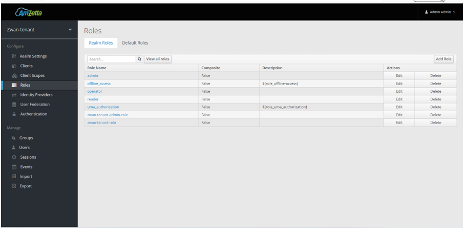

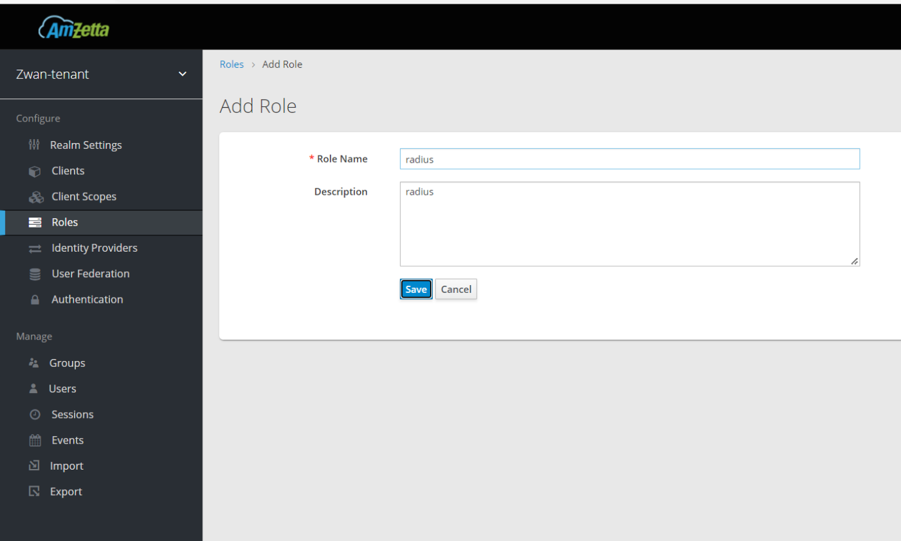

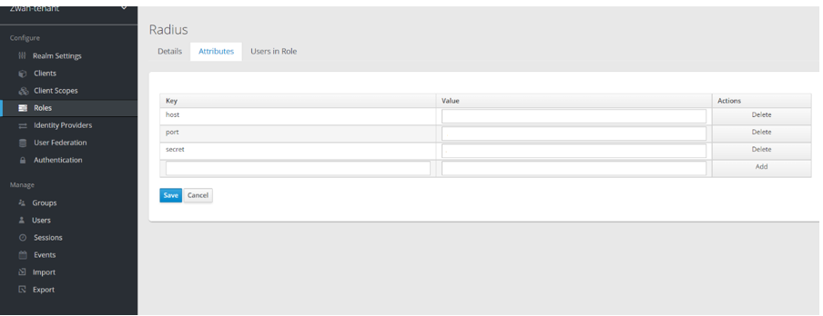

Go to authentication page, click copy and save it as Radius Authentication (user-preferred name)

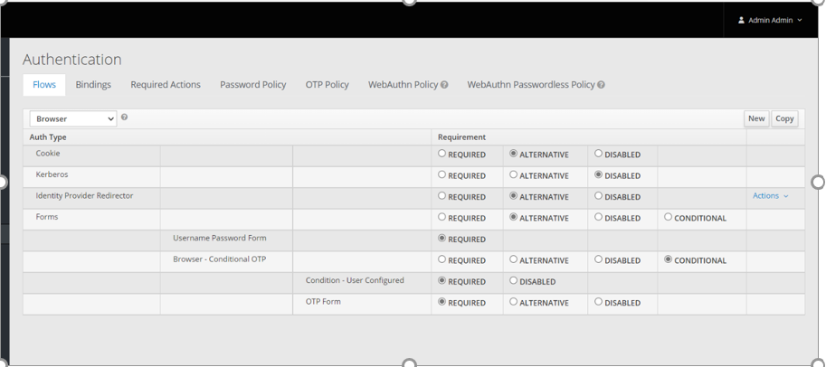

Select Radius Authentication from flows.

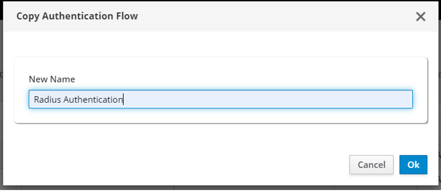

Delete Username Password Form

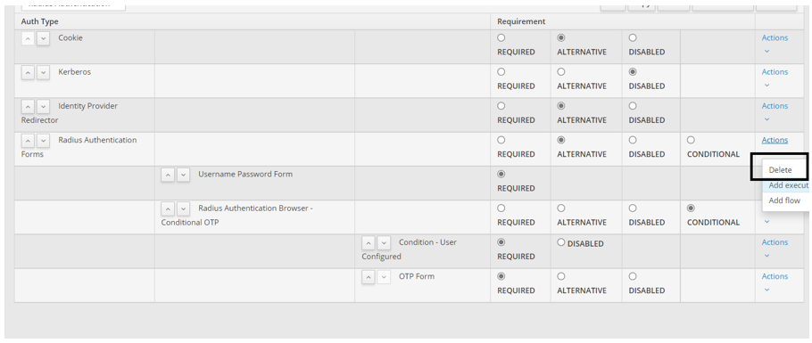

Click add execution in Radius Authentication forms, select Radius Username Password form and save it.

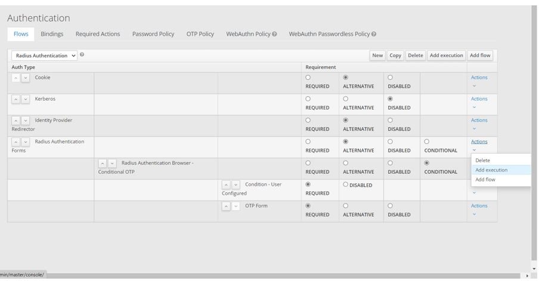

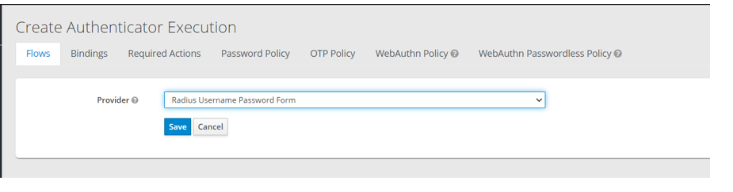

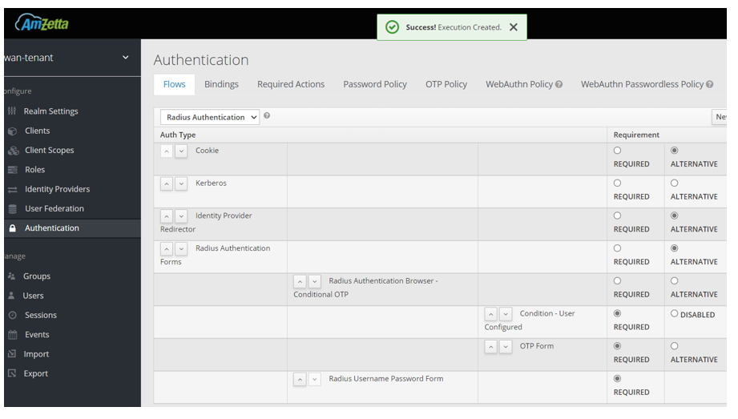

Click the up arrow nearby Radius Username Password form to move up.

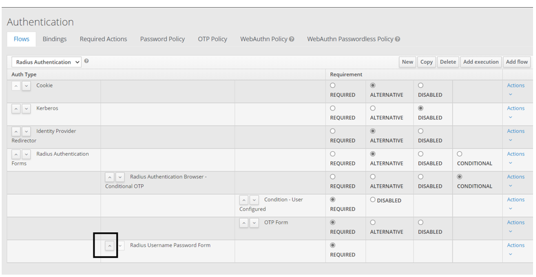

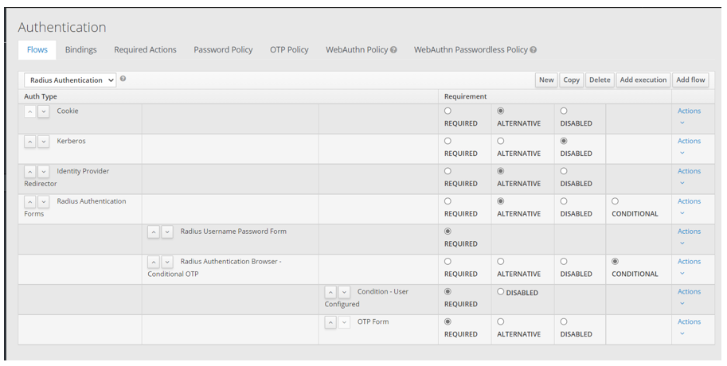

Go to bindings, select radius authentication and save it.

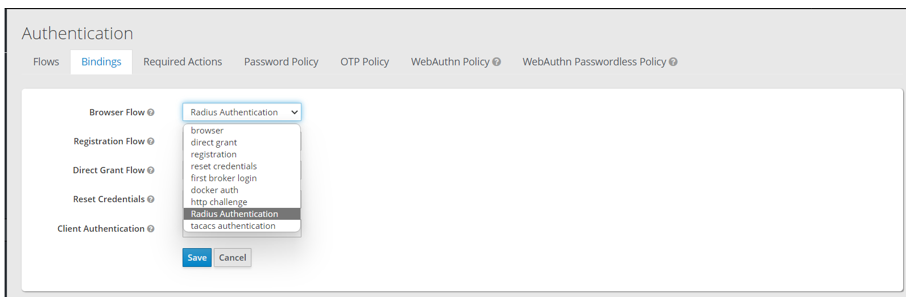

Launch director URL[https://<director_ip>:<director_port>/<tenant_name>],

Give the valid radius user credentials click login.

At first login, The user doesn't have any permission, It will show below error.

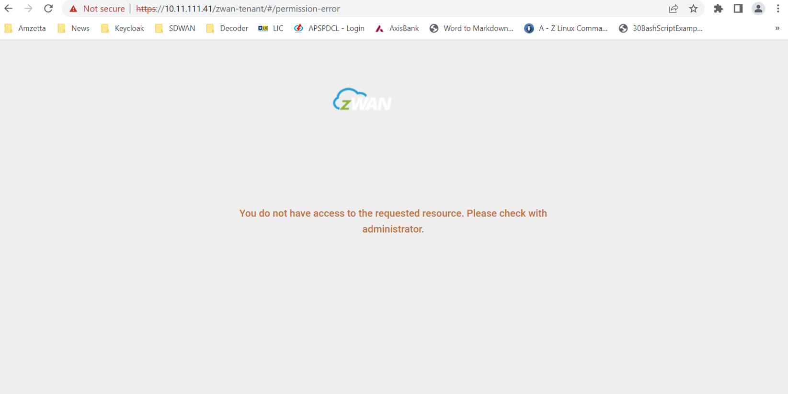

Login to the director with superadmin credentials and go to user’s page.

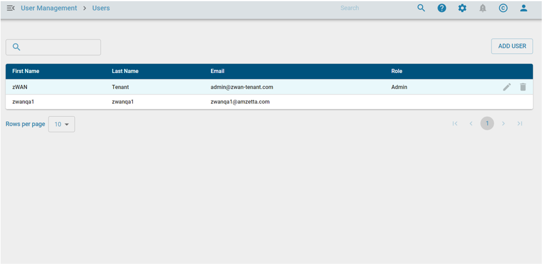

Click on "Edit" icon, Assign role and Edge controller[Assign Or Unassign] and hit "UPDATE" button.

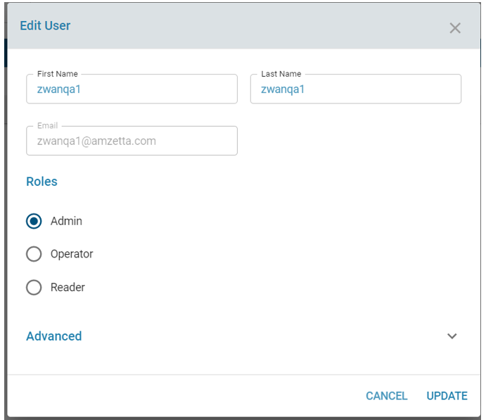

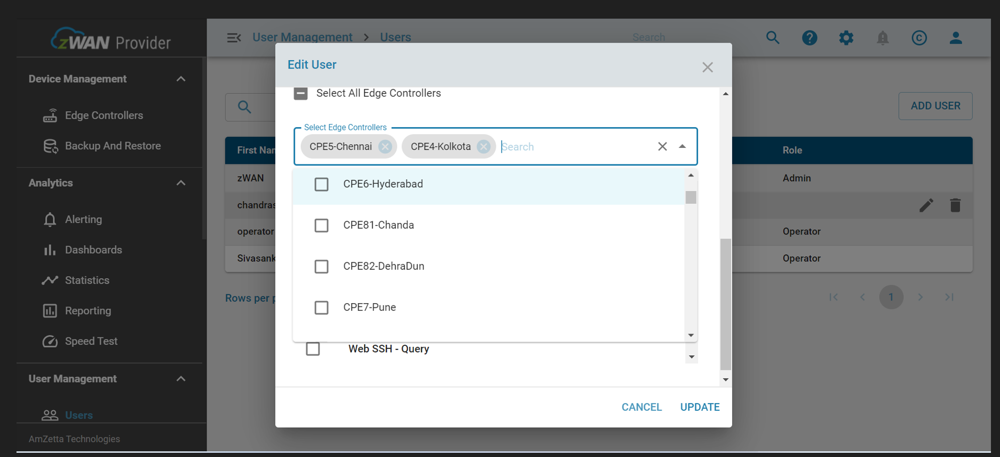

Now try to login to the director with the radius user.
