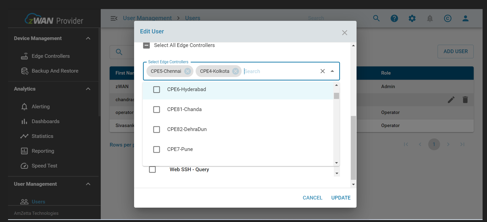

# Configure Tacacs role in zWAN

Login to zID with the URL https://<zwan_director_ip>:8082/auth/admin/<tenant_name>/console

Go to Roles and click add role.


Give the role name as tacacs (name should be in tacacs (small letters)) and save it.

Click next tab attributes; add host, port and secret key and save it.


```
host    - <tacacs_server_ip>
port    – <tacacs_server_port>
secret  – <tacacs_server_secret>
```

Ex:

```
host    - *.*.*.*
port    – 49
secret  – testing123
```


Go to authentication page, click copy and save it as tacacs Authentication (user-preferred name)


Select tacas Authentication from flows


Delete Username Password Form


Click add execution in Tacas Authentication forms, select tacacs Username Password form and save it.


Click the up arrow nearby tacacs Username Password form to move up.


Go to bindings, select tacacs authentication and save it.


Launch director URL[https://<director_ip>:<director_port>/<tenant_name>],

Give the valid tacacs user credentials click login.

At first login, The user doesn't have any permission, It will show below error.


Login to the director with superadmin credentials and go to user’s page.


Click on "Edit" icon, Assign role and Edge controller[Assign Or Unassign] and hit "UPDATE" button.




Now try to login to the director with the tacacs user.
